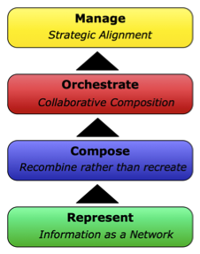

To transform the knowledge management of an organization from a traditional, repository-oriented structure into a knowledge network oriented structure is a complex process. The following maturity framework is meant to provide guidance in this process:

<table style="empty-cells:show;border-collapse:collapse;"><tbody><tr><td style="vertical-align:top;width:112px;border:0 solid rgb(191,191,191);margin:0;padding:0;"><strong>Maturity Level</strong></td><td style="vertical-align:top;width:269px;border:0 solid rgb(191,191,191);margin:0;padding:0;"><strong>Key Requirements</strong></td></tr><tr><td style="vertical-align:top;width:112px;border:0 solid rgb(191,191,191);margin:0;padding:0;">4.Manage</td><td style="vertical-align:top;width:269px;border:0 solid rgb(191,191,191);margin:0;padding:0;">Nodes in the network are embedded in fine-grained ownership and value-allocation frameworks; ultimately allowing to align the encoded knowledge network with other dimensions of organizational knowledge.</td></tr><tr><td style="vertical-align:top;width:112px;border:0 solid rgb(191,191,191);margin:0;padding:0;">3.Orchestrate</td><td style="vertical-align:top;width:269px;border:0 solid rgb(191,191,191);margin:0;padding:0;">The process of composition can be conducted in a collaborative fashion, involving individuals, teams, departments, organizations and business networks.</td></tr><tr><td style="vertical-align:top;width:112px;border:0 solid rgb(191,191,191);margin:0;padding:0;">2.Compose</td><td style="vertical-align:top;width:269px;border:0 solid rgb(191,191,191);margin:0;padding:0;">New information can be composed out of already existing information pieces</td></tr><tr><td style="vertical-align:top;width:112px;border:0 solid rgb(191,191,191);margin:0;padding:0;">1.Represent</td><td style="vertical-align:top;width:269px;border:0 solid rgb(191,191,191);margin:0;padding:0;">Domain-independent organizational information can be expressed as nodes and vertices in an information network</td></tr></tbody></table>

_Knowledge Network Maturity Framework_
