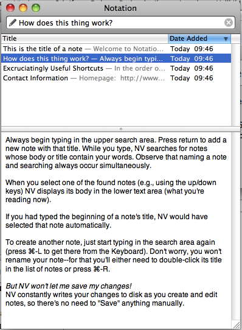
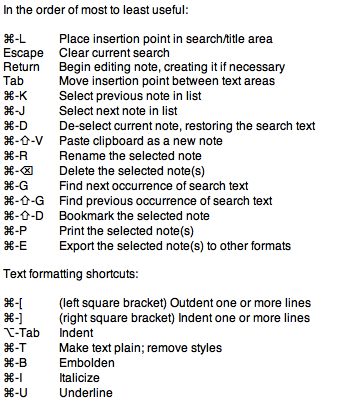

National Velocity proposes to “to loosen the mental blockages to recording information and to scrape away the tartar of convention that handicaps its retrieval” ( [http://notational.net/](http://notational.net/), 9/4/2010).

It tries to integrate the workflow of searching for notes and creating notes. When the user types in the name for a new node, automatically existing notes are searched for the words used.

**Key features:**

- Integrated process for creating and searching notes
- Everything can be done using keyboard shortcuts
- Small footprint
- Free and open source (and “nonconformist” ([http://notational.net/](http://notational.net/), 9/4/2010))
- Integrates with iPhone notes applications

**Conclusion:**

Useful for small and simple chunks of information, which must be accessed quickly.

**Screenshots:**

**Application Overview:**

<table style="empty-cells:show;border-collapse:collapse;"><tbody><tr><td style="vertical-align:top;width:112px;border:0 solid #bfbfbf;margin:0;padding:0;"><strong>Application</strong></td><td style="vertical-align:top;width:269px;border:0 solid #bfbfbf;margin:0;padding:0;"><strong>Notational Velocity</strong></td></tr><tr><td style="vertical-align:top;width:112px;border:0 solid #bfbfbf;margin:0;padding:0;">Category</td><td style="vertical-align:top;width:269px;border:0 solid #bfbfbf;margin:0;padding:0;">Note taking</td></tr><tr><td style="vertical-align:top;width:112px;border:0 solid #bfbfbf;margin:0;padding:0;">Version</td><td style="vertical-align:top;width:269px;border:0 solid #bfbfbf;margin:0;padding:0;">2.0 β3 (6)</td></tr><tr><td style="vertical-align:top;width:112px;border:0 solid #bfbfbf;margin:0;padding:0;">Website:</td><td style="vertical-align:top;width:269px;border:0 solid #bfbfbf;margin:0;padding:0;"><a href="http://notational.net/">http://notational.net/</a></td></tr><tr><td style="vertical-align:top;width:112px;border:0 solid #bfbfbf;margin:0;padding:0;">Tested on:</td><td style="vertical-align:top;width:269px;border:0 solid #bfbfbf;margin:0;padding:0;">9/4/2010, Mac OS X 10.6.3</td></tr><tr><td style="width:112px;border:1px solid #bfbfbf;margin:0;padding:0;">Technical Details:</td><td style="width:269px;border:1px solid #bfbfbf;margin:0;padding:0;">Open Source, For Mac OS X, Universal Binary&nbsp;</td></tr></tbody></table>
