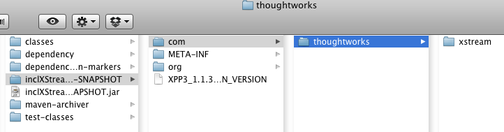
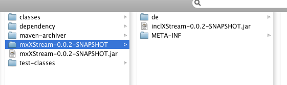

**The Problem**

Some libraries like XStream or Beans serialization require direct access to the classloader of the bundles, which use them. These libraries need access the classes, in order to deserialze them. Otherwise expections like the one below occur:

SCHWERWIEGEND: Application class de.mxro.textedit.gdocseditor.gui.GoogleDocsEditorGUIApp failed to launch com.thoughtworks.xstream.converters.ConversionException: de.mxro.textedit.gdocseditor.GDocsEditorData$GDocNode : de.mxro.textedit.gdocseditor.GDocsEditorData$GDocNode \---- Debugging information ---- message : de.mxro.textedit.gdocseditor.GDocsEditorData$GDocNode : de.mxro.textedit.gdocseditor.GDocsEditorData$GDocNode cause-exception : com.thoughtworks.xstream.mapper.CannotResolveClassException cause-message : de.mxro.textedit.gdocseditor.GDocsEditorData$GDocNode : de.mxro.textedit.gdocseditor.GDocsEditorData$GDocNode class : java.util.HashMap$Values required-type : java.util.HashMap path : /java.util.HashMap$Values/outer-class/entry/de.mxro.textedit.gdocseditor.GDocsEditorData$GDocNode line number : 5 \-------------------------------         at com.thoughtworks.xstream.core.TreeUnmarshaller.convert(TreeUnmarshaller.java:63)         at com.thoughtworks.xstream.core.AbstractReferenceUnmarshaller.convert(AbstractReferenceUnmarshaller.java:45)         at com.thoughtworks.xstream.core.TreeUnmarshaller.convertAnother(TreeUnmarshaller.java:46) ...

**The Solution (1)

**The only solution I can think of at the moment, is to load these libraries directly in the bundle, which uses them. So, normally, I would place 3rd party libraries in separate OSGi bundles and import packages from these bundles. But in case of libraries, which require access to the ClassLoader of the package, I compile them as JAR library, which can be added to the using bundles classpath directly. Of course, this may lead to duplication of libraries, if these libraries are used by more than one bundle. Therefore, it is very important NEVER to export any packages from these included libraries from the libraries, which are using them.

I would recommend to create such modules in the following way. First, set up a Java project in eclipse. Make sure the source and output folders follow Maven convention (src/main/java, target/classes). Using the Eclipse IAM plugin, convert the project into a Maven project.

Add the dependencies to third party libraries you need. If you cannot find a Maven repository, which has these artifacts, upload them on a [local Nexus or Artifactory server](http://nexnet.wordpress.com/2010/05/29/setting-up-a-maven-repository-using-nexus-and-artifactory/).

Add the Maven dependency plugin and an additional resource definition to your project pom.xml:

<?xml version\="1.0" encoding\="UTF-8"?><project\> <modelVersion\>4.0.0</modelVersion\> <groupId\>de.mxro.incl.xstream</groupId\> <artifactId\>inclXStream</artifactId\> <version\>0.0.2-SNAPSHOT</version\> <build\> <plugins\> <plugin\> <artifactId\>maven\-dependency-plugin</artifactId\> <executions\> <execution\> <id\>unpack-dependencies</id\> <phase\>generate-resources</phase\> <goals\> <goal\>unpack-dependencies</goal\> </goals\> </execution\> </executions\> </plugin\> <plugin\> <artifactId\>maven\-compiler-plugin</artifactId\> <configuration\> <source\>1.6</source\> <target\>1.6</target\> </configuration\> </plugin\> </plugins\> <resources\> <resource\> <directory\>${basedir}/target/dependency</directory\> </resource\> </resources\> </build\> <dependencies\> <dependency\> <groupId\>xstream</groupId\> <artifactId\>xstream</artifactId\> <version\>1.2.2</version\> </dependency\> </dependencies\> </project\>

Now you can package this library. All the classes from the JARs you use, will be extracted and added to your own JAR.

Now you can add this library as dependency to your projects, which require the library.

However, as these kind of libraries will not be available as bundles during runtime, the libraries need to be embedded in the libraries, which use them.

This can be accomplished by adding the following to the project pom.xml of the bundle, which uses the library:

<plugin\> <artifactId\>maven\-dependency-plugin</artifactId\> <executions\> <execution\> <id\>copy</id\> <phase\>generate-resources</phase\> <goals\> <goal\>copy</goal\> </goals\> <configuration\> <artifactItems\> <artifactItem\> <groupId\>de.mxro.incl.xstream</groupId\> <artifactId\>inclXStream</artifactId\> <version\>0.0.2-SNAPSHOT</version\> </artifactItem\> </artifactItems\> </configuration\> </execution\> </executions\> </plugin\>

And an additional entry for the resources:

<resource\> <directory\>${basedir}/target/dependency</directory\> </resource\>

Now the JAR generated for the bundle should include the JAR of the library, which is to be included:

**The Solution (2)**

The problem with the first solution is, when access to the classes of the library are required during compile time: During runtime, all the classes of the included library are available through the OSGi container. However, during compile time, the classes in the included libraries are not available.

This can be mitigated - as long the the license of the included library permits - by extracting all the classes of the included libraries and placing these extracted classes in your own library‘s jar:

The following changed pom.xml will do the trick (please note, you will now need the dependency as Maven artifact. It is marked as „compile“ dependency as libraries, which will use your library, will not require the dependency any more (as all its classes are included in your library) :

<?xml version\=“1.0” encoding\=“UTF-8”?><project\> <modelVersion\>4.0.0</modelVersion\> <groupId\>de.mxro.incl.xstream</groupId\> <artifactId\>inclXStream</artifactId\> <version\>0.0.2</version\> <build\> <plugins\> <plugin\> <artifactId\>maven\-dependency-plugin</artifactId\> <executions\> <execution\> <id\>unpack-dependencies</id\> <phase\>generate-resources</phase\> <goals\> <goal\>unpack-dependencies</goal\> </goals\> </execution\> </executions\> </plugin\> <plugin\> <artifactId\>maven\-compiler-plugin</artifactId\> <configuration\> <source\>1.6</source\> <target\>1.6</target\> </configuration\> </plugin\> </plugins\> <resources\> <resource\> <directory\>${basedir}/target/dependency</directory\> </resource\> </resources\> </build\> <dependencies\>         <dependency\>                 <groupId\>xstream</groupId\>                 <artifactId\>xstream</artifactId\>                 <version\>1.2.2</version\>                 <scope\>compile</scope\>                 <optional\>false</optional\>         </dependency\> </dependencies\> </project\>

Further, you might have to change the bundle classpath when using eclipse PDE. Just add target/dependency to the bundle‘s class path.

**Resources**

[Maven: Unpacking classes from JAR of project dependencies](http://maven.apache.org/plugins/maven-dependency-plugin/examples/unpacking-project-dependencies.html) [Maven: Copy Project Dependencies](http://maven.apache.org/plugins/maven-dependency-plugin/examples/copying-project-dependencies.html) [Eclipse+Maven: Shows example POM how depdencies can be downloaded for eclipse‘s pde environment](http://felix.apache.org/site/apache-felix-maven-bundle-plugin-bnd.html) [Maven: Set up the classpath using maven-jar-plugin](http://maven.apache.org/shared/maven-archiver/examples/classpath.html) [Maven: Package application into one executable jar using assembly plugin](http://maven.apache.org/plugins/maven-assembly-plugin/usage.html) [Maven: Discussion on Stack Overflow how to create executable JAR with Maven](http://stackoverflow.com/questions/574594/how-can-i-create-an-executable-jar-with-dependencies-using-maven)
