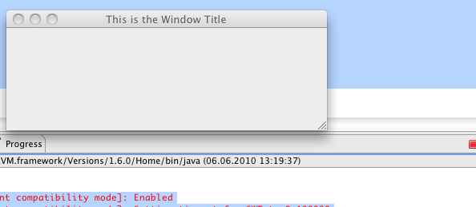
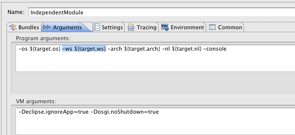

**The Problem**

I have created a very simple Swing class, which is to be started by an OSGi Declarative Service.

public class SwingOSGiApplicationService implements ApplicationService {

                 public void activate() {                 System.out.println("Starting Application Service; show window");                 Runnable launcher = new Runnable() {                         @Override                         public void run() {                                 JFrame aWindow = new JFrame(“Swing Test OSGi“);                          int windowWidth = 420;                          int windowHeight = 170;                          aWindow.setBounds(55, 150,                          windowWidth, windowHeight);                          aWindow.setDefaultCloseOperation(JFrame.EXIT\_ON\_CLOSE);                          aWindow.setVisible(true);                         }                 };                 SwingUtilities.invokeLater(launcher);                          }

} When I start the containing OSGi bundle using an „OSGi Framework“ eclipse run configuration. The application takes very long to start up (The same bundle starts in Apache Felix in an instant).

The following obscure messages appear in the console shortly before the application starts up: osgi> Starting Application Service; show window 2010-06-06 13:20:09.087 java\[892:903\] \[Java CocoaComponent compatibility mode\]: Enabled 2010-06-06 13:20:09.090 java\[892:903\] \[Java CocoaComponent compatibility mode\]: Setting timeout for SWT to 0.100000 2010-06-06 13:20:09.458 java\[892:903\] \*\*\* \_\_NSAutoreleaseNoPool(): Object 0x1001410e0 of class \_\_NSCFDate autoreleased with no pool in place - just leaking 2010-06-06 13:20:09.458 java\[892:903\] \*\*\* \_\_NSAutoreleaseNoPool(): Object 0x100147f80 of class NSCFTimer autoreleased with no pool in place - just leaking

Further, the Swing window never receives a focus. The only remaining option is to terminate the application.

**The Solution**

The problem seems only to be appearing on Mac OS X. [This bug](https://bugs.eclipse.org/bugs/show_bug.cgi?id=212617) described the issues. The solution is to remove the „-ws ${target.ws}“ from the launch configuration. Just delete what is highlighted below and the window should start up instantly.

**Resources**

[Launching Swing based Applications on Mac OS X Eclipse Bug](https://bugs.eclipse.org/bugs/show_bug.cgi?id=212617) [Launch Configuration for Swing for ADempiere](http://www.adempiere.com/index.php/Equinox_Integration_2_-_Swing_Client_Run_Configuration) [Launch Swing Application with Felix in Eclipse](http://www.mail-archive.com/users@felix.apache.org/msg04527.html)
