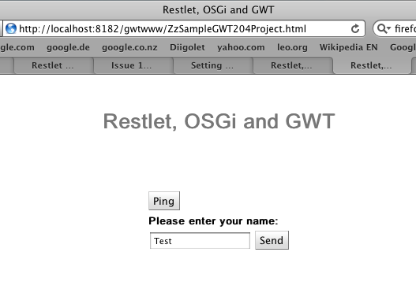
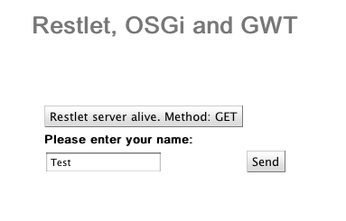
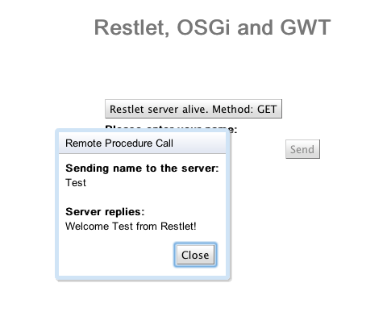

After some difficulties I got a project working, which consists of a simple GWT application with a Restlet backend. The application consists of four OSGi bundles, which work inside eclipse PDE. Also, all of these modules and their dependencies are declared using Maven 2.

**Overview:**

The user interface is based on google‘s standard project from the google eclipse plugin.

 The button Ping triggers a very simple REST call to the server (based on example from Restlet documentation)

tstBtn.addClickHandler(new ClickHandler() {

                        @Override                         public void onClick(ClickEvent event) {                          ClientResource r = new ClientResource("/ping");

                         r.setOnResponse(new Uniform() {                          public void handle(Request request, Response response) {                          try {                          tstBtn.setText(response.getEntity().getText());                          } catch (IOException e) {                          e.printStackTrace();                          }                          }                          });                          r.get();                                                          }                                          });

Clicking this button should result in the caption of the button being filled with a response from the server.

 The server resource is as following:

public class PingResource extends ServerResource {

@Get("txt") public String toText() { StringBuilder sb = new StringBuilder("Restlet server alive. Method: "); sb.append(getRequest().getMethod());

ChallengeResponse challengeResponse = getRequest() .getChallengeResponse(); if (challengeResponse != null) { sb.append("/ Auth. scheme: "); sb.append(challengeResponse.getScheme()); }

return sb.toString(); } }

The send button should work in the same way as in the google example; only that the remote procedure call is facilitated using Restlet.

GWT Client:

GreetingServiceAsync r = GWT.create(GreetingServiceAsync.class);                                 r.getClientResource().setReference("/services/greet");                                 r.getClientResource().getClientInfo().getAcceptedMediaTypes().add(new                                                 Preference<MediaType>(MediaType.APPLICATION\_JAVA\_OBJECT\_GWT));                                                                          r.greetServer(new Name(nameField.getText()), new AsyncCallback<String>() {

                                        @Override                                         public void onFailure(Throwable caught) {                                                 // Show the RPC error message to the user                                                 dialogBox                                                                 .setText("Remote Procedure Call - Failure");                                                 serverResponseLabel                                                                 .addStyleName("serverResponseLabelError");                                                 serverResponseLabel.setHTML(SERVER\_ERROR+" "+caught.getMessage());                                                 dialogBox.center();                                                 closeButton.setFocus(true);                                                                                          }

                                        @Override                                         public void onSuccess(String result) {                                                 dialogBox.setText("Remote Procedure Call");                                                 serverResponseLabel                                                                 .removeStyleName("serverResponseLabelError");                                                 serverResponseLabel.setHTML(result);                                                 dialogBox.center();                                                 closeButton.setFocus(true);                                                                                          }                                                                          });

Restlet Server:

public class GreetingServiceServerResource extends ServerResource implements GreetingService {        @Override         public Representation handle() {                                                    CompositeClassLoader customCL = new CompositeClassLoader();                  customCL.addClassLoader(Thread.currentThread().getContextClassLoader());                  customCL.addClassLoader(Name.class.getClassLoader());                                   ClassLoader oldCL = Thread.currentThread().getContextClassLoader();                  Thread.currentThread().setContextClassLoader(customCL);                                  Representation rep = super.handle();                                  Thread.currentThread().setContextClassLoader(oldCL);                                  return rep;         }        @Override         @Post         public String greetServer(Name name) throws IllegalArgumentException {                 System.out.println(“Name submitted: “+[name.name](http://name.name));                 return “Welcome “+[name.name](http://name.name)+” from Restlet!”;         }         

}

**OSGi Bundles:**

Under equinox, the following modules were required:

id        State Bundle 0        ACTIVE org.eclipse.osgi\_3.5.2.R35x\_v20100126          Fragments=2, 3 2        RESOLVED org.eclipse.persistence.jpa.equinox.weaving\_1.1.3.v20091002-r5404          Master=0 3        RESOLVED javax.transaction\_1.1.1.v201002111330          Master=0 17        ACTIVE org.hamcrest.core\_1.1.0.v20090501071000 18        ACTIVE thrdGWTUser\_0.0.2.SNAPSHOT 19        ACTIVE javax.servlet\_2.5.0.v200806031605 21        ACTIVE org.junit4\_4.5.0.v20090824 41        ACTIVE org.eclipse.osgi.services\_3.2.0.v20090520-1800 49        ACTIVE thrdRestletGWT\_0.0.2 50        ACTIVE thrdRestletExtSimple\_0.0.2 51        ACTIVE zzSampleGWTClient\_0.0.2 52        ACTIVE zzSampleRestletServer\_0.0.2

**Lessons Learned and Helpful Resources**

\- org.restlet.ext.simpleframework is deprecated and should not be used - the current version for the Maven GWT plugin is 1.3-SNAPSHOT or 1.3.1.google. My projects worked with 1.3-SNAPSHOTS at the end. - Restlet might have problems with transporting String objects. Therefore I encapsulated the String with the username in a Name object. - [Classloaders: GWT RPC, OSGi and Restlet](http://nexnet.wordpress.com/2010/10/06/classloaders-gwt-rpc-osgi-and-restlet/) - [GWT Module XXX not found in project sources or resources.](http://nexnet.wordpress.com/2010/10/05/gwt-module-xxx-not-found-in-project-sources-or-resources/) - [CLAP Protocol in Restlet and OSGi](http://nexnet.wordpress.com/2010/09/29/clap-protocol-in-restlet-and-osgi/) - [GWT + OSGi + Maven](http://nexnet.wordpress.com/2010/09/25/gwt-osgi-maven/) - [Restlet Server: OSGi and Maven](http://nexnet.wordpress.com/2010/09/19/restlet-server-osgi-and-maven/) - [Deployment of GWT Applications (Part 2)](http://nexnet.wordpress.com/2010/09/19/deployment-of-gwt-applications-part-2/) - [Maven, GWT and Eclipse Quick start (Part 1)](http://nexnet.wordpress.com/2010/09/17/maven-gwt-and-eclipse-quick-start-part-1/)
