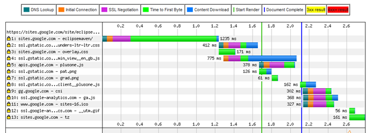
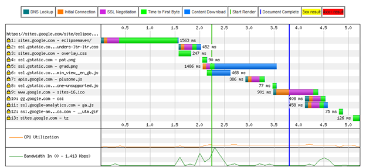
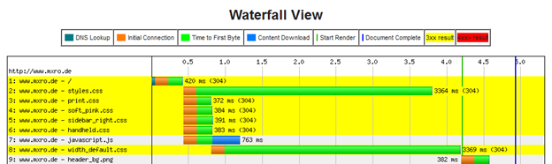

Google offers free web hosting as part of their '[Google Sites](https://sites.google.com/)' service. Anyone with a Google (gmail) account can sign up for a website with an address such as https://sites.google.com/site/\[yoursitename\].

Google sites has some nice features, first and foremost that editing the website can be easily done online. Just click the edit button on your site and you can start. Moreover, although there is a large number of free webhosting providers, it often is doubtful for how long they will continue to host your website.

Google is usually a strong advocator of increasing the speed of the web; offering various tools and services for web content providers to monitor and control their services as well as improve their performance. It is all the more surprising that the **load time of google hosted sites seems not to be very impressive**.

Of course, from New Zealand most web pages appear to be loading with increased latency, but luckily there are a great number of web services available, which help to measure page load time from different locations and systems. I used the service [http://www.webpagetest.org/](http://www.webpagetest.org/) to test the load time of the google sites hosted page [https://sites.google.com/site/eclipsemaven/](https://sites.google.com/site/eclipsemaven/).

Below I have listed a sample from the load time from a location in the US and in Europe. Google sites appear to be hosted in the US, so there is a slightly longer load time from the European locations. However, establishing the initial connection in both cases did not take much time. The most time seemed to be spent rendering the page on google's server (time to first byte). As an advocator of fast page loading time, I would really have thought better of google.

**From US location:**

**From European location:**

(Test were performed on different days at different times)

**Other hosting provider:**

As a comparison, a simple page hosted by a budget web hosting provider in Germany:

Test from US location. In this test, the 'Time to First Byte' is significantly lower. I
