[Github](https://github.com) is an awesome repository to share your source code. Although there are [numerous](http://npascut1.wordpress.com/2011/03/10/eclipseandgit/) [tutorials](http://jeromyanglim.blogspot.co.nz/2010/11/getting-started-with-git-egit-eclipse.html) discussing how to use git and eclipse, I got stuck again today while trying to **upload** an existing eclipse project to git**hub**. This tutorial walks thus through all the steps from signing up for github to uploading an eclipse project to the site!

Please note that the focus of this tutorial is the mere upload of source code and not any of the more sophisticated features git and github offer.

The following steps will be discussed in this tutorial:

1. Sign Up for github
2. Installing EGit
3. Create a DSA Key in Eclipse
4. Register DSA Key with github
5. Create Repository on github
6. Import github Repository into eclipse
7. Link Eclipse Project with github Repository
8. Uploading Project Sources to github

## Step 1: Sign Up for github

That's the easiest part, just go to [https://github.com/](https://github.com/) and register!

## Step 2: Installing EGit

You will need to install the git plugin for eclipse, EGit, in order to upload code from eclipse projects.

- In eclipse, go to Help / Install New Software

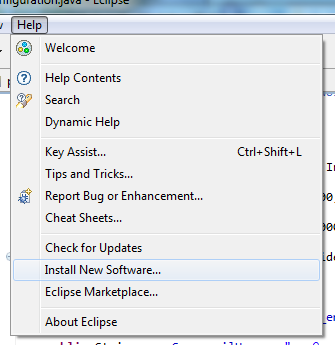

- Open the eclipse Indigo repository

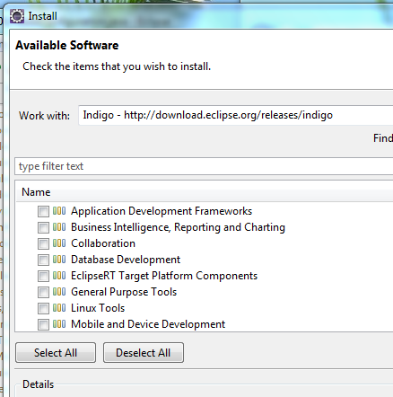

- Select Collaboration / Eclipse EGit

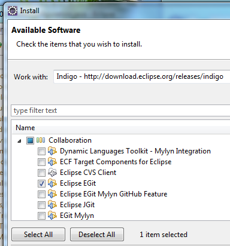

- Click \[Next\]
- JGit should have been selected for you automatically

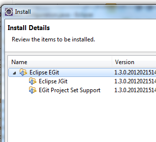

- Click \[Next\] and confirm the licence agreement
- Restart eclipse and the EGit plugin should be installed

## Step 3: Create a DSA Key in Eclipse

In order to be able to upload source code to github, you need to define a secure key, which must be known both to your local eclipse installation as well as the github service. Luckily, eclipse provides all the tooling necessary to generate the appropriate key.

- Open Menu Window / Preferences
- In the preferences, go to General / Network Connections / SSH2
- On the SSH2 page, open the tab 'Key Management'

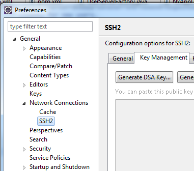

- Click on \[Generate DSA Key …\]
- At the bottom of the page, enter a passphrase of your choosing

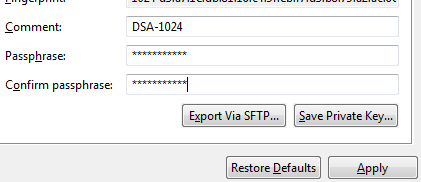

- Click \[Save Private Key …\] (what's going on with these three dots in the button captions … strange)
- Save the key at a location of your choosing (best in the location specified as your SSH2 home on under the tab General)

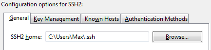

## Step 4: Register DSA Key with github

- Open the file you have saved in the previous step with a text editor (e.g. Notepad on windows)
- Select the contents of the file (Ctrl + A) and copy the complete text
- Go to the github website ([https://github.com](https://github.com)) and login
- On the top right of the screen, click on 'Account Settings'

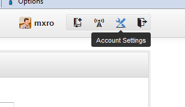

- On the left hand side of the account settings, click on 'SSH Keys'

- Click on \[Add SSH key\]
- Provide an appropriate title for your key (e.g. 'EGit 1' ?)
- Paste the contents from the text file containing your DSA key into the text box 'Key'

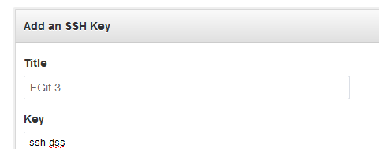

- Click \[Add Key\] at the bottom of the form

## Step 5: Create Repository on github

In order to upload source code from a project in eclipse to github, you will need to create a github repository.

- Go to github homepage ([https://github.com/](https://github.com/)) and log in
- At the top right corner, click on 'Create a New Repo'

- Chose a repository name and description to your liking and click \[Create Repository\]

## Step 6: Import github Repository into eclipse

Before you can link an existing eclipse project to a github repository, you must import the repository you have created on github first. For this:

- In eclipse, open Menu / Window / Show View / Other …

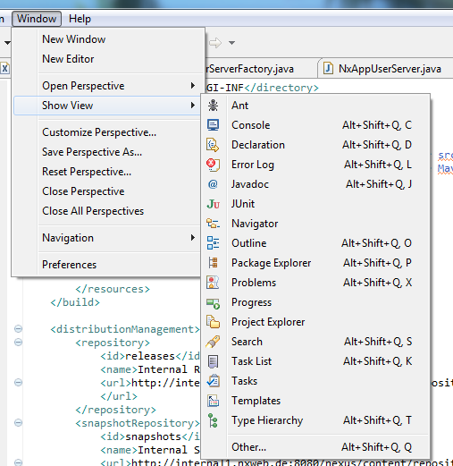

- Select Git / Git Repositories and click \[Ok\]

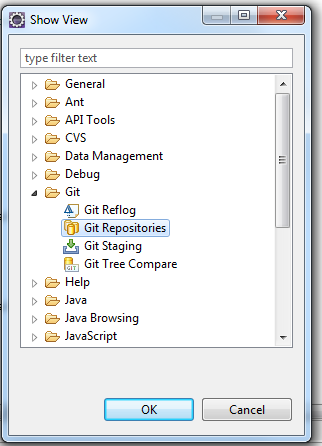

- You might see a warning message such as the one show below (even setting the environment variable did not help me to get rid of the message, but everything seems to be working okay) – you can confirm with \[Ok\]

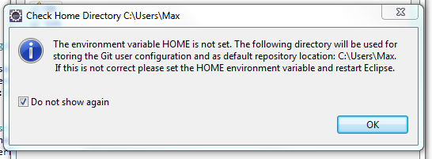

- You should have a new view 'Git Repositories now'
- Click on 'Clone a Git repository' within the new view

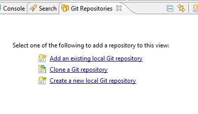

- Now go back to [https://github.com](https://github.com) and to your newly created github repository
- Under your repository description, you can get the URI for your project. Copy the text starting with 'git@' (make sure that SSH is selected)

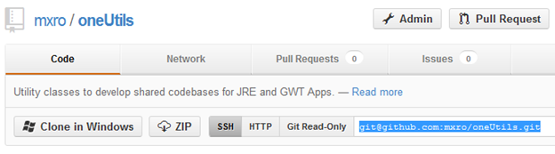

- Go back to eclipse. You can paste the URI you have just copied into the field 'URI'
- Further select as Protocol 'ssh'
- Click \[Finish\]

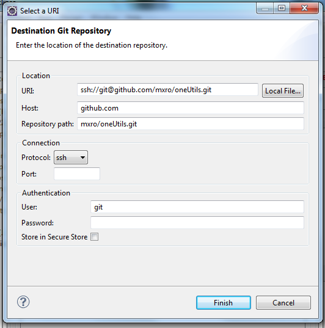

- If asked to select a branch, select the 'master' branch

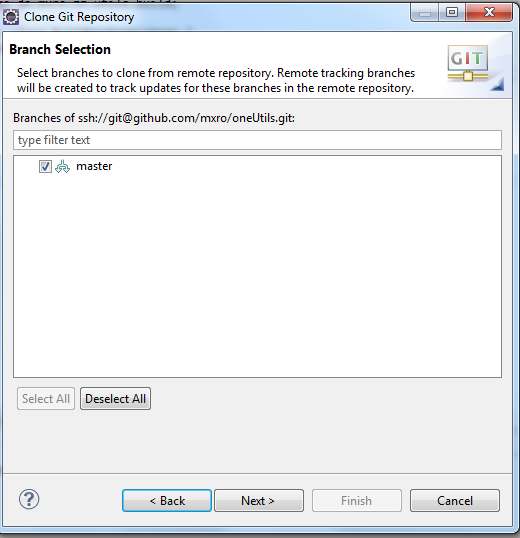

Git (in difference to subversion) allows storing a full blown repository on your local machine rather than just a local copy of the files. This requires to store all source you want to synchronize with git at least **twice** on your local machine: one copy will be stored in the clone of the remote git repository and another one will be stored in your eclipse project.

Hence, when you close the git repository from github, you should define a repository location, which lies outside the eclipse project you want to upload:

- Select one such location and click \[Finish\]

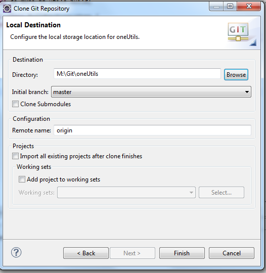

- Now you should have one 'Git Repository'

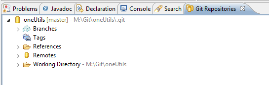

## Step 7: Link Eclipse Project with github Repository

After you have created a local clone of the repository from github, you can link the eclipse project you would like to upload to this local repository.

- Right click your eclipse project and select Team / Share Project …
- Select 'Git' as Repository Type

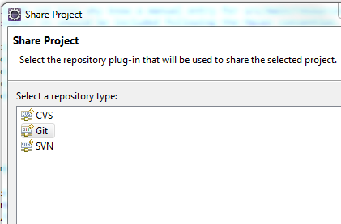

- Select under 'Repository' the repository you have cloned in the previous step and click \[Finish\]

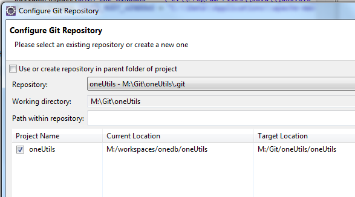

## Step 8: Uploading Project Sources to github

After you have linked your project with the local clone of the github repository, you can 'Commit' all the source files in your existing project to this repository. After you have committed the files to your local repository, you can 'Push' them to the github repository.

- Right click your project and select Team / Commit … from the popup menu

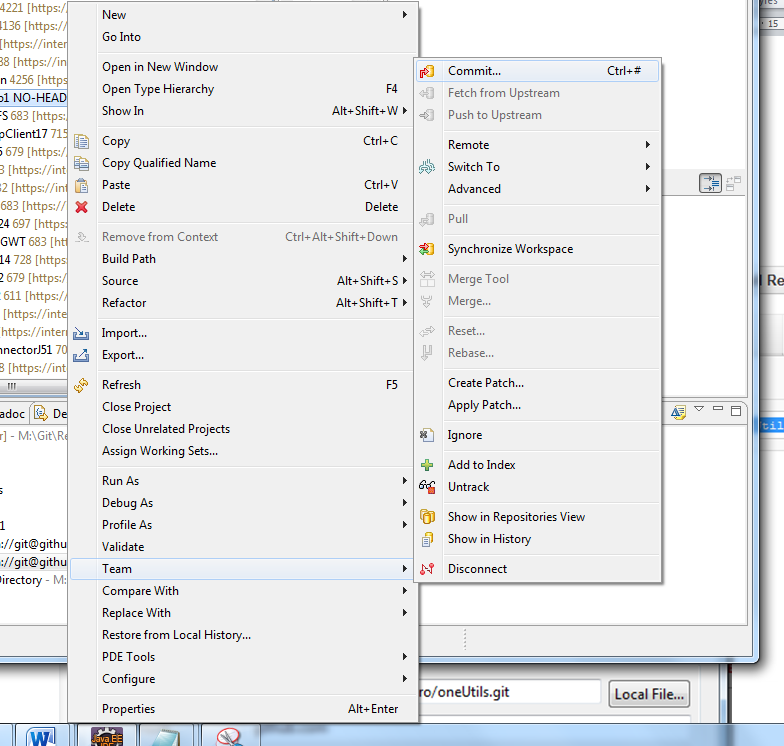

- Write a beautiful commit message and click \[Commit\]

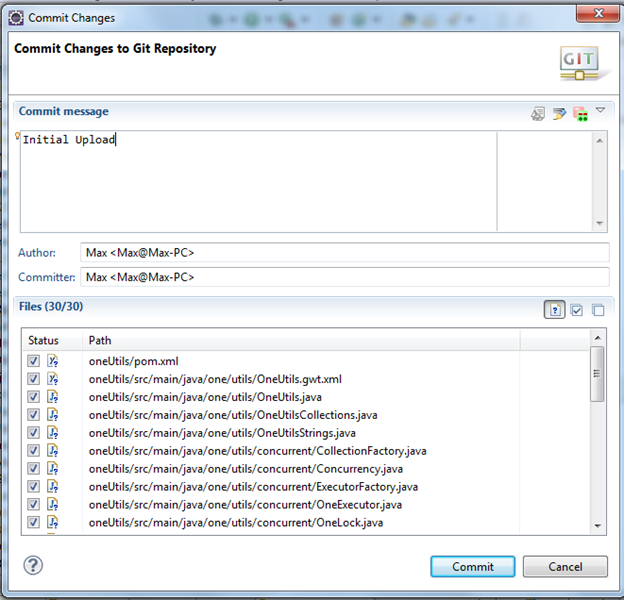

- In the 'Git Repositories' view, open <your repository> / Remotes / origin
- Right click on the second icon (with the red arrow) and select 'Push'

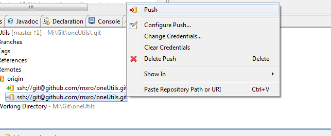

- You should receive the results of the push, click \[Ok\] to confirm

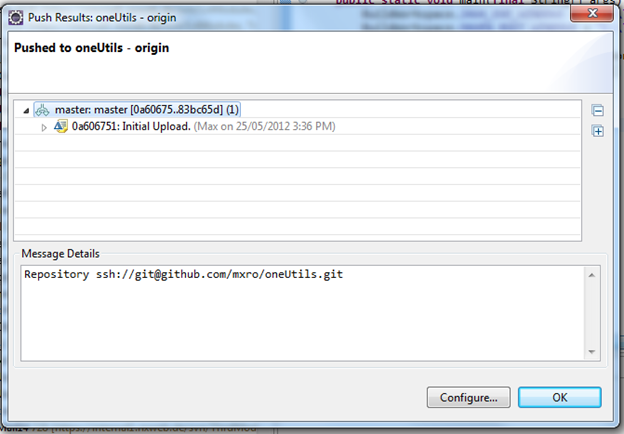

- You can now go to github and your project sources should be displayed in your repository:

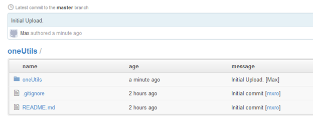

(hmm, did it really took 2 hrs to get this done …)

## References

[Git with Eclipse (EGit) - Tutorial (vogolla.com)](http://www.vogella.com/articles/EGit/article.html)

[Getting Started with Git, EGit, Eclipse, and GitHub: Version Control for R Projects](http://jeromyanglim.blogspot.co.nz/2010/11/getting-started-with-git-egit-eclipse.html)

[git push rejected](http://stackoverflow.com/questions/620253/git-push-rejected) (stackoverflow.com)

[A Short Tutorial on Eclipse/EGit/GitHub](http://npascut1.wordpress.com/2011/03/10/eclipseandgit/)

[Tutorial: Using the EGit Eclipse Plugin with GitHub](http://loianegroner.com/2009/11/tutorial-using-the-egit-eclipse-plugin-with-github/)
