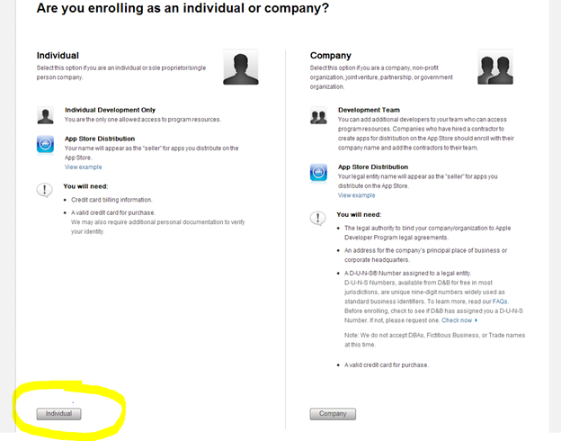
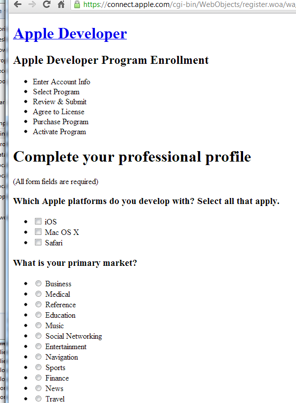
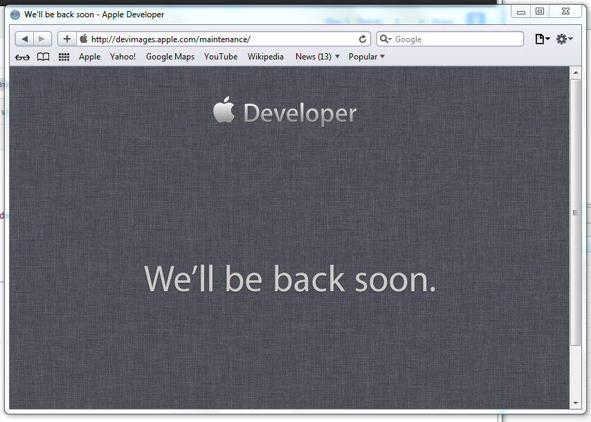
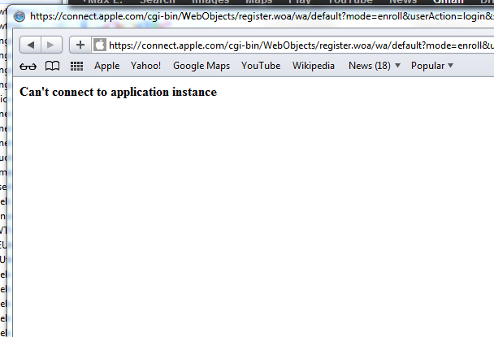

## Problem

You would like to become an esteemed member of [Apple's Developer Program](https://developer.apple.com/enroll/selectEnrollmentType.php?t=cm) but you dare to do so from a machine running Microsoft Windows using Internet Explorer or Google Chrome.

After you click on either \[Individual\] or \[Company\] as shown below …

… you are greeted with an broken web page such as:

## Solution

As I was told by the Apple support (with an amazing response time of 1 day!), you can **only sign up using Apple's Safari Browser**.

So [download the Safari browser for Windows](http://support.apple.com/kb/DL1531) and do the sign up there!

## Possible Obstacles

Even using the Safari browser, I encountered a number of problems such as:

**We'll be back soon.**

Or **Can't connect to application instance**.

If this happens, don't despair! Just try again later. Eventually, the planets will have the right constellation and the registration process will work!
