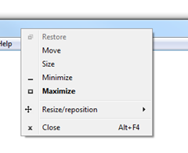
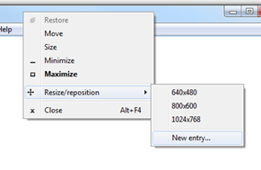
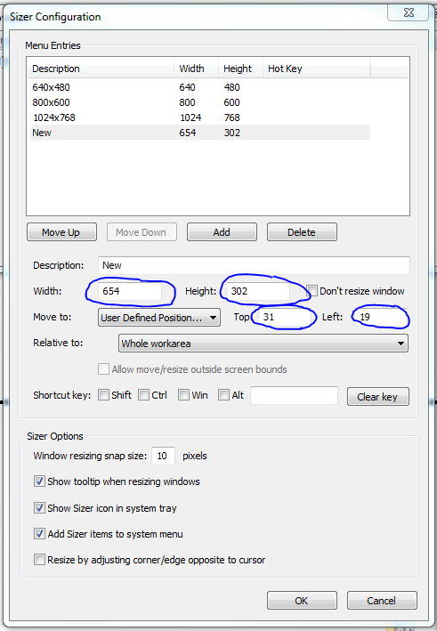

## Problem

You would like to know the exact pixel **position** and **size** of a window in Microsoft Windows.

## Solution

Use the very useful utility [Sizer](http://www.brianapps.net/sizer/). You can download it for free from the page below:

[http://www.brianapps.net/sizer/](http://www.brianapps.net/sizer/)

I downloaded the portable version (download the Zip Package).

Launch sizer.exe from the extracted zip package.

Then right click the title bar of the window of which you would like to know the position and size.

Select the option Resize/reposition from the context menu. Select 'New entry …'

Now, you can see the width and height as well as the top and left offset for your window:

