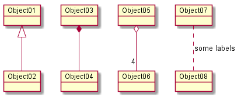

I've always had a soft spot for diagrams. I think that representing information in various visual ways tremendously helps our thinking and understanding. Unfortunately it is often a big headache to create (and maintain) diagrams.

So I was very pleased today when I came across [PlantUML](http://plantuml.com/). PlantUML is a Java library and web service which renders UML diagrams from text input. Take the following text definition for example:

```


@startuml
object Object01
object Object02
object Object03
object Object04
object Object05
object Object06
object Object07
object Object08

Object01 <|-- Object02
Object03 *-- Object04
Object05 o-- "4" Object06
Object07 .. Object08 : some labels
@enduml

```

This will be rendered into the following diagram:



PlantUML does not just support object diagrams but also many other types of diagrams. There is another service, called [WebSequenceDiagrams](https://www.websequencediagrams.com/) which focusses on only sequence diagrams (and is not open source) but can be useful if more visually pleasing sequence diagrams are required,
