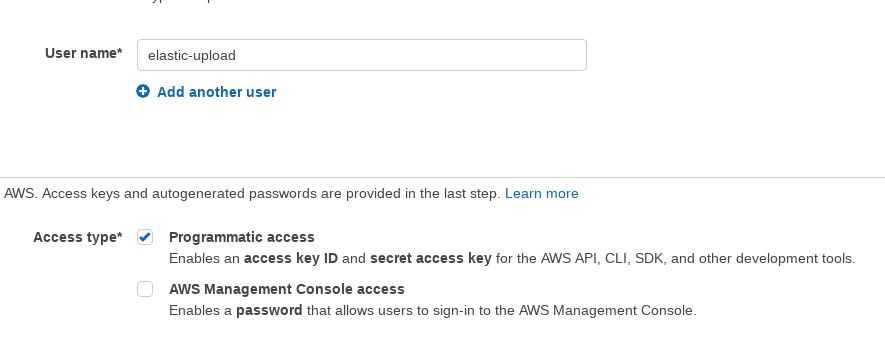
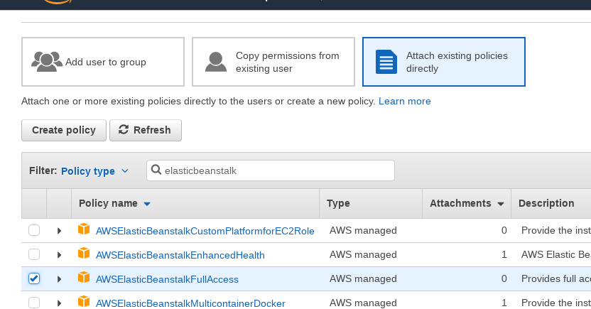
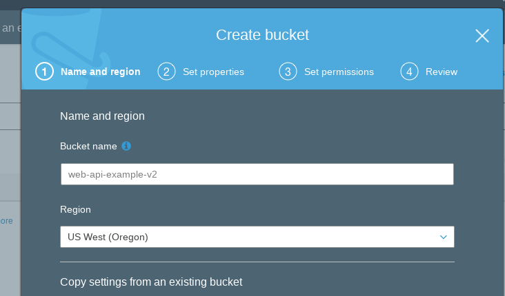

[AWS Elastic Beanstalk](https://aws.amazon.com/elasticbeanstalk/) is well established service of the AWS cloud and can be used as a powerful platform to deploy applications in various languages. In this short tutorial, I will outline how to conveniently deploy a Tomcat application to AWS Elastic Beanstalk using the [beanstalk-maven-plugin.](http://beanstalker.ingenieux.com.br/beanstalk-maven-plugin)

The following assumes that you already have a project which is configured to be deployed as WAR and provides a valid web.xml to start answering requests. If you are unsure of how to set this up, please have a look at the example project [web-api-example-v2](https://github.com/mxro/web-api-example-v2) (on GitHub).

### Step 1: Create IAM User

- Create a new user on IAM user AWS for programmatic access

- For Permissions, select 'Attach existing policies directly' and add the following policy

- Save the access key and secret key

### Step 2: Add Server to Local Maven Configuration

- Add the following declaration in the element in your $HOME/.m2/settings.xml and provide the access key and secret key for the the user you've just created

\[code language='xml'\]

<server> <id>aws.amazon.com</id> <username>\[aws access key\]</username> <password>\[aws secret key\]</password> </server>

\[/code\]

### Step 3: Add Beanstalk Maven Plugin

- Add the [beanstalk-maven-plugin](http://beanstalker.ingenieux.com.br/beanstalk-maven-plugin) to your project pom.xml

\[code language='xml'\]

<plugin> <groupId>br.com.ingenieux</groupId> <artifactId>beanstalk-maven-plugin</artifactId> <version>1.5.0</version> </plugin>

\[/code\]

- Test your security credentials and connection to AWS

\[code\]

mvn beanstalk:check-availability -Dbeanstalk.cnamePrefix=test-war

\[/code\]

### Step 4: Create S3 Bucket for Application

- Create a new S3 bucket with a name of your choice (e.g. the name of your application)

### Step 5: Update Plugin Configuration

- Provide the following configuration for the beanstalk-maven-plugin

\[code language='xml'\] <plugin> <groupId>br.com.ingenieux</groupId> <artifactId>beanstalk-maven-plugin</artifactId> <version>1.5.0</version> <configuration> <applicationName>\[Provide your application name\]</applicationName> <!-- Path of the deployed application: cnamePrefix.us-east-1.elasticbeanstalk.com --> <cnamePrefix>${project.artifactId}</cnamePrefix> <environmentName>devenv</environmentName> <environmentRef>devenv</environmentRef> <solutionStack>64bit Amazon Linux 2015.03 v1.4.5 running Tomcat 8 Java 8</solutionStack>

<!-- Bucket name here equal to artifactId - but this is not guaranteed      to be available, so therefore the bucket name is given statically --> <s3Bucket>\[Provide your S3 bucket name\]</s3Bucket> <s3Key>${project.artifactId}/${project.build.finalName}-${maven.build.timestamp}.war</s3Key> <versionLabel>${project.version}</versionLabel> </configuration> </plugin> \[/code\]

### Step 6: Deploy project

- Run the following to upload the project to the S3 bucket:

\[code\] mvn beanstalk:upload-source-bundle \[/code\]

- If this succeeds, deploy the application

\[code\]

mvn beanstalk:upload-source-bundle beanstalk:create-application-version beanstalk:create-environment

\[/code\]

Your application should now be deployed to Elastic Beanstalk. It will be available under

\[code\]

cname.us-east-1.elasticbeanstalk.com

\[/code\]

Where cname is the cname you have specified in step 5

### Good To Know

- To find out, which solution stacks are available (to define the solutionStack environment variable), simply run

\[code\]

mvn beanstalk:list-stacks

\[/code\]

### References

- [Spring Boot AWS Elastic Beanstalk example](https://exampledriven.wordpress.com/2017/01/09/spring-boot-aws-elastic-beanstalk-example/)
- [AWS Elastic Beanstalk / API Reference / Actions](https://docs.aws.amazon.com/elasticbeanstalk/latest/api/API_Operations.html)
