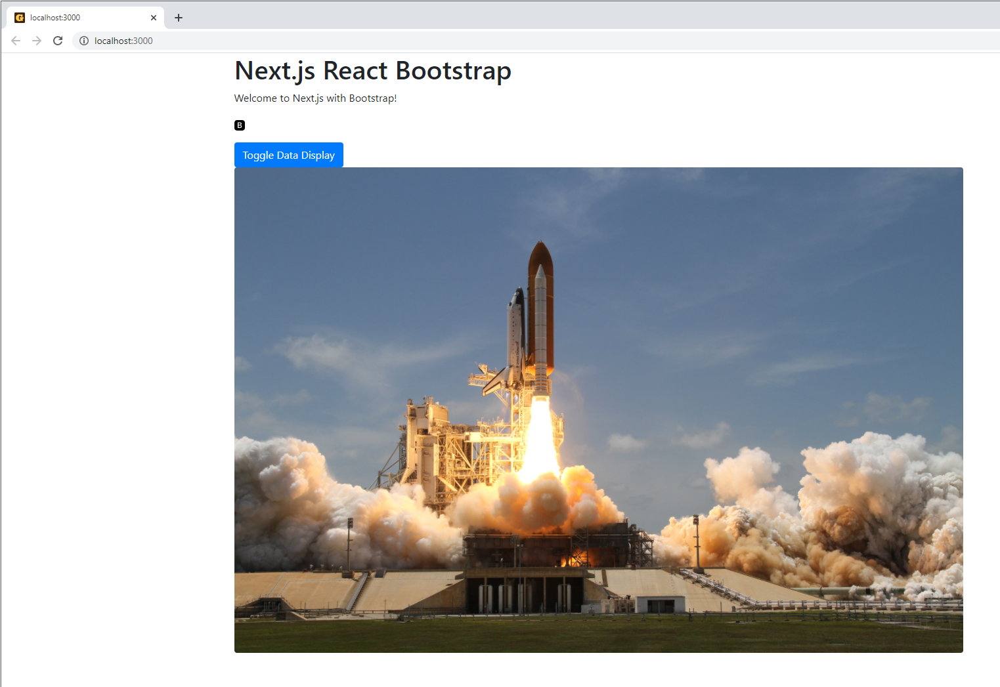

I has been nearly two years since I first wrote about a [Next.js + Bootstrap starter project](https://maxrohde.com/2020/03/06/next-js-with-bootstrap-getting-started/) on this blog. Since then I have been extending the base template and made it easier to configure and use. It is now available as one of the templates on [Goldstack](https://goldstack.party): [Next.js + Bootstrap Template](https://goldstack.party/templates/nextjs-bootstrap).

While I think using the starter project builder is a great way to launch a new project, it can sometimes be useful to see the source code of a working project; either to clone the whole project to adapt it to your needs, or just to copy and paste the parts you need (commonly known as boilerplate, see for instance [Next.js boilerplate](https://dev.to/joeygoksu/the-ultimate-collection-of-production-ready-nestjs-boilerplate-2d4h), [GraphQL boilerplate](https://dev.to/tuanlc/graphql-clean-architectire-boilerplate-hog) and [React Native boilerplate](https://dev.to/joeygoksu/the-ultimate-react-native-boilerplate-with-typescript-3778)).

Thus, I have created a [**Next.js + Bootstrap boilerplate**](https://github.com/goldstack/nextjs-bootstrap-boilerplate) project on GitHub. This project is automatically generated from the base Goldstack template, so when the template is updated, the boilerplate will automatically be updated as well.


See the project on GitHub here:

[github.com/goldstack/nextjs-bootstrap-boilerplate](https://github.com/goldstack/nextjs-bootstrap-boilerplate).

* * *

## Local Development

To get the boilerplate up and running for local development, we only need to follow a few simple steps.

First clone the repository:

```
git clone git@github.com:goldstack/nextjs-bootstrap-boilerplate.git
```

Then install the dependencies and build the project:

```
yarn
yarn build
```

Then you can start a local development server that will serve the [Next.js](https://nextjs.org/) project:

```
cd packages/app-nextjs-bootstrap-1
yarn watch
```



* * *

## Bootstrap Configuration

The Bootstrap files are included in the folder [`packages/app-nextjs-bootstrap-1/src/styles`](https://github.com/goldstack/nextjs-bootstrap-boilerplate/tree/master/packages/app-nextjs-bootstrap-1/src/styles). The file `app.css` contains the CSS for all bootstrap components compiled from the Bootstrap source.

The package `packages/app-nextjs-bootstrap-1` contains a script [`compile:sass`](https://github.com/goldstack/nextjs-bootstrap-boilerplate/blob/master/packages/app-nextjs-bootstrap-1/package.json#L13) that will update `app.css` in case any changes are made to the Bootstrap source using [`node-sass`](https://www.npmjs.com/package/node-sass).

The Bootstrap styles are made available for the Next.js application by modifying [the application component](https://nextjs.org/docs/advanced-features/custom-app) in [`_app.tsx`](https://github.com/goldstack/nextjs-bootstrap-boilerplate/blob/master/packages/app-nextjs-bootstrap-1/src/pages/_app.tsx#L4). Here we simply import the compiled `app.css` file.

```typescript
/* eslint-disable react/prop-types */
import React from 'react';

import './../styles/app.css';

const BootstrapApp = ({ Component, pageProps }): JSX.Element =&gt; {
  process.env.GOLDSTACK_DEPLOYMENT =
    process.env.NEXT_PUBLIC_GOLDSTACK_DEPLOYMENT;
  return ;
};

export default BootstrapApp;
```

The boilerplate includes the [react-bootstrap](https://dev.to/marioarranzr/getting-started-with-react-bootstrap-5amc) library, which makes it easy to create components using Bootstrap styling. Bootstrap components can be imported as follows:

```typescript
import Container from 'react-bootstrap/Container';
import Row from 'react-bootstrap/Row';
import Col from 'react-bootstrap/Col';
import Button from 'react-bootstrap/Button';
import Image from 'react-bootstrap/Image';
```

* * *

## Infrastructure and Deployment

The boilerplate comes with [Terraform](https://www.terraform.io/) definitions for setting up the infrastructure for the project on AWS and scripts for deployment. This infrastructure is completely [Serverless](https://dev.to/ematipico/going-completely-serverless-with-nextjs-and-terraform-43b2) and thus can be hosted at very low cost, and will scale easily to different levels of usage. For a moderate-traffic site, the infrastructure costs should lie below US$1.00 a month.

The Terraform can easily be adjusted to your needs. Simply modify any of the files in [packages/app-nextjs-bootstrap-1/infra/aws](https://github.com/goldstack/nextjs-bootstrap-boilerplate/tree/master/packages/app-nextjs-bootstrap-1/infra/aws).

In order to set up the infrastructure for your project, you will need to adjust the project configuration: [goldstack.json](https://github.com/goldstack/nextjs-bootstrap-boilerplate/blob/master/packages/app-nextjs-bootstrap-1/goldstack.json):

```json
{
  "$schema": "./schemas/package.schema.json",
  "name": "app-nextjs-bootstrap-1",
  "template": "app-nextjs-bootstrap",
  "templateVersion": "0.1.0",
  "configuration": {},
  "deployments": [
    {
      "name": "prod",
      "awsUser": "goldstack-dev",
      "awsRegion": "us-west-2",
      "configuration": {
        "hostedZoneDomain": "dev.goldstack.party",
        "websiteDomain": "nextjsbootstrap-1646549479572.tests.dev.goldstack.party",
        "defaultCacheDuration": 10
      },
      "tfStateKey": "app-nextjs-bootstrap-1-prod-ef2ea3a3ceb56c2d4c87.tfstate"
    }
  ]
}
```

Key here are the properties `deployments[0].configuration.hostedZoneDomain` and `deployments[0].configuration.websiteDomain`. If you don't know how to determine the hosted zone for your application, check out [Hosted Zone Configuration on the Goldstack documentation](https://docs.goldstack.party/docs/goldstack/configuration#hosted-zone-configuration). `websiteDomain` is simply the domain you would like to deploy your application to.

Lastly, you will need to configure your local environment to point to the correct AWS account. For detailed instructions on how to do this, see the Goldstack documentation on [AWS Configuration](https://docs.goldstack.party/docs/goldstack/configuration#aws-configuration).

Once you have everything configured, standing up your infrastructure is as easy as running:

```
cd packages/app-nextjs-bootstrap-1
yarn infra up prod
```

Lastly you can deploy your application with:

```
yarn deploy prod
```

[Bootstrap](https://getbootstrap.com/) has been around for a while but certainly [remains popular](https://dev.to/rsnazario/bootstrap-a-quick-guide-to-beginners-avoid-hating-it-7ok) and is used in combination with many frameworks such as [Rails](https://dev.to/amree/rails-6-with-bootstrap-webpacker-for-js-asset-pipeline-for-css-2lmn), [Vue](https://dev.to/bnevilleoneill/getting-started-with-bootstrapvue-5364) and [React](https://dev.to/dikadj/how-to-use-react-with-bootstrap-4cn7).

It is not that difficult to [use Bootstrap with Next.js](https://medium.com/nextjs/how-to-add-bootstrap-in-next-js-de997371fd9c) and the combining them enables [building feature-rich project quickly](https://dev.to/duomly/build-an-instagram-clone-with-react-js-next-js-and-bootstrap5-in-35-mins-33n1).

This boilerplate helps you get set up and started very quickly. Apart from configuration Bootstrap for Next.js it also contains all the quality of life features we expect from contemporary JavaScript projects: it's optimised to work with VSCode, uses TypeScript and unit testing with Jest. To see a full list of features, check out the [Next.js + Bootstrap template](https://goldstack.party/templates/nextjs-bootstrap) on Goldstack that this boilerplate inherits all features from.

If you have any comments or ideas for this template, please head over to the [Goldstack GitHub project](https://github.com/goldstack/goldstack#readme) and [raise an issue](https://github.com/goldstack/goldstack/issues).

* * *

Cover picture from [Unsplash](https://unsplash.com/photos/DsQU3n5o3Sg), icons from [Flat](https://www.flaticon.com/premium-icon/robotic-arm_3273644?term=robot&page=1&position=7&page=1&position=7&related_id=3273644&origin=search) [Icon](https://www.flaticon.com/free-icon/boiler_1683010?term=boiler&related_id=1683010)
