Here are some more pictures!  
  

[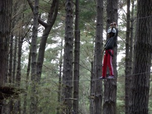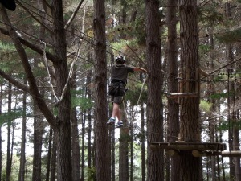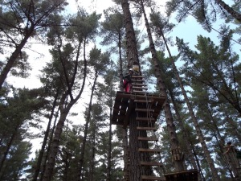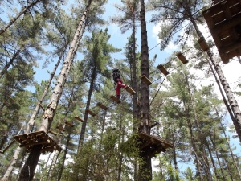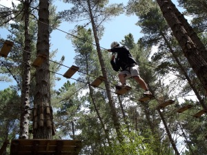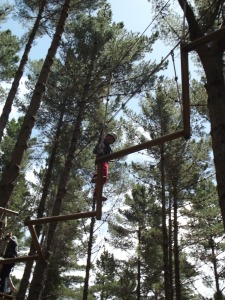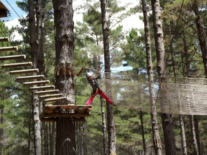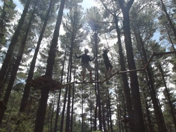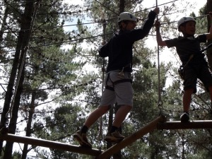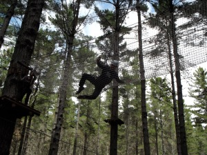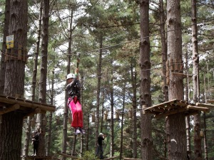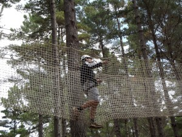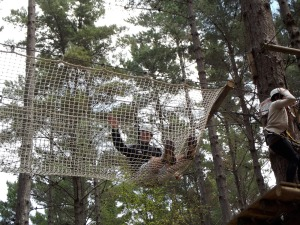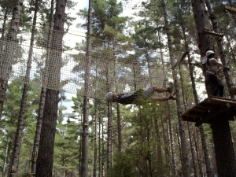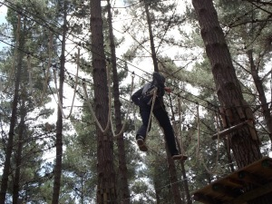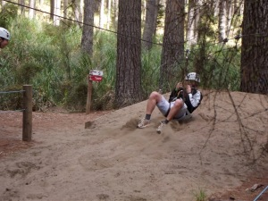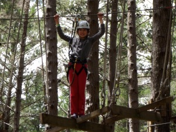](https://shalveena.files.wordpress.com/2012/11/7468c-dscf2499.jpg)...While for the adults, it was a slightly different story  
Slightly half way through, I actually told Max that I could not do it; I want to go down and I can't move my foot. Why? Because I'm too scared! Simply that.  
  
Then someone behind me said "The quickest way down is across". And this was so true. From this situation, I learnt how it feels when you're faced by something extremely challenging and scary but the only way past is to face your fear and continue through to the end. And somehow, in that moment, we find that we actually have more courage that we give ourselves credit for. Its as if we have this reserve of strength and courage that we call on in that moment and somehow, eventually (and in my case one slow step at at time) we get through and reach that safe haven at the other end.  
  
If this does not build confidence, what does? It definitely gave me confidence and after facing this evil obstacle I felt that I could face the ones in the next course without great difficulty (and with much more courage).  
  
All in all, it was a fun and challenging experience; and I'm happy to have done it.
