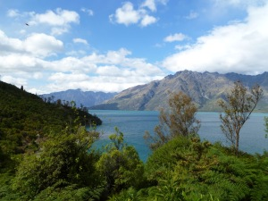

**Date of travel: March, 2011**

**Travel companions: Max, Manni, Beeke, Ingrid and me**

**Duration: less than 1 week**

**I must admit, this post has been a long time coming. The sheer number of photographs, and the beauty captured in each one, has made the task of condensing it into a few posts amazingly difficult! But here goes...**

 

**Thinking of Queenstown reminds me of the movie Main Prem Ki Diwani Hoon, which was set in the fictional town of “Sundarnagar” (translates roughly to: beautiful town). The setting of the movie was indeed beautiful: mountains looming in the background, snow, beautiful and natural scenery; and it was shot right here, mainly in the South Island. The line “heaven falls here” perfectly captures my experience of Queenstown and the surrounding area.**

[**We went to Queenstown during March so it was late summer. We also had a trip planned to Fiji immediately after spending a few days in Queenstown. So in all my wisdom, I tried to pack mostly summer clothes and reduce the amount of baggage we had to take with us. Little did I know that ‘summer’ on the South Island of New Zealand still means cold for those like me, coming from the tropics. That said, we were lucky to have beautiful weather while in Queenstown, with clear blue skies (mostly) but it was cold nonetheless.** **We booked accomodation at**](https://shalveena.files.wordpress.com/2013/01/03525-p1020068.jpg) **[Distinction Queenstown Nugget Point Hotel](http://www.nuggetpoint.co.nz/distinction-hotels-queenstown-nugget-point-boutique-hotel-spa/welcome-to-distinction-queenstown_idl=2_idt=3828_id=22069_.html), which has Queenstown’s Shotover River flowing just behind it and overlooks majestic moutains. Our room had a patio and the view from there was serene and calming. The hotel was a bit of a distance from the centre but it was worth the peace and serenity :)**

 

 

**Some of the highlights of the trip for me were (in no particular order):

The Spa**

**The spa looked out over the mountains, trees and river. The side looking out was open and the view was stunning. Warm water, beautiful scenery and wonderful people made this experience one to remember!** **Skyline [Gondola](http://www.skyline.co.nz/queenstown/gondola/) and [Luge](http://www.skyline.co.nz/queenstown/luge/)**

 **I had never before heard of what a luge is so as one may imagine, I did not want to have to ride one. I mean, after all, this is me who cannot even ride a bike. So, I thought that riding up the Gondola to the Luge will be the easier part - after all, you just sit in the little box and it takes you up. Not entirely true. The gondola ride was steep! As I have just now read, it is apparently the steepest cable car lift in the southern hemisphere. But the view, once again, was stunning! PS, I vaguely remember there being sheep at the bottom as we were going up (but maybe that is totally credited to my imagination).**  **As for the luge, well, I really should learn not to worry so much about trying new things. It was awesome :) I did not crash, I did not go over any ledges and I had fun!**

 

 

 

 

**Here is a picture of us going back up for another round...**

