Max and I cook quite a bit at home, and eat out very seldom. When we cook, we tend to become more aware of what goes on our plate and into our bodies. And we therefore start to eat healthier too. Plus, cooking at home tends to be more healthy as we use less oil and no additives and all the bad things :)  
  
But these days, I sometimes wonder if cooking is a dying art. I certainly home not!  
  
Unfortunately, I have not been able to chronicle much of my cooking adventures, but here is a start:  
  
This was our dinner tonight, yummy! I tend to cook more by taste, and generally use ingredients that are available in the house. So please, if there are any ingredients listed in this recipe, which you don't have (or maybe don't like) feel free to substitute it :) And if there is too much or too little of some ingredient, please change it as you feel - make the recipe your own, experience with it and have fun!  
  
**The Ingredients**  
  
Half of a large onion, sliced  
  

[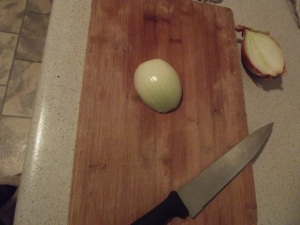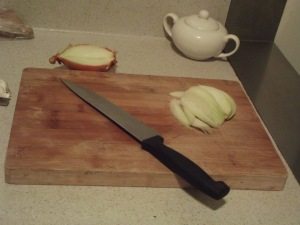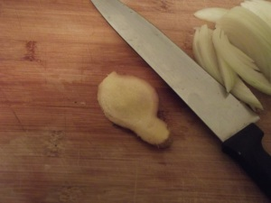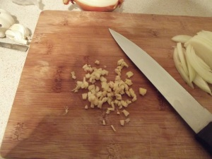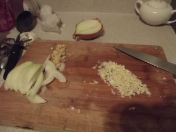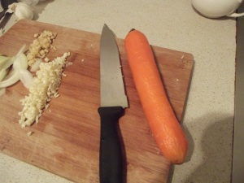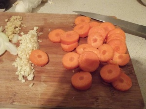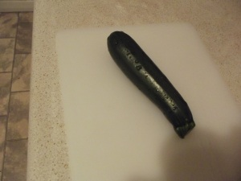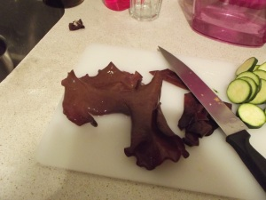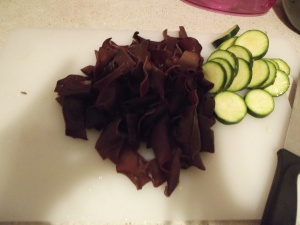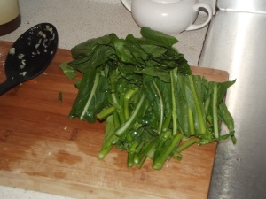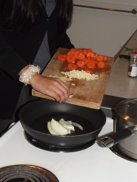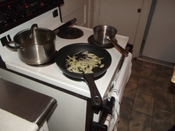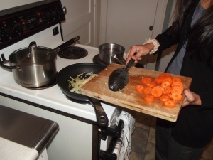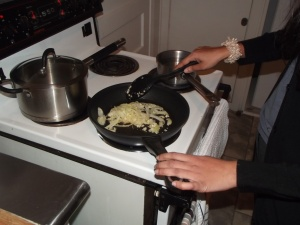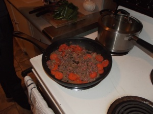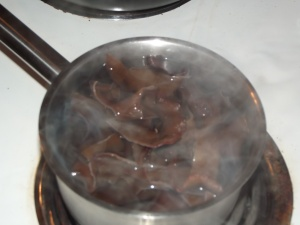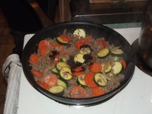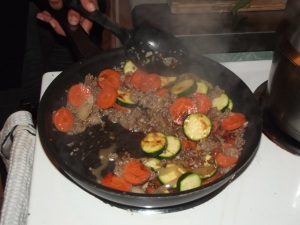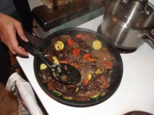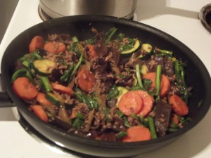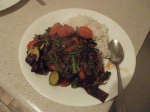](https://shalveena.files.wordpress.com/2013/08/1a214-dscf5594.jpg)My portion
