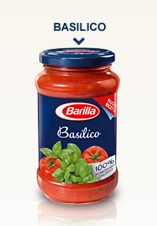
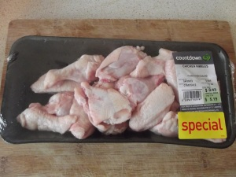
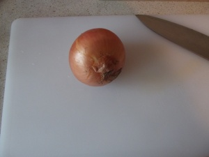
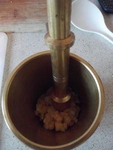
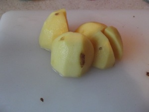
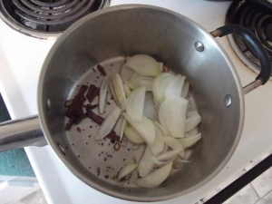
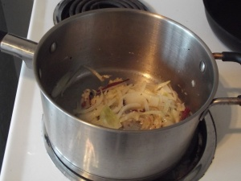
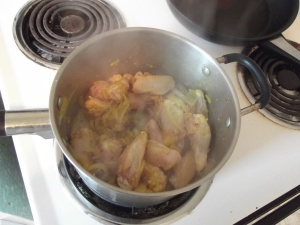
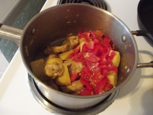

I grew up in Fiji, where it is common for girls to learn cooking from a young age. My young cousins and relatives often helped in the kitchen and their parents often thought this is an essential for their young daughters to have. Somehow, this seemed to have completed passed by my parents. They did not believe their daughter should be in the kitchen cooking. Instead, I was encouraged to study, get an education and be career minded. This idea that housework is somehow not as important and the we often view home-makers as "less than thou" is best left for another post. Suffice it to say, I was _envious_ of my friends and relatives who were free to help in the kitchen, learn to make "round rotis" while I was told to bury my head in books.  

  

Sometimes, while my parents cooked I would steal a bit of flour and make a miniature basket and then fill it with flour eggs. Then I would go around offering eggs to those in the kitchen. Or, my favourite was pretending that the kitchen was a family restaurant and we all worked there. And I would be the one taking orders and going around supervising the cooking. Of course, my parents were unknowing participants in this imaginary scenario.

  

So, when I eventually moved out of home, I was faced with the challenge of cooking for myself and this amazing guy who had placed immense trust in my ability to cook. Needless to say, I had never cooked in my life before this. Maybe a fried egg here, or a sandwich there but nothing more than that. 

  

We started off with bottled pasta sauces, to which I would add some spices and herbs and occasionally some tuna. PS, we have tried many different pastas and pasta sauces, and I must admit we still occasionally have this as a quick and easy meal. Our favourite is the Barilla range:

  

  

  

The first time I tried to make chicken curry at our apartment, my brother was visiting from Hamilton and we wanted to have a taste of home. What a disaster that was! I tried to make it like I remembered Mum cooking it but the sauce did not come together well, there was not enough flavour, the meat was dry and definitely not like home. I had to call Mum in the middle of the night, while the curry was still on the stove, asking for advice about how to save the dish and bring some flavour into it! To which my Mum most graciously replied with various tricks and tips.

  

But I did not give up so easily. And I discovered that my cooking improved dramatically over time. I **love** cooking, and could probably do it all day long. Now, my curries come together perfectly (most of the time) and tastes just like home, with my very own twists and touches. 

  

I have not made Indian food in some time. Partly because it takes so long and partly because Max just loves pasta so much hehehe. But last night, I made my best chicken curry yet. It was just right, spicy, flavourful and soulful.

  

  

I hope you have the chance to try this recipe, and make it your own :)

  

**Ingredients**

Approximately 600 g chicken nibbles, or other pieces. I took out all the fatty skin bits - just left some skin on for flavour.

  

