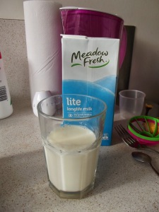
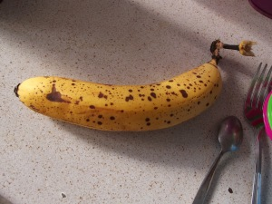
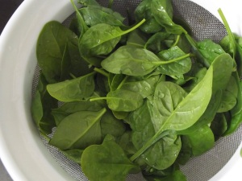
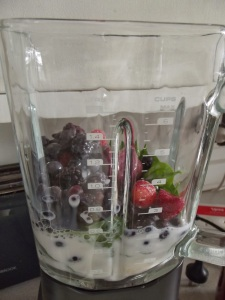

This morning, I made my first ever green smoothie! Okay, so it was not exactly green - more like a dark purple but it did have some green in it :) I was a bit skeptical about how raw greens might taste in a smoothie so this was a beginner's version, with mostly fruits in it.  
  
Here is the recipe for beginner's green smoothie:  
  
1\. One ripe banana  
2\. One cup frozen berries  
3\. One cup of milk (you can use almond, soy or rice milk but I just used ordinary cow's milk)  
4\. As much baby spinach as you dare (I put in approx 60g).  
  
Put all ingredients in a blender and blend away! Serves 1 huge glass or 2 smaller ones  
  
PS, I put the liquid in the bottom and the frozen berries right at the top.  
  

<table align="center" cellpadding="0" cellspacing="0" class="tr-caption-container" style="margin-left:auto;margin-right:auto;text-align:center;"><tbody><tr><td style="text-align:center;"></td></tr><tr><td class="tr-caption" style="text-align:center;">The finished product :D</td></tr></tbody></table>
