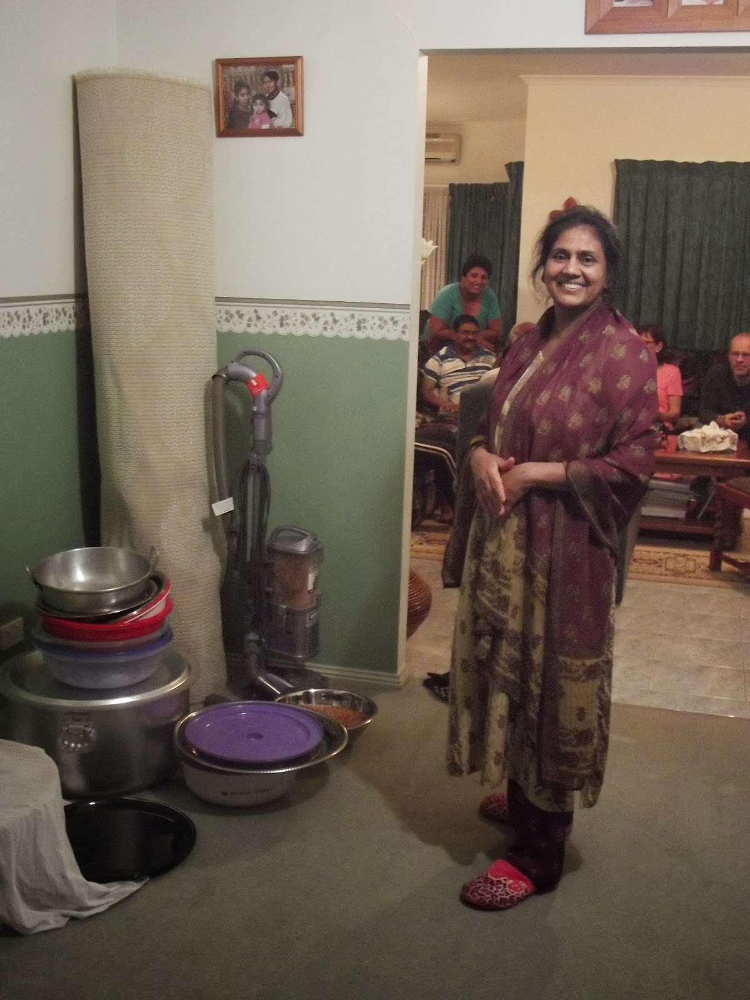
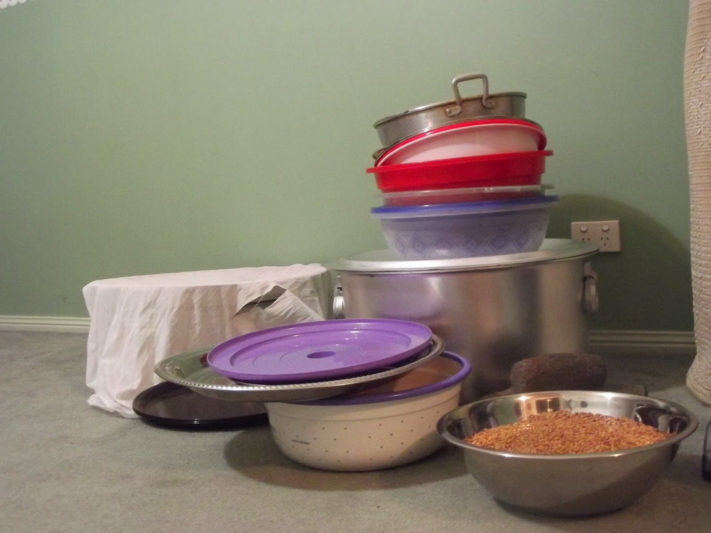
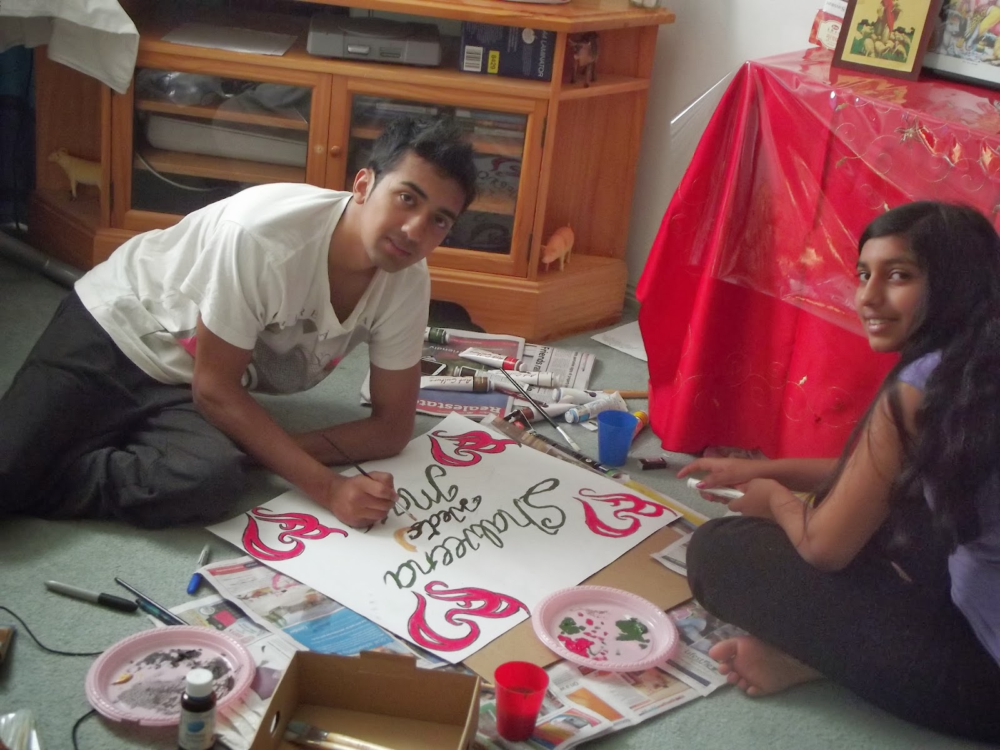
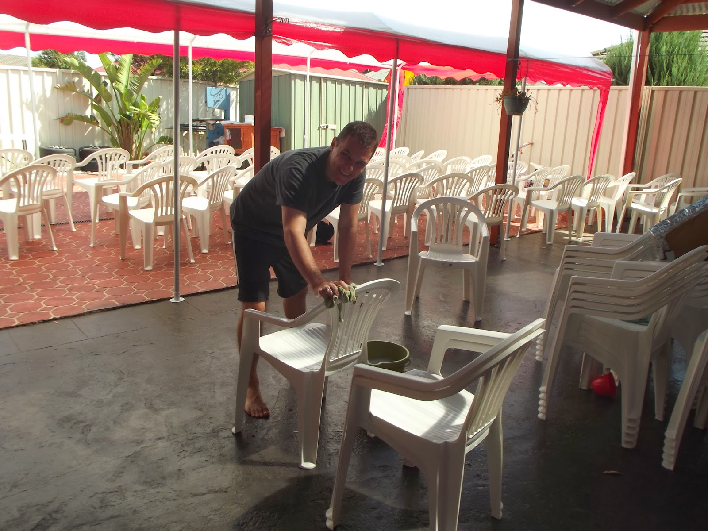
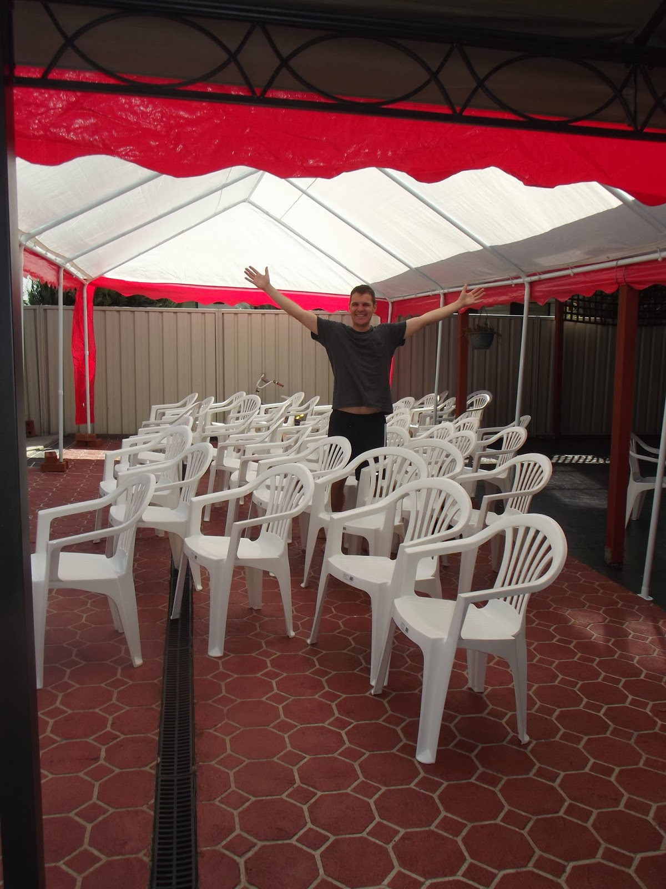
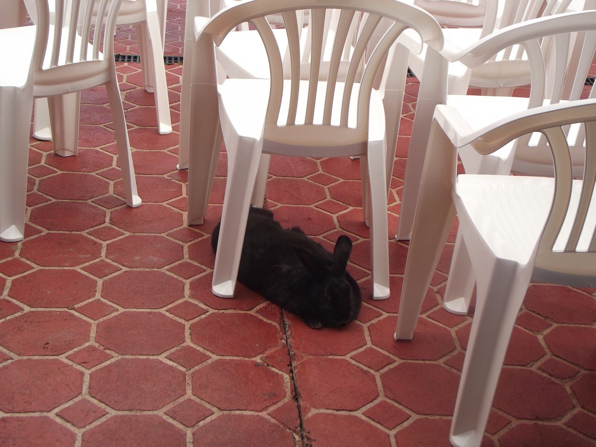

---
authors:
- shalveena
blog: shalveena.com
categories:
- journal
date: "2014-02-21"
id: our-hindu-wedding-preparations
title: Our Hindu Wedding - Preparations
---

I've always dreamed of my wedding, as many girls do. Yet in all that dreaming we somehow seem to look over or somehow manage to completely miss all the planning, headache, stress, money issues and heartache associated with a wedding. Call it naiveté, youth, or ignorance but so it was the case with me.

I blame Bollywood movies, which show colourful, grand weddings, without any indication of all the work that goes on behind the scenes both before and immediately after the grand affair. I admit, those were movies after all, and most things in Bollywood movies tend towards grandeur.

As I embarked upon the task of finally organising my wedding, it quickly became clear that everything in a wedding, from the table clothes to the Ganesh statue at the front, costs money. And a lot of it. We decided that spending our life savings and then some was not the way to go. Spending a fortune on that one day, especially when we were embarking on the beginning of our life together and needed all the financial support we could get, simply did not make sense. And so it was that the grand Bollywood style wedding lost its allure.

Our wedding was not grand. It was not in a hotel or a large and lavishly decorated hall room. It was not a destination wedding. It was something better. It was a small wedding full of well wishing relatives, openness and love. There was no formal pretence, no strict time schedule to adhere to. And we didn't end up spending a fortune.

I am thankful to my parents who worked so hard to make our wedding possible, for their support and for organising the wedding. I am also thankful to our relatives and my friends who helped with all the cooking, cleaning, entertaining and even the henna painting involved in the wedding. A special thank you to my in-laws (Manni, Geli, Torsti, Ingrid, Beeke and Leif) who came to attend our wedding all the way from Germany, who all dressed up in traditional Indian clothes and kept an open mind about having a Hindu wedding in the family.

**Wedding Preparations**

<table class="tr-caption-container" style="margin-left:auto;margin-right:auto;text-align:center;" cellspacing="0" cellpadding="0" align="center"><tbody><tr><td style="text-align:center;"></td></tr><tr><td class="tr-caption" style="text-align:center;">My beautiful Mum</td></tr></tbody></table>

<table class="tr-caption-container" style="margin-left:auto;margin-right:auto;text-align:center;" cellspacing="0" cellpadding="0" align="center"><tbody><tr><td style="text-align:center;"></td></tr><tr><td class="tr-caption" style="text-align:center;">All these pots (handis) were kindly provided by relatives for use during the wedding. Thank you!</td></tr></tbody></table>

 

<table class="tr-caption-container" style="margin-left:auto;margin-right:auto;text-align:center;" cellspacing="0" cellpadding="0" align="center"><tbody><tr><td style="text-align:center;"></td></tr><tr><td class="tr-caption" style="text-align:center;">My handsome brother and grown-up-too-fast sister painting the poster that will go in the room where I'll be staying in during the days leading up to the wedding.</td></tr></tbody></table>

 

<table class="tr-caption-container" style="margin-left:auto;margin-right:auto;text-align:center;" cellspacing="0" cellpadding="0" align="center"><tbody><tr><td style="text-align:center;"></td></tr><tr><td class="tr-caption" style="text-align:center;">The Bridegroom (Dulha) himself working hard wiping down all the chairs.</td></tr></tbody></table>

 

<table class="tr-caption-container" style="margin-left:auto;margin-right:auto;text-align:center;" cellspacing="0" cellpadding="0" align="center"><tbody><tr><td style="text-align:center;"></td></tr><tr><td class="tr-caption" style="text-align:center;">Victory</td></tr></tbody></table>

 

<table class="tr-caption-container" style="margin-left:auto;margin-right:auto;text-align:center;" cellspacing="0" cellpadding="0" align="center"><tbody><tr><td style="text-align:center;"></td></tr><tr><td class="tr-caption" style="text-align:center;">And here is Blackie the rabbit nicely sleeping the afternoon away while we work hard. Ah, what a life!</td></tr></tbody></table>
