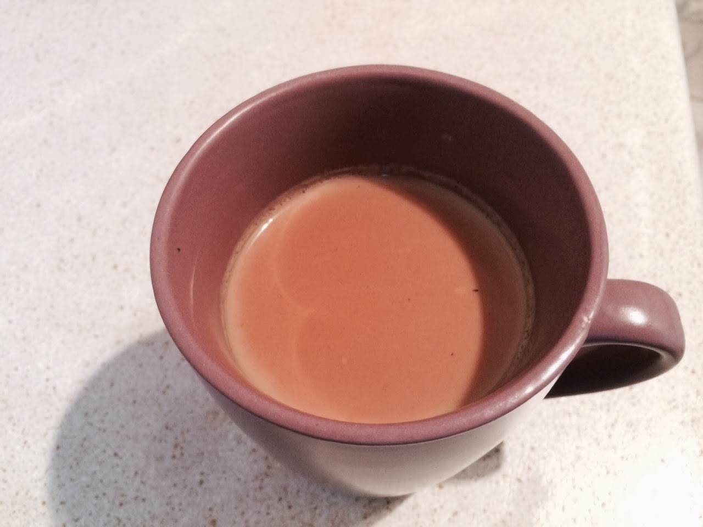

  

  

I've been experimenting with various Indian tea recipes - from Google search results, fellow bloggers and even venturing to the local Indian spice store for Chai Masala. None have yet found the right spot between spicy and sweet.  
  
It's strange but I don't actually like spicy tea, ginger tea, lemon grass tea or the likes - it brings back memories from days in Fiji where I sometimes drank those with great displeasure! But I as I've grown up, I've begun to like some spice in my tea, and long for a taste of home, of tastes that bring back memories of the rain, the warmth, the yummy food and happy childhood. So, having searched without much success for the right Indian tea recipe, I decided to create my own. With just the right amount of spice (very little) and just the right amount of sugar (also significantly less than the average Indian tea).  
  
Here it is:  
  
**For 2 large mugs of tea you will need -**   
2 tablespoons of black tea (English breakfast or Ceylon tea will do just fine)  
2 cups of water (or less if you want it to be more milky)  
half a cup of full cream milk (or more if you like it milky)  
2 whole cardamon  
1 clove  
a generous sprinkle of cinnamon  
a pinch of nutmeg  
  
Bring water to the boil, add the tea and sugar to taste (I put in 3 teaspoons for the 2 mugs of tea)  
Add the spices  
Once the water is beginning to boil, add milk  
Bring back to boil and let it boil until it reaches the desired strength (darker shade of brown = stronger tea).  
