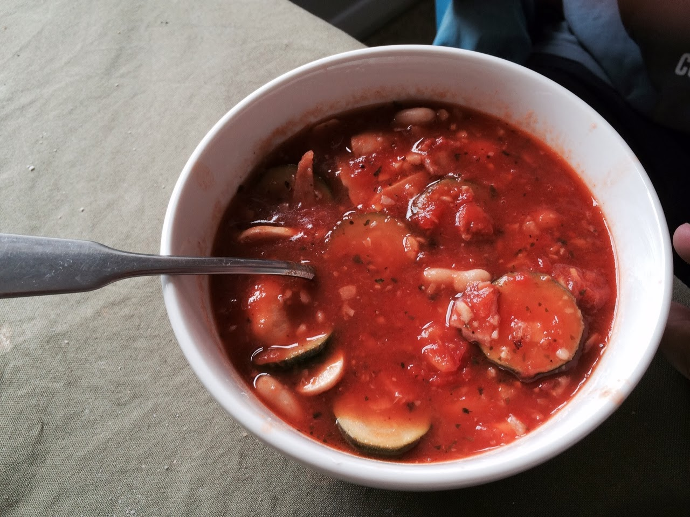

Some days are soup days. Where a nice bowl of soup with crusty bread or pasta is just the thing the soul needs. Especially when someone is sick or the weather outside is bordering towards the dull, grey shades.

  

I like making tomato soup for a quick meal on these days and here is the recipe for just a soup, which we had for lunch today with slices of warm olive loaf left over from breakfast:

  

**Ingredients:**

1 tablespoon of coconut oil (you can use any vegetable oil of your choice)

4 cloves garlic, finely chopped

2 rashers of bacon (I used 4 rashers of rindless middle eye bacon, which are smaller), cut into small pieces

1 zucchini, sliced

1 can tomatoes in natural juices

1 chicken stock pot (I used [this](http://www.continental.com.au/product/detail/254052/chicken))

1/3 or 1/2 can of cannellini beans, drained and washed in water

  

**Recipe:**

Heat coconut oil in a medium size pot

Add garlic and fry for about half a minute until the garlic releases its fragrance and flavour

Add the bacon and zucchini then fry for a few minutes until the zucchini starts to get softer

Stir in the tomatoes and the stock

Let it simmer for a few minutes then add mushrooms and about half a glass of water (more or less depending on how thick you want the soup to be)

Add the beans, salt and pepper to taste (I also sprinkled some dried oregano and coriander)

Simmer until the soup reaches your desired consistency. If it is too watery, cook for longer and if it is too thick add water to dilute it. 

  

Enjoy with crusty bread, with pasta, or simply on its own :) 

  

  

