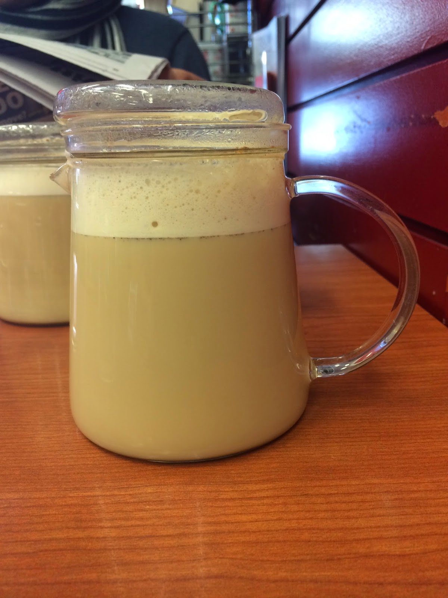
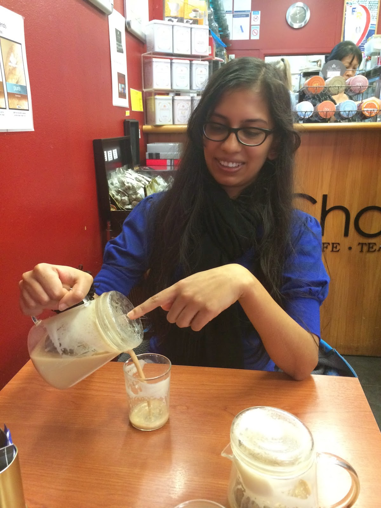

  

  

There is a tea house we visit sometimes in Mount Eden, when we have the chance to walk there in nice sunshine. Today was just such a day.  

  

The little shop is called _[Chapter](http://www.chapter.co.nz/)_ and is located on the Mt Eden Rd. I like the shop as it is cozy and surrounded by books and tea on the shelves and walls. This afternoon, we decided to order tea chai latte from there. Yum, it was one of the -- no, it was the best chai tea I have tried so far. The lady at the counter told us that it will take 5 minutes to make because they need to brew it. Hearing this, Max decided he will also have one (instead of the safer Assam choice). 

  

It was definitely worth the wait. The danger with getting chai tea is that often times it is too sweet, or too milky, and does not taste like tea at all. It is also most often (always?) made with powder chai (tea). But this one. Ah, this chai tea latte had real, large tea leaves in it. And was the perfect combination of tea, milk, honey, cinnamon...and something else. After finishing the whole pot, I curiously looked inside the tea compartment in the glass pot and found bits of orange peels in it. Upon enquiring with the staff, I was told it is make with _Nepal tea_ -- next time I go, I must remember to try Nepal tea and buy some for home!

  

