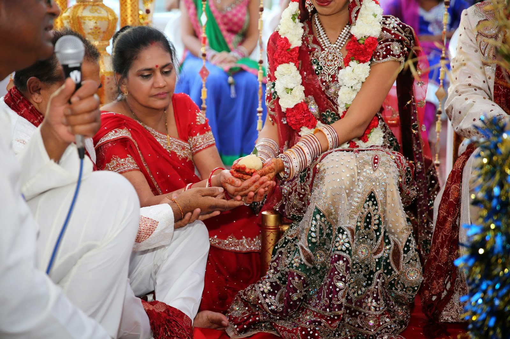

<table class="tr-caption-container" style="margin-left:auto;margin-right:auto;text-align:center;" cellspacing="0" cellpadding="0" align="center"><tbody><tr><td style="text-align:center;"></td></tr><tr><td class="tr-caption" style="text-align:center;">Max is taken to the <i>Mandap</i>&nbsp;by Vishal</td></tr></tbody></table>

 

<table class="tr-caption-container" style="margin-left:auto;margin-right:auto;text-align:center;" cellspacing="0" cellpadding="0" align="center"><tbody><tr><td style="text-align:center;"></td></tr><tr><td class="tr-caption" style="text-align:center;">Max, patiently waiting for the bride to come :D</td></tr></tbody></table>

 

<table class="tr-caption-container" style="margin-left:auto;margin-right:auto;text-align:center;" cellspacing="0" cellpadding="0" align="center"><tbody><tr><td style="text-align:center;"></td></tr><tr><td class="tr-caption" style="text-align:center;">Following the priests directions about how to do the steps required for the prayers.</td></tr></tbody></table>

 

 

<table class="tr-caption-container" style="margin-left:auto;margin-right:auto;text-align:center;" cellspacing="0" cellpadding="0" align="center"><tbody><tr><td style="text-align:center;"></td></tr><tr><td class="tr-caption" style="text-align:center;">Bride is on her way, with my brother and sister on either side :)</td></tr></tbody></table>

 

<table class="tr-caption-container" style="margin-left:auto;margin-right:auto;text-align:center;" cellspacing="0" cellpadding="0" align="center"><tbody><tr><td style="text-align:center;"></td></tr><tr><td class="tr-caption" style="text-align:center;">I was told to look down and shy like a good Hindu bride should!</td></tr></tbody></table>

 

<table class="tr-caption-container" style="margin-left:auto;margin-right:auto;text-align:center;" cellspacing="0" cellpadding="0" align="center"><tbody><tr><td style="text-align:center;"></td></tr><tr><td class="tr-caption" style="text-align:center;">We greet each other and I put the garland on Max</td></tr></tbody></table>

 

 

This is the Kanya Daan (giving away the bride) - My parents give me away to Max.

My parents are to announce that they are entrusting Max with me (I represent Goddess Laksmi - the goddess of wealth and prosperity here!). They give me away by placing my right hand in Max's right hand. Max and I are to vow to accept each other in equal partnership of love and respect and to show goodwill and affection towards each other's families.

My parents also gave me a new set of clothes and some small gifts at this time.

 

 

 

 

 

<table class="tr-caption-container" style="margin-left:auto;margin-right:auto;text-align:center;" cellspacing="0" cellpadding="0" align="center"><tbody><tr><td style="text-align:center;"></td></tr><tr><td class="tr-caption" style="text-align:center;">My mother's cousin and her husband also did <i>Kanya Daan</i>&nbsp;for me, symbolizing that I am also like their daughter, who they have now entrusted to Max.</td></tr></tbody></table>

 

 

<table class="tr-caption-container" style="margin-left:auto;margin-right:auto;text-align:center;" cellspacing="0" cellpadding="0" align="center"><tbody><tr><td style="text-align:center;"></td></tr><tr><td class="tr-caption" style="text-align:center;">
Here Deepi's sister is tying a ribbon to tie Max and us together. This represents that we are bound to each other in mind, body and soul for the rest of our lives.
</td></tr></tbody></table>

The Agni Pooja:

The priest now lights a fire in the _agni kund_. Max and I offer prayers to the lord of fire (Agni) -- with some help from the priest haha -- symbolizing light, power and purity by putting Ghee (unpurified butter), rice and flowers int he flames. This, ofcourse, made the fire burn even brighter! ...with more smoke too haha.

The fire has special significance as fire is seem as being pure (destroying evil) and is sacred in Hinduism. Lord Agni is invoked to act as a pure and sacred witness to the marriage vows that are taken by Max and me.

Time now to take the steps around the fire:

We circle the fire 4 times. Each round represents one of the 4 goals of life: Dharma (righteousness), Artha (prosperity), Kama (energy and passion) and Moksha (liberation/salvation).

My brother had the important job of giving us parched rice (or pop corn in this case) each time we before we begin the round around the fire. The parched rice is offered into the fire each time, a prayer for long life, health, prosperity and happiness from the gods.

 

 

 

 

 

 

 

 

 

<table class="tr-caption-container" style="margin-left:auto;margin-right:auto;text-align:center;" cellspacing="0" cellpadding="0" align="center"><tbody><tr><td style="text-align:center;"></td></tr><tr><td class="tr-caption" style="text-align:center;">Time to take the seven steps to signify the beginning of our journey together: 1. Let us take this first step to sharing the responsibility of providing for our household 2. Let us take this second step to strengthen our mind, body and soul to accomplish life's needs 3. Let us take the third step to accomplish wealth and prosperity through righteous means 4. Let us take the fourth step to acquire knowledge, happiness and harmony through mutual love, respect and trust 5. Let us take the fifth step to raise strong, virtuous and courageous children 6. Let us take the sixth step towards spiritual values and longevity. 7. Let us take the seventh step to remain true companions, committed only to each other.</td></tr></tbody></table>

 

 

 

<table class="tr-caption-container" style="margin-left:auto;margin-right:auto;text-align:center;" cellspacing="0" cellpadding="0" align="center"><tbody><tr><td style="text-align:center;"></td></tr><tr><td class="tr-caption" style="text-align:center;">Time to put <i>sindoor</i>&nbsp;(red powder) to signify me as being a married woman from this day forward haha</td></tr></tbody></table>

 

 

<table class="tr-caption-container" style="margin-left:auto;margin-right:auto;text-align:center;" cellspacing="0" cellpadding="0" align="center"><tbody><tr><td style="text-align:center;"></td></tr><tr><td class="tr-caption" style="text-align:center;">Max putting the <i>mangalsutra</i>&nbsp;around my neck. The mangalsutra is the most important piece of jewellery in Hindu marriage - it is like the wedding ring in European marriages. It has black beads, signifying protection from evil and is believed to protect the couple's marriage and their lives.</td></tr></tbody></table>

 

 

<table class="tr-caption-container" style="margin-left:auto;margin-right:auto;text-align:center;" cellspacing="0" cellpadding="0" align="center"><tbody><tr><td style="text-align:center;"></td></tr><tr><td class="tr-caption" style="text-align:center;">Happy and loved :)</td></tr></tbody></table>

Ready to receive blessings from friends and family! We now take blessings from the guests and have rice and flowers thrown at us!

 

 

 

 

 

 

 

 

 

 

<table class="tr-caption-container" style="margin-left:auto;margin-right:auto;text-align:center;" cellspacing="0" cellpadding="0" align="center"><tbody><tr><td style="text-align:center;"></td></tr><tr><td class="tr-caption" style="text-align:center;">The legal marriage ceremony</td></tr></tbody></table>

 

<table class="tr-caption-container" style="margin-left:auto;margin-right:auto;text-align:center;" cellspacing="0" cellpadding="0" align="center"><tbody><tr><td style="text-align:center;"></td></tr><tr><td class="tr-caption" style="text-align:center;">Max looking for his shoes!</td></tr></tbody></table>
