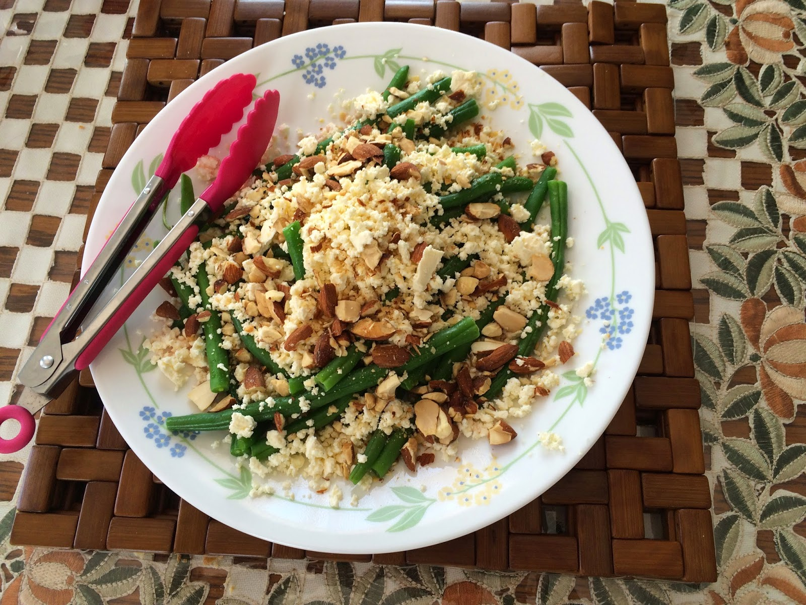
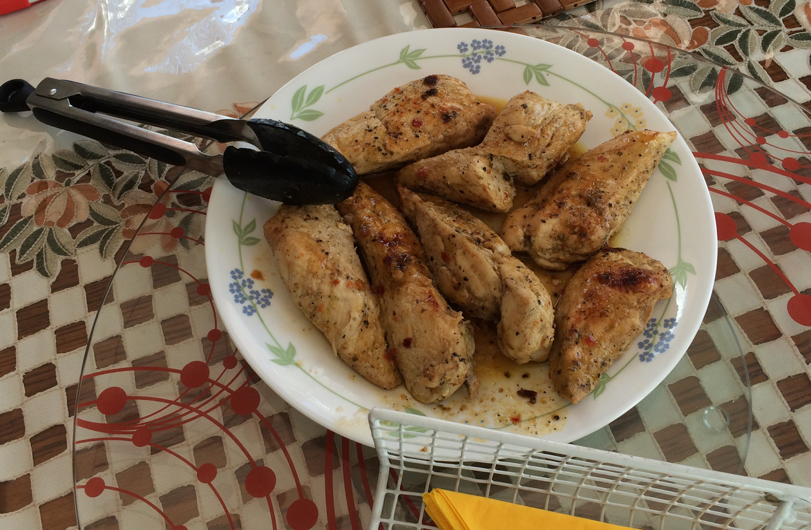

  

  

  
  
I haven't posted a recipe for some time - to be honest, I haven't tried making something new in a while. But it is always so exciting and fun to try new recipes. So, today, Sharlene and I tried out a healthy recipe for bean salad and chicken breasts.  
  
First, please note that when I was making the salad, I did not take exact measures of any of the ingredients or the exact times for cooking. I cook with the guidance of The Force ;) After all, recipes are best used as a guide, not an exact manuscript to follow word by word. Cooking, to me, is like an art and when I limit myself to exactness I find the end result to be sub-par.  
  
In any case, here we go:  
  
**Ingredients for the Chicken**  
  
3 pieces of chicken breast  
A generous splash of white wine  
A smaller splash of red wine vinegar  
Some herbs for the chicken - I used mixed herbs for steak (pepper, dried capsicum, dried onions, etc) - it really doesn't matter and you can change the herbs depending on your own likes or dislikes. I added chilli and pepper powder as well.  
1 teaspoon of honey  
A dash of avocado oil (because that is what I had in the pantry)  
  
**Cooking steps for the Chicken**  
Cut the chicken into thick strips, pierce with a fork or small knife and marinate with the wine, red wine vinegar, herbs, oil and honey. Leave aside to marinade while you prepare the rest of the ingredients.  
  
After it has marinated for a few minutes (approx 5 - 10 minutes), place the chicken pieces on a wide frying pan and add the left over marinade. Pan fry over low to medium heat until the chicken is cooked through (the chicken will turn white rather than the pinkish that it began with and you can check by poking a sharp knife though to see if it is cooked). Add salt to taste.  
  
PS, I also covered the chicken towards the end for some short periods to help in the cooking process.  
  
Don't overcook otherwise the chicken pieces will become dry and hard - we want it soft and juicy!  
  
**Ingredients for the Bean Salad**  
I adopted this recipe from the blog [Well Nourished](http://wellnourished.com.au/green-bean-and-almond-salad/) and my sister helped me prepare it.  
  
Green beans (as much as you like - enough for around 3 people)  
100 grams feta cheese, crumbled (my sister did this part with great devotion)  
Some roasted almonds (heated on a fry pan over low heat)  
  
For the dressing- 1 tablespoon lemon juice, 1 teaspoon red wine vinegar, 2 tablespoon extra virgin olive oil.  
  
Steam the beans for 2 minutes - I know, this sounds very short and when done the beans still looked raw, but when we ate it it was delicious and just perfectly cooked. Juicy and still with a bite to it :)  
Drizzle the dressing, add the feta and almond on top.  
  
Serve and enjoy! We really liked the dish, even though we all generally aren't big fans of beans, but we have never had beans like this. Crunchy and delicious. Sharlene ate every last piece of the feta off the salad plate and only then was she satisfied!
