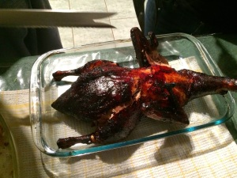

  

  

Last year, Max and I made really yummy crispy roast duck. Unfortunately, though, I do not remember the recipe for that and so when we decided to make duck again this year I went on a search for how to make Peking Duck. I love having Peking Duck at restaurants and the idea of putting the meal together at the table is very nice, but the meal can be quite pricey. So, we decided to try it at home. 

  

I combined recipes from 2 different websites: [Taste.com.au](http://www.taste.com.au/recipes/27924/peking+duck) and [All recipes.com](http://allrecipes.com/recipe/peking-duck/). I did not have a steamer at home so we modified the steps a little bit. 

  

The end result was a hit with the family and the whole duck was finished (mostly by my mum and sister). We also used lettuce leaves instead of the traditional pancakes for wrapping the duck meat in and added a bit of rice and a salad on the side. 

  

**Ingredients**

1 duck, whole

1/2 teaspoon cinnamon powder

1/2 teaspoon ginger powder

1/4 teaspoon ground pepper

1/8 teaspoon ground cloves

3 tablespoons of dark soy sauce

1 (halved) spring onion

1 slice of ginger

2 to 3 tablespoons of honey

75ml of Chinese cooking wine (Shao Shing)

1/2 lemon, sliced

1 small cup of water

Hoisin sauce for serving 

Sliced cucumbers for serving

Lettuce leaves for serving

Sliced spring onions for serving

**Steps**

Rinse the duck and pat dry with a paper towel. Our duck was still a bit frozen on the inside so we washed the inside too and I placed a paper town in the duck's cavity to help soak the water.

  

Mix the cinnamon, ginger power, pepper and cloves and a bit of chilli powder (if you like, and to taste). Sprinkle 1 teaspoon of the mixture into the duck's cavity.

  

Mix the remaining mixture with 1 tablespoon of soy sauce and rub it all over the outside of the duck.

  

I then tucked the wings of the duck so it is close by the body.

  

Place the spring onion and ginger slice into the duck's cavity.

  

Refrigerate, uncovered, for a minimum of 2 hours. I refrigerated it for about 6 hours.

  

Preheat the oven to 180 degrees Celsius (ours was fan forced so we kept it at 180 but if you have a traditional oven you can increase the heat to around 220 degree).

  

Put the duck into the oven for about 10 minutes - this makes it crispier.

  

Heat the remaining soy sauce with the Shao Shing and water in a small pan with the lemon slices and heat over medium heat. You can taste the mixture and add more soy sauce or honey according to your taste. 

  

Prick the duck all over with a fork, being careful to only pierce the skin, not the meat itself. 

  

When the mixture is reduced a bit, brush it over the duck (we did not have a brush so used a spatula instead). 

  

Put the duck into the oven, breast side up, for about 30 minutes. Take it out and brush all over with the mixture again then put it back in the oven with the other side up. Keep doing this until the duck is a rich brown colour and the skin is crispy. It took us about 2 hours. 

  

To check whether the duck was cooked, I cut with a sharp knife between the thigh bone.

  

Enjoy with lettuce cups, sliced cucumber, sliced spring onions and hoisin sauce.
