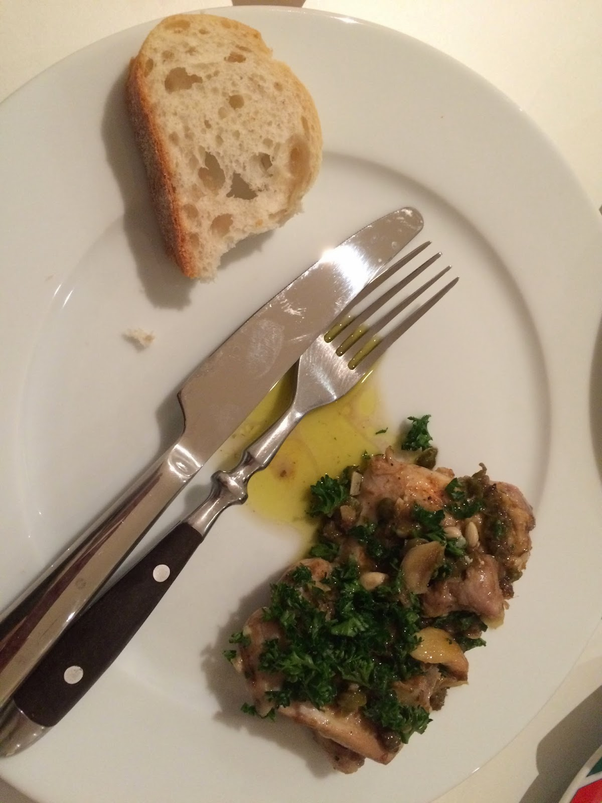

  
  

  
This recipe is adopted from the New York Times: [here](http://cooking.nytimes.com/recipes/1015290-garlicky-chicken-with-lemon-anchovy-sauce) is the original recipe. It involves mixing chicken with anchovy - something that I would never have done normally. I've never cooked with anchovy before (to tell the truth, I have never eaten anchovies before!). I also hardly cook with capers, but this recipe looked good and it had a video accompanying the recipe that made it sound so good that I just had to try it. And it was really, really delicious. One of the best meals I have cooked - so good that I woke up the next morning thinking about how yummy dinner was the night before! I don't usually follow recipes as I found that in the past they didn't lead to good result, but I have to say so far the New York Times has provided very good recipes.  
  
**Ingredients**  
  
4 chicken thighs, boneless and skinless  
6 cloves of garlic  
1/4 cup extra-virgin olive oil  
5 anchovy fillets  
2 tablespoon drained capers, patted dry  
1 lemon, halved  
Salt and pepper to taste  
Chilli powder  
Fresh chopped parsley for serving  
Crusty bread  
  
**Method**  
  
Season chicken thighs with salt and pepper and set aside.  
  
Mince 1 garlic clove and set aside for use later.  
  
In a large fry-pan heat the oil and then put 5 cloves of garlic (smashed) in. Add the anchovies and capers and let it cook on medium heat, stirring, until the anchovies dissolve and the garlic starts to get a bit golden.  
  
Add chicken thighs and let it brown on one side. Then flip it and let it cook through but not overcooked.  
  
When the chicken is cooked, transfer it to a plate and add the minced garlic to the pan with the juice of half a lemon. Add chilli powder to taste. Mix it around to scrape any brown bits that may be left in the pan. When the garlic is looking almost cooked, add the chicken back in and cook for a few more minutes.  
  
To serve, squeeze the remaining half lemon juice over the chicken and sprinkle parsley on top.  
  
We ate it with crusty bread, by dipping the bread in the oil/sauce. It was really yummy! The lemon gave it that nice zesty kick and amplified the flavour.
