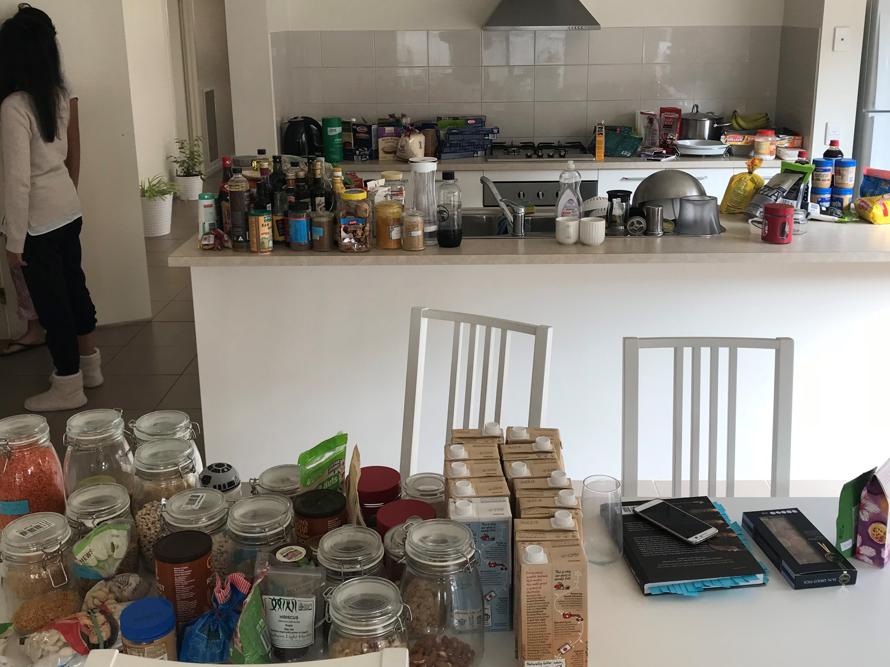
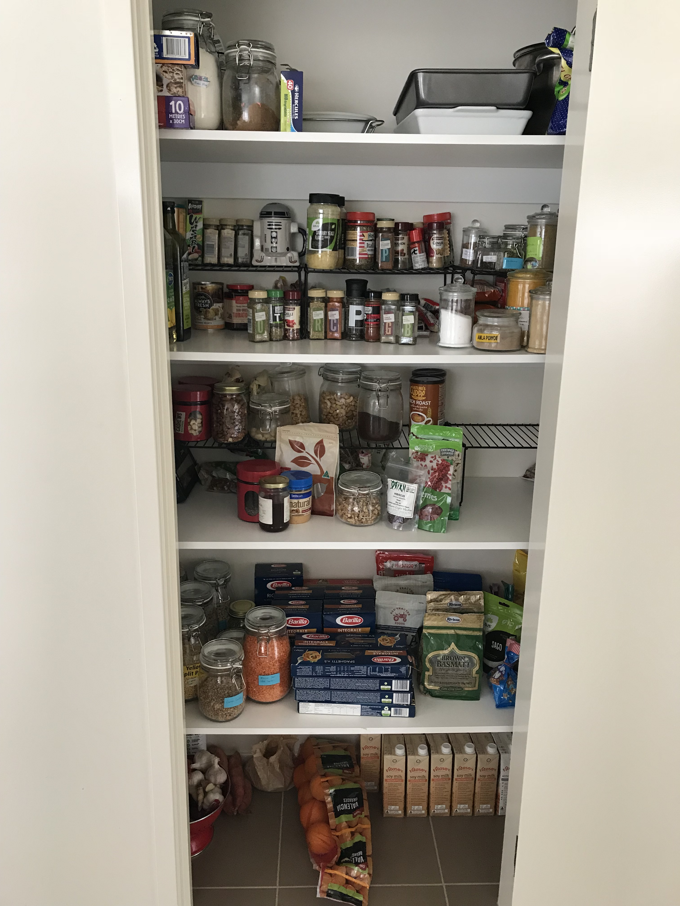

Since we became vegan, I realise we have many, many more spices, herbs and oils in our pantry. Over time, it has also become more cluttered and dis-organised.

It was time to overhaul it. A Summer clean (who says you need to do cleaning only in Spring right?).

The "before" (we took all the things out of the pantry. Geez, it looks like a whole lot more than I thought would fit in the tiny pantry!)

It took us almost a whole day, but we did it. The "after":

So what exactly do we have in our pantry, you ask. Well...

Right at the bottom is the plant milk - mostly soy and almond. That's also where our oranges go (my father-in-law makes fresh orange juice every morning for us all). It's also the place where our coconut water, potatoes, garlic, ginger, onion and sweet potatoes live.

The next shelf up is pasta, rice, grains, lentils and beans.

The next shelf, the one which is the easiest to reach has nuts, coffee (we don't drink coffee - that is for my father-in-law only), our 'fake' coffee (made from barley), our breakfast items (we have chia puddings every week-day morning and a different breakfast for the weekends). Since I live with 2 men, I needed to make sure that the things they use/eat the most often are right at the front and in a place where it is not too much work to put it back in place once they are done with it. So these things go right at the front and can be put back there easily.

I used the same idea with the next shelf up, which contains all our spices, herbs, and oils. Again, the ones that we use most often are right at the front.

The top most shelf is for my sister's backing supplies and some bigger pots that don't fit in the kitchen. Since I know she will make the effort to put the things back (and since she doesn't bake every day), we could put those things a bit out of the way and it is still okay.

So there it is! We now have a nicely organised pantry :) Let's hope it stays this way for a while.
