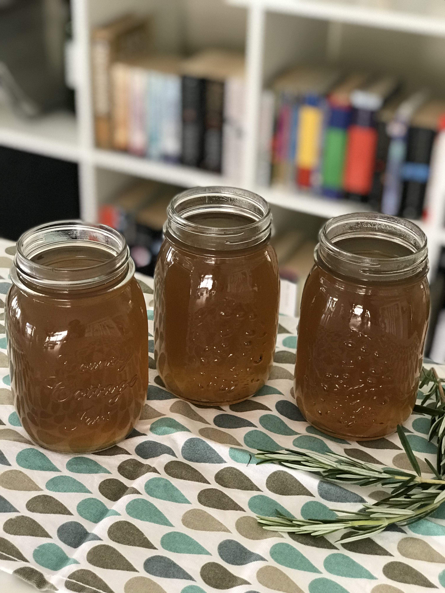
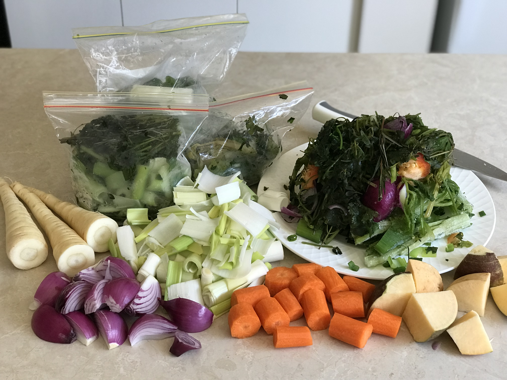

Recipes often call for stock, but I found it difficult to find a good vegetable stock without added, unwanted, ingredients such as maltodextrin and sugar. I searched online for healthy, tasty alternatives. I tried each one that I could find, but none was right. I remember one of them tasted like mud!

I also tried making my own stock a few times. And failed. Then, I came across [this post](https://www.buzzfeed.com/merleoneal/how-to-make-veggie-stock-from-kitchen-scraps?bffbtasty&ref=bffbtasty&utm_term=.npJpBXLRQ#.apJy5V3Qg) on BuzzFeed. I tried it and the result was magnificent. Tasty stock that I could use in any meal that called for stock. It didn't have any salt or sugar and was very healthy. I didn't put in any additional seasoning, so the stock was neutral and could be used in any cuisine.

The difficulty with the BuzzFeed article was, though, that it didn't specify what exactly to put in the stock. I then came across another blog post (I forgot where I saw it now), where the writer mentioned buying a 'stock vegetable' pack from her grocer. It included leeks, parsnips and turnips. I went to Coles and bought those vegetables. I then made the most yummy stock ever.

Here is the recipe:

## Ingredients

- 2 small red onions (you can use brown onions instead if that is what you have). You can also use the skin but since my onions were not organic I peeled the skin off. Cut it into quarters.
- 3 small carrots, peeled. Again, you can use them without peeling if they are organic. Roughly cut.
- 1 turnip, quartered.
- 3 small parsnips, roughly sliced.
- 2 leeks (I only had the bottom parts but you can put the dark green parts in too if you have it), roughly chopped.
- Vegetable scraps - whatever you have. I included a lot of herbs such as rosemary, coriander, thyme. I also included celery, spring onions, and some capsicum scraps. Just don't put in broccoli, cauliflower, kale, eggplants and things that might make the stock bitter.
- You can also put in mushrooms but I didn't have any :(
-  8 to 10 cups of water.

 

## Preparation

1. Put all the vegetables into a large pot.
2. Add 8 to 10 cups of water.
3. Cook on high, uncovered, until it starts boiling.
4. Once boiling, lower the heat to simmer and cook for 30 to 40 minutes. You can cook it covered or uncovered. I left mine uncovered because the pot was very full!
5. After 30 to 40 minutes, strain using a sift. Keep the stock in a pot or large bowl to cool. Once cooled, you can transfer it to mason jars and keep for 3 - 4 days in the refrigerator. If you want to keep it for longer, you can freeze it for up to 3 months (although mine never lasts that long!). To freeze, I just pour the cooled stock into ziplock bags and put in the freezer.