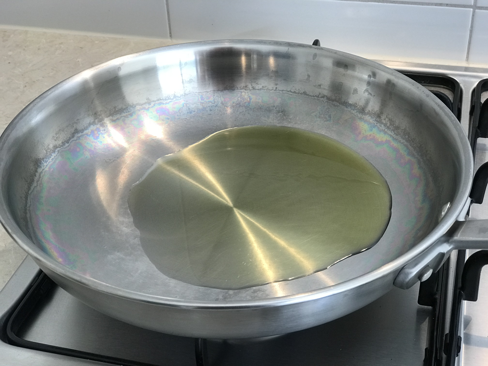
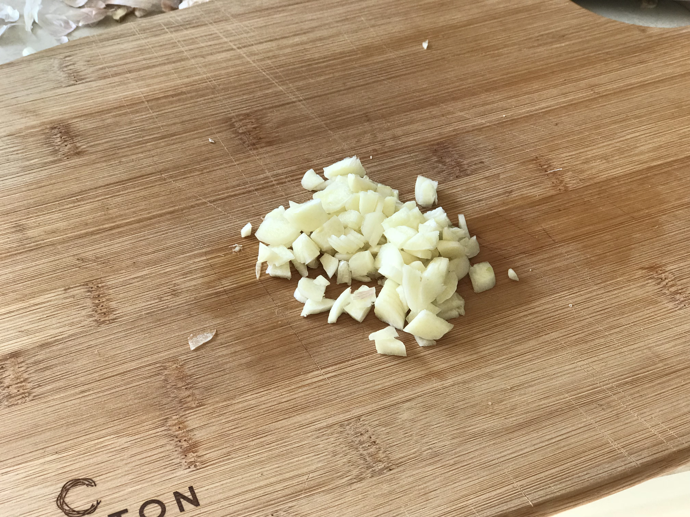
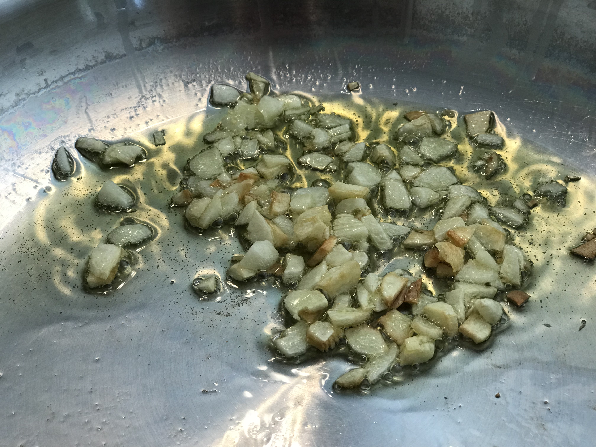
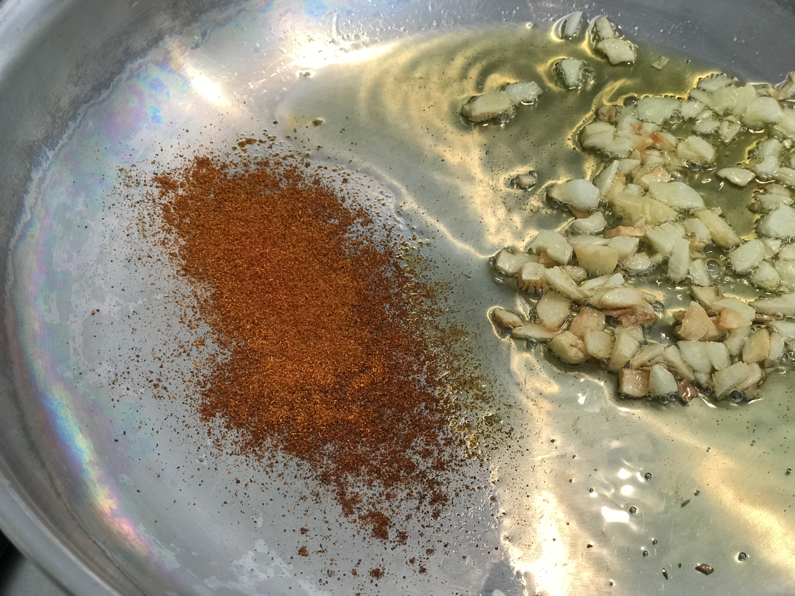
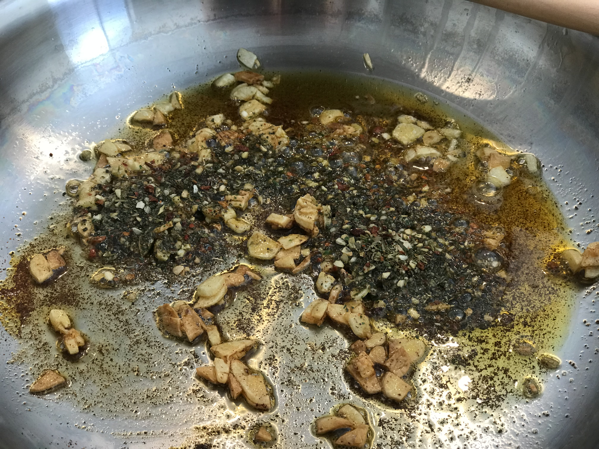
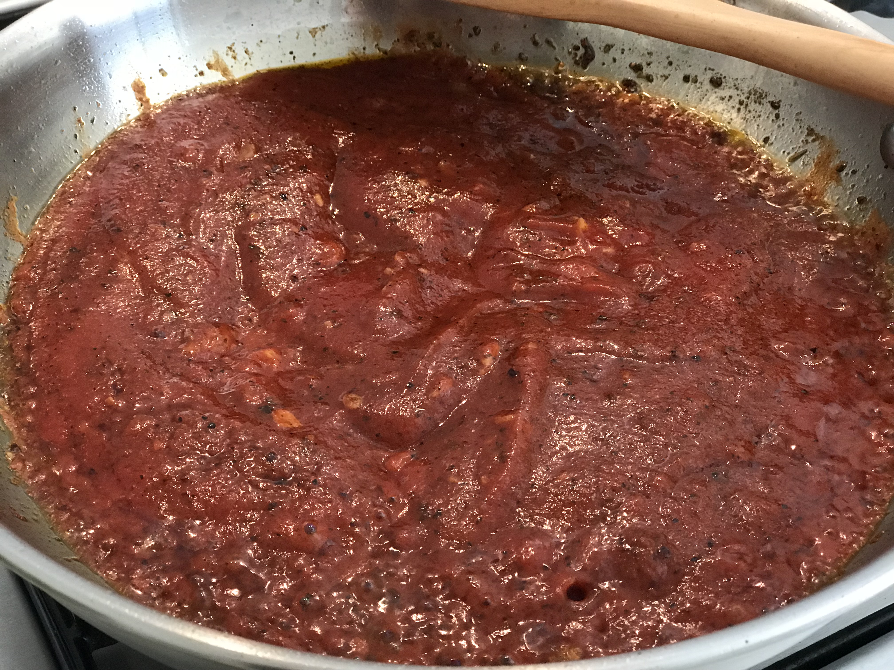
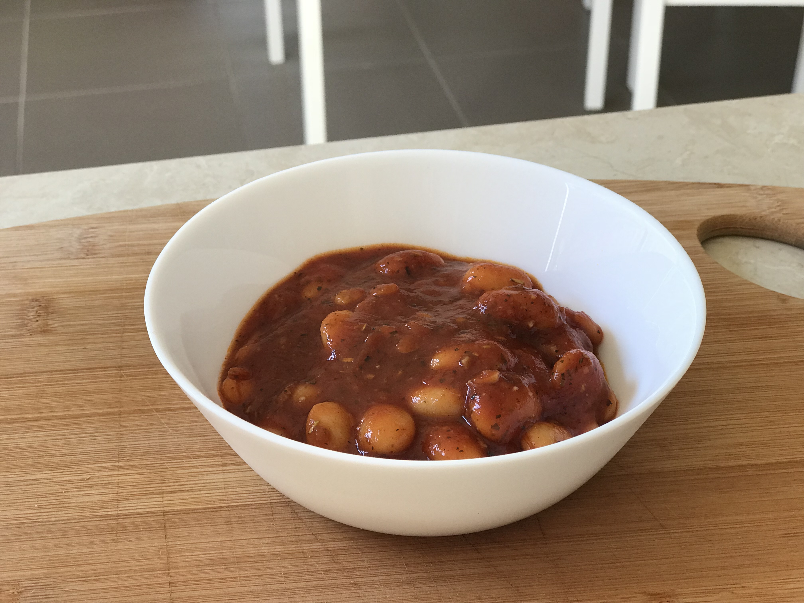

When I first arrived in New Zealand 10 years ago, one of the things which startled me was the breakfast. I lived in an all-inclusive student accommodation and for better or worse had to eat whatever was given to me. I quickly settled on a winning combination of white toast and baked beans, neither of which I ate before in my life.

But there was always something which bothered me about baked beans and that is that they are sweet. I don't particularly like sweet things and sugar is not exactly healthy either. So one day I decided to try to make my own baked beans; and to make them spicy. This experiment turned out surprisingly well and spicy baked beans have become a staple of our breakfast ever since their inception.

Here is the recipe:

| Name | Spicy Baked Beans |
| --- | --- |
| [Serves](https://shalveena.com/serving-sizes/) | 4 |
| [Dr. Greger Points](https://shalveena.com/dr-greger-points/) | 2 |
| [Costs](https://shalveena.com/costs/) | US$ 5 |
| [Cooking time](https://shalveena.com/cooking-times/) | 30 min (first time) / 20 min (repeats) |
| [Difficulty](https://shalveena.com/difficulty-levels/) | Beginner |

### Ingredients

- 2 400g cups of butter beans (Fagioli Bianchi Di Spangna)
- 1/2 740 ml bottle of Mutti Passata
- 6 cloves of garlic, sliced
- 1/4 teaspoon of turmeric
- 3/4 teaspoon of dried rosemary leaves
- 1/4 teaspoon of dried parsley flakes
- 1/2 teaspoon of garlic powder
- 2 teaspoons of Italian Herb Mix (the one [we use](https://www.woolworths.com.au/Shop/ProductDetails/210354/hoyts-italian-herb-mix) is composed of Garlic, Dried Tomato, Basil, Onion, Black Pepper, Oregano, Parsley, Marjoram, Red Bell Pepper and Canola Oil)
- 1 tablespoon of extra virgin olive oil

### Preparation

- Heat the 3/4 tablespoon of the oil in a large fry pan on medium to low heat

- Add the garlic and fry until it gets brown

- Add chilli and turmeric and toast/fry it for 1 minute (Sorry I forgot the turmeric while making the picture)

 

- Reduce heat to low and add the remainder of the olive oil (1/4 tablespoon)
- Add Italian Herb Mix and fry for 1 minute

- Add Mutti Passata (remember you only need half the bottle)
- Increase to medium heat and let it simmer for 5 minutes

- Add butter beans
- Add rosemary, parsley, and garlic powder to taste

Now you can serve and eat on top of toast, bread or buns or just by itself.

There is one variation which gives the dish a whole different flavour but which is very easy to do. Just replace the dried rosemary flakes with 1/2 teaspoon of Portuguese seasoning for a more zesty taste.
