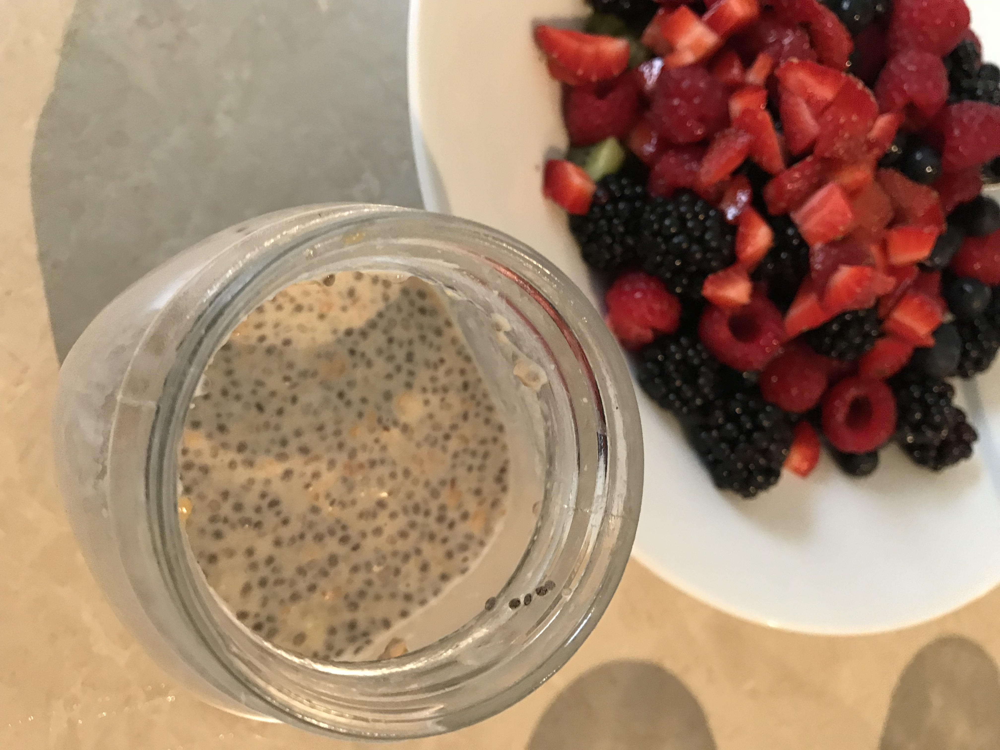

This is the breakfast that we enjoy every week-day. It's a healthy, goodness filled breakfast that keeps me going through the day without needing to snack until lunch! It's filled with awesomeness from chia, peanut butter, and fruits. It's easy to prepare, and delicious.

| Name | Overnight Chia Seed Pudding |
| --- | --- |
| [Serves](https://shalveena.com/serving-sizes/) | 1 |
| [Dr. Greger Points](https://shalveena.com/dr-greger-points/) | 4 |
| [Costs](https://shalveena.com/costs/) | US$ 3 |
| [Cooking time](https://shalveena.com/cooking-times/) | 30 mins (first time)/10 min (repeats) |
| [Difficulty](https://shalveena.com/difficulty-levels/) | Absolute Beginner |

## Ingredients

- 1/3 to 1/2 ripe banana, mashed
- 2 Tbsp chia seeds
- 2 Tbsp peanut butter (we use the one with only peanuts; no nasties added), plus 1 Tbsp for later
- 1/2 tsp (or less) honey - optional
- 1 cup almond or soy milk
- 1 Tbsp flax seeds - optional
- 4 almonds, chopped
- Berries and/or other fruits of your choice as a topping

## Preparation

1. Mash the banana and put it into a mason jar.
2. Add 2 Tbsp chia seeds, 2 Tbsp peanut butter, 1/4 to 1/2 tsp honey, and 1 cup almond or soy milk to the mason jar. Mix it all together with a fork.
3. Cover and leave in refrigerator overnight.
4. The next morning, just before serving, add additional 1 Tbsp peanut butter, 1 Tbsp flax seeds (optional) and chopped almonds or other nuts. Mix well. Top with berries and enjoy!
