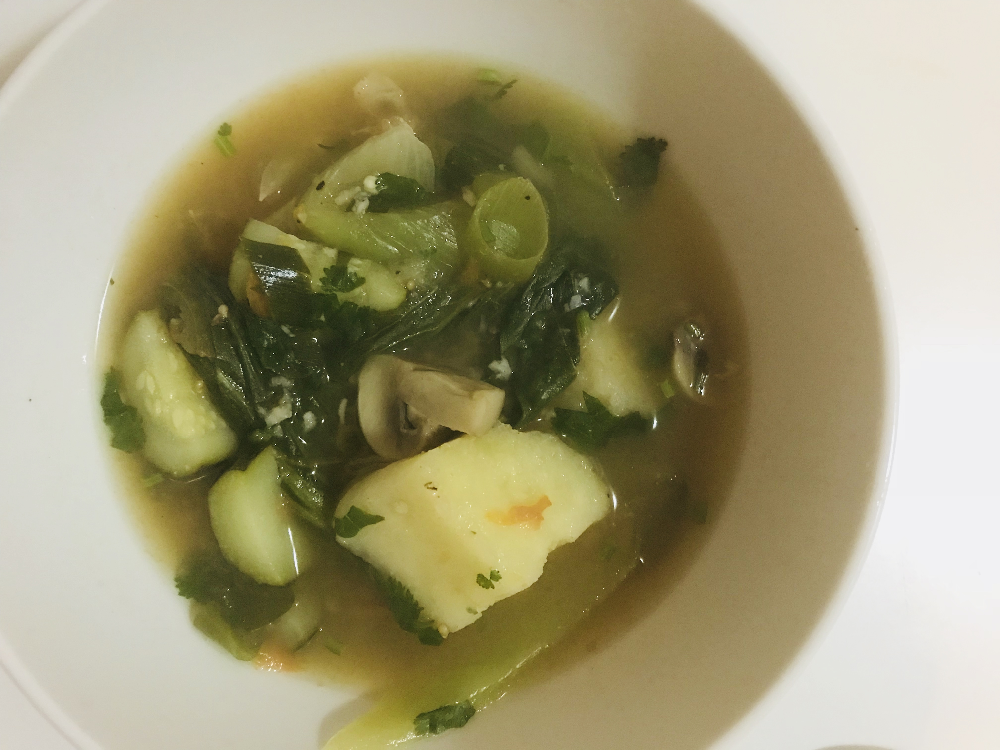

Today was one of those days. I felt tired of cooking all week and wanted to have something easy for dinner. It's winter. It's cold in our house. It was dark outside. It was a day for soup. But not just any soup, a soup that would require little time and work!

I also wanted to broaden our range of foods beyond just rice and pasta, and so I thought, hey, I have some frozen taro in the fridge, let's use that! Instantly, what came to my mind was some yummy mutton soup with taro (or dalo as they call it back in Fiji). But alas, no mutton on a vegan lifestyle. And so I veganised the soup :)

I used our [super healthy and yummy vegetable stock](http://shalveena.com/2018/01/06/home-made-vegetable-stock/), which I always keep in the fridge for just such days. It turned out really tasty and was so easy to make. AND it is healthy and has no oil! AND it all comes together in just one pot. Win, win and win!

I used the vegetables that I had in my fridge, but this is a soup where you can easily substitute the veggies here for whatever you have on hand. I think some carrots would go nicely in this soup, but I didn't have any today. Maybe you could also use some onions instead of onion powder. Feel free to play around with it and make it your own.

| Name | Easy and Tasty Taro Soup |
| --- | --- |
| [Serves](https://shalveena.com/serving-sizes/) | 4 |
| [Dr. Greger Points](https://shalveena.com/dr-greger-points/) | 4 |
| [Costs](https://shalveena.com/costs/) | US$ 10 |
| [Cooking time](https://shalveena.com/cooking-times/) | 40 minutes |
| [Difficulty](https://shalveena.com/difficulty-levels/) | Beginner |

## Ingredients

- Taro (I used a 1kg pack of frozen taro - the pack had 6 pieces and I used 4 of those pieces)
- 2 bunches of bok choy (the small ones), roughly cut
- 2 stalks of spring onions
- 2 bay leaves
- 6 - 8 small cloves of garlic, crushed
- About 1 inch of ginger, peeled and crushed
- About 2 cups of vegetable stock
- Water
- Salt and pepper
- Cayenne pepper/chilli powder/fresh chillies
- Onion powder (I didn't measure how much I used but it was about 4 general shakes - I would say maybe about 1 tsp)
- Tomatoes, roughly chopped (I used 1 punet of perino tomatoes - 200 g - but you can use any kind of tomatoes)
- 1 medium sized zucchini, cut into half lengthwise and then sliced
- 4 - 5 small button mushrooms, quartered
- Coriander

## Method

1. Heat some water in a kettle/water boiler.
2. Put the frozen tomatoes in a large pot and cover with boiling water. Add enough water so that the taro is covered fully, but don't add too much extra water above that.
3. Add the bay leaves, crushed garlic and crushed ginger to the pot.
4. Boil for 10 minutes, uncovered.
5. After the 10 minutes, remove the taro from the pot (keep the water!) and cut it into 4 - 6 pieces (the pieces should be just larger than bite sized).
6. Put the cut pieces of taro back into the pot and add the stock, tomatoes, onion powder, chilli, salt and pepper. Cook for about 30 minutes.
7. During the last 5 - 10 minutes of cooking, add the mushrooms and zucchini. Then, after a few minutes, add the bok choy and spring onions as these need next to no time to cook.
8. Check that the taro has cooked through (I checked it by taking a piece and eating it!). If needed, cook for a few more minutes.
9. Add coriander and your soup is ready to eat.
10. Enjoy!

 

