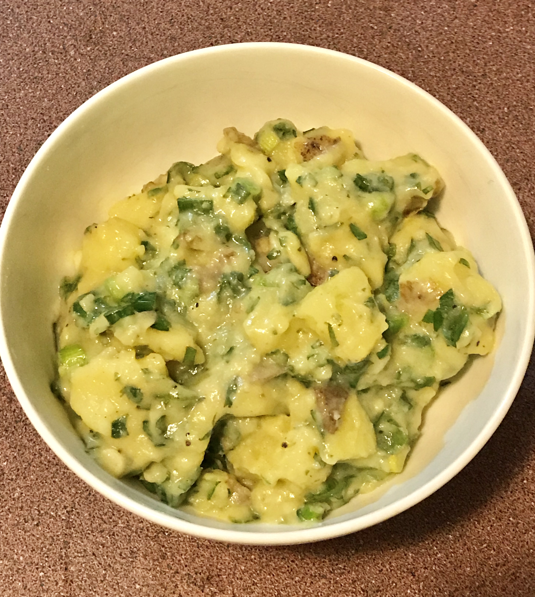
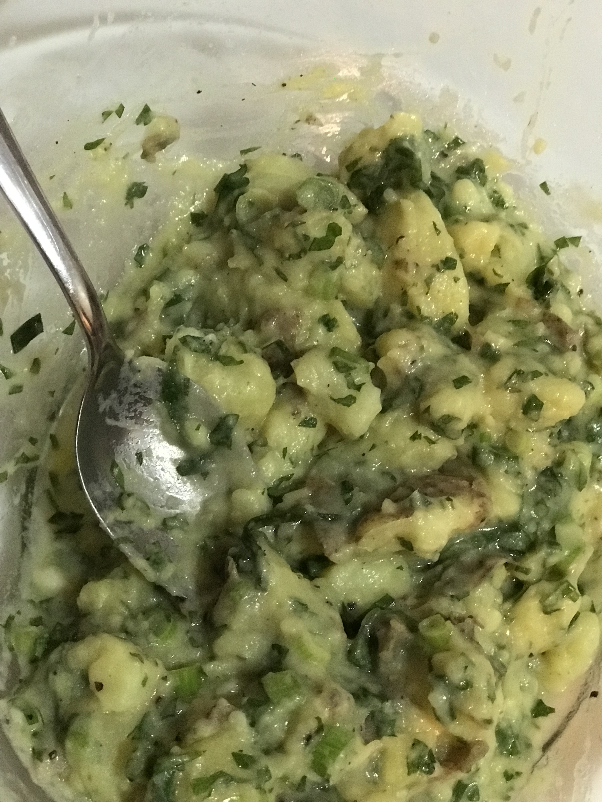

We went to a German restaurant, which served Bavarian style dishes, a couple of weeks ago with some visiting friends. Unfortunately, it seems that Bavarian cuisine is a bit light on the vegetarian/vegan dishes, but when we asked which dishes were vegan/could be made vegan, we were surprised to hear that the potato salad was vegan. Ah?! No mayonnaise in it?? Yes, yes, yes! It appears that some German potato salads have no mayonnaise! Instead, it is made using vinegar and herbs.

The potato salad we got was creamy and a little tangy. It was really yum.

I decided to recreate it.

Of course, having no clue about German cuisine, I asked my friend Google for help. Sadly, though, it seems Google was a little bit lost when it came to finding German potato salad recipes without meat or animal products. (Yes, Max IS German, but he is not a big fan of German food - or so he tells me - and he has not much of an idea how to make it either!)

Luckily, I found [this](http://susikochenundbacken.blogspot.com/2010/07/oma-ingrids-german-potato-salad.html?m=1) and [this](https://www.eyecandypopper.com/german-style-potato-salad-vegan-no-mayonnaise/) recipe, which I used as a reference point when making the salad. It turned out delicious and, you know what, it was super healthy (well, as far as potatoes go)!

| Name | German Potato Salad |
| --- | --- |
| [Serves](https://shalveena.com/serving-sizes/) | 4 |
| [Dr. Greger Points](https://shalveena.com/dr-greger-points/) | 2 |
| [Costs](https://shalveena.com/costs/) | US$ 2 |
| [Cooking time](https://shalveena.com/cooking-times/) | Approx 40 minutes |
| [Difficulty](https://shalveena.com/difficulty-levels/) | Beginner |

## Ingredients

- 7 small to medium sized potatoes (I used Nicola Yellow potatoes)
- 2 Tbsp olive oil
- 3 Tbsp apple cider vinegar
- 1 Tbsp white vinegar
- 1/4 cup hot water mixed with 3/4 tsp of vegetable stock powder
- 1 Tbsp Dijon mustard
- 3 stalks of spring onion
- A handful of parsley leaves
- Salt and pepper to taste

## Directions

1. Bring a medium pot of water to the boil. Add the potatoes and let it boil (covered or uncovered - it doesn't really matter, except that covered may cook earlier). Continue boiling until the potatoes are quite tender. For me, this took about 40 minutes.
2. While the potatoes are cooking, finely chop the green onions and parsley. Set aside.
3. Mix the vinegars and oil in a bowl. Set aside.
4. Once the potatoes are tender, turn off the heat and remove the potatoes from the pot. Wait a few minutes so that the potatoes have slightly cooled and can be handled safely. Don't wait too long though, the potatoes need to still be hot enough so that they'll absorb the liquids that we are going to add soon. Roughly chop the potatoes so that some of them are quartered and some are smaller. Put the chopped potatoes into a large bowl.
5. Add the vinegar/oil mix to the potatoes and mix well. In a small bowl, mix the 1/4 cup of hot water and the vegetable stock powder, and pour the mixture over the potatoes. Mix the potatoes well - at this stage, you can also mash a few of them if you like, to give the sauce more body.
6. Lastly, add the mustard, parsley, spring onions, salt & pepper to taste, and mix everything well. Serve or store in fridge for later. Enjoy :)

