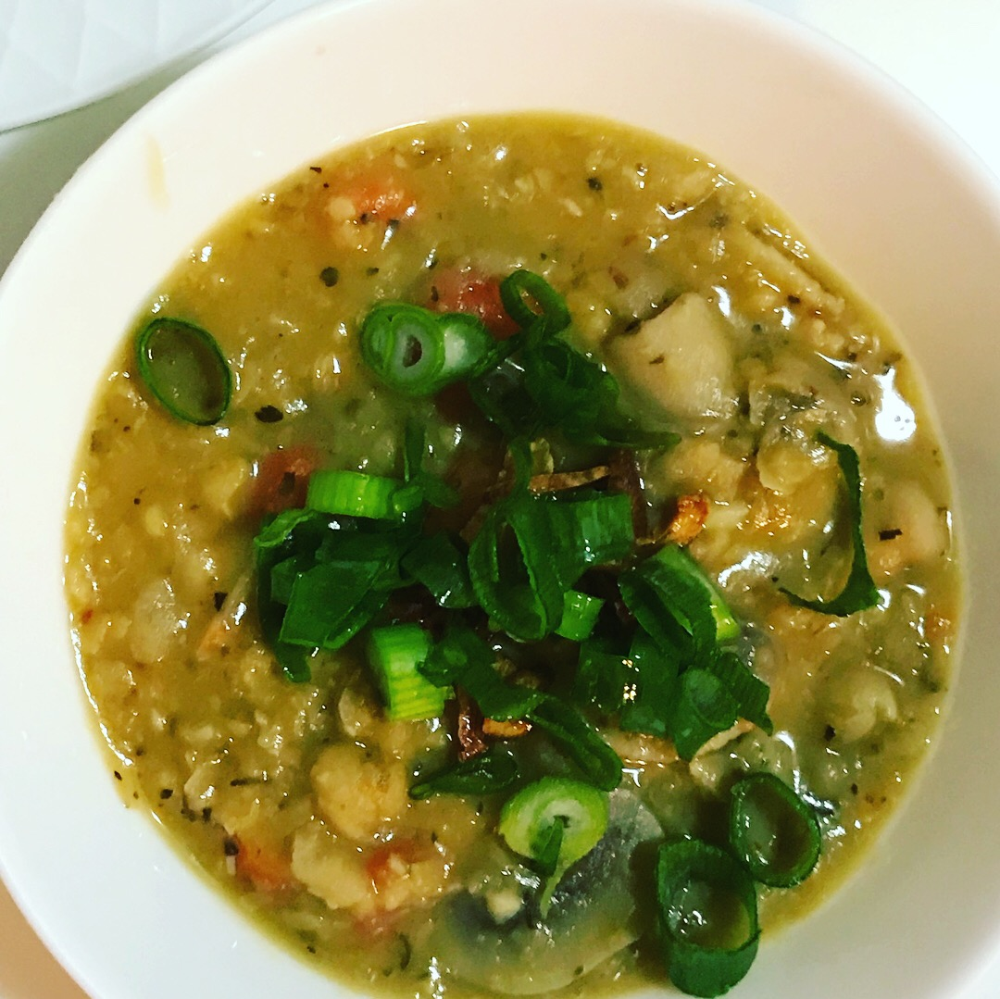

It is freaking COLD here! I read that a few days ago Melbourne was the coldest city in the world one morning! That is crazy cold.

Max has been leaving home at 7am, which means its still cold and dark outside and the sun is no where to be seen. He was sniffling and feeling under the weather so yesterday I offered to make whatever he wanted to eat. He said "Chickpea Soup". So, here it is - chickpea soup for a cold Winter's day. Its super easy and is made up mostly of pantry staples that I always have on hand anyway (actually, on that note, we only have 1 can of chickpeas left in the pantry after this and I forgot to buy it when going grocery shopping for the coming week....sigh).

This dish is super easy and quick to make, perfect for when you're feeling a bit under the weather.

 

| Name | Easy Chickpea Soup |
|