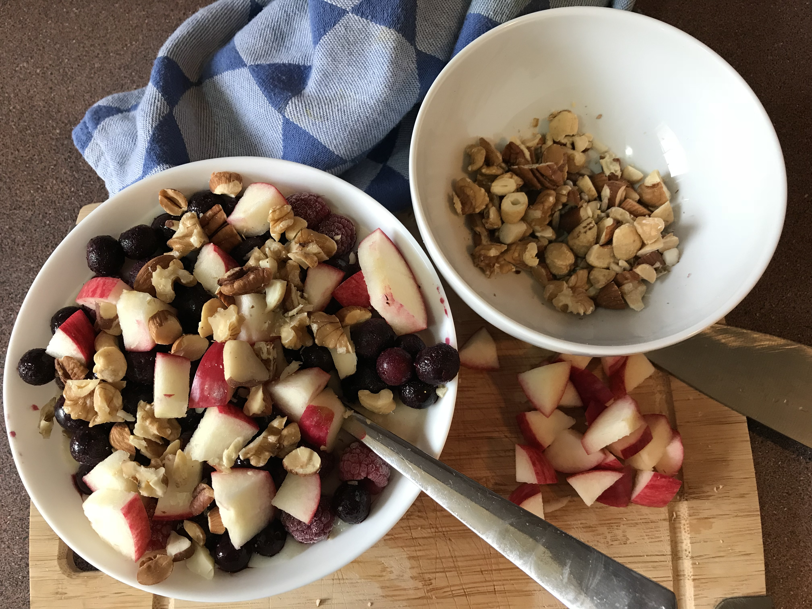

I posted our favourite [overnight chia seed pudding recipe](http://shalveena.com/2018/03/16/overnight-chia-seed-pudding/) a while back, which is Max's absolute favourite weekday breakfast. BUT, I find that to be toooooooo cold to eat on a freezing cold Winter's morning. Especially since we wake up when it is still dark outside!

So I went looking (experimenting) with different, warm, things that I could have for breakfast. And, BEHOLD, the most delicious, comforting, healthy and delectable breakfast recipe was created. Warm, creamy, soft oats topped with delicious, sweet blueberries and tarty raspberries, with chopped nuts and seeds to top it all off. It is heavenly! This is my favourite breakfast at the moment. I even feel like eating it on the weekends!

The warm oats and cold berries make a really, really nice combination and the textures added by the nuts....mmmmmm....just devine.

| Name | Creamy Oats with Nuts and Berries |
| --- | --- |
| [Serves](https://shalveena.com/serving-sizes/) | 1 very hungry human |
| [Dr. Greger Points](https://shalveena.com/dr-greger-points/) | 4 |
| [Costs](https://shalveena.com/costs/) | US$ 5 |
| [Cooking time](https://shalveena.com/cooking-times/) | 5 - 10 minutes |
| [Difficulty](https://shalveena.com/difficulty-levels/) | Beginner |

PS: I use frozen blueberries and raspberries because those are the ones I love but you can use any berries you like.

## Ingredients

-  1/2 cup uncooked oats (I used organic, rolled oats)
- 1 cup boiling water
- A splash of soy milk
- 1/4 tsp of honey, or to taste (optional)
- 1/3 cup raspberries
- 1/2 blue berries
- 1 small apple, or kiwifruit, or any other fruit of your choice (optional)
- 1/2 Tbsp of chia seeds (optional)
- Nuts and seeds of your choice, chopped (I usually put a small handful of walnuts, 2 or 3 pecans, 10 almonds, a small handful of cashews and 1 brazil nut)

## Method

1. Put 1/2 cup oats into a small pot and add 1 cup boiling water.
2. Add 1/4 tsp of honey (or to taste), mix well, and put it on the stove over medium high heat.
3. Add the soy milk and bring it to a boil.
4. Once it begins to boil, lower the heat and let it continue to gently cook for 5 minutes. Mix it from time to time so it doesn't stick to the bottom of the pot.
5. While the oats are cooking, chop the nuts and apple/other fruit.
6. Once the oats are cooked to your liking (I like mine soft with a little bit of liquid still left in - 5 minutes is about perfect for that), take it out into a bowl, sprinkle chia seeds on top, pile on the frozen berries, apple or other fruit and nuts. Dig in and enjoy :)
