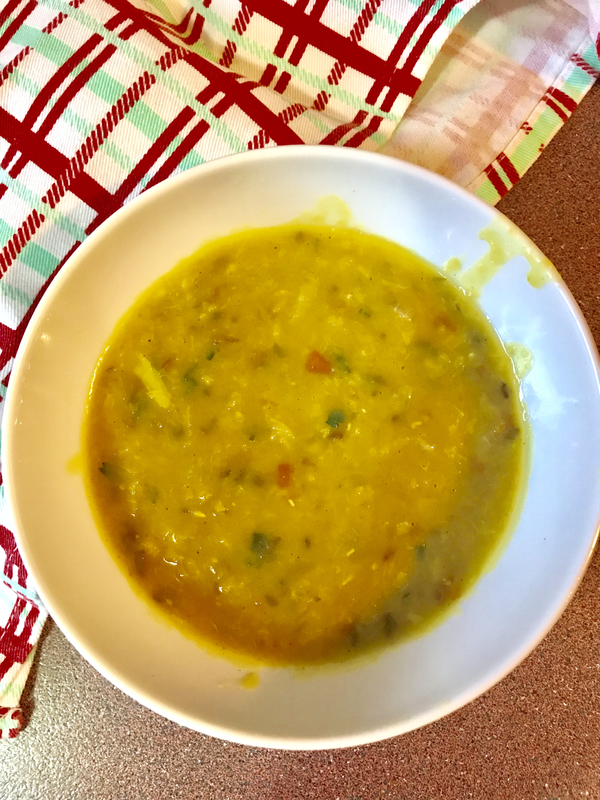

Dahl and veggies with rice, ah, perfect dish for cold Winter nights. Aaaaaand, according to Dr Gregor, lentils beat other beans in their antioxidant content, and they are good for heart health and for fighting cancer.

So, win for the lentils!

This dish is easy to make and makes enough for yummy leftovers the next day.

| Name | Simple Dahl (Indian lentil soup) |
| --- | --- |
| [Serves](https://shalveena.com/serving-sizes/) | 4 - 6 |
| [Dr. Greger Points](https://shalveena.com/dr-greger-points/) | 3 |
| [Costs](https://shalveena.com/costs/) | US$ 3 |
| [Cooking time](https://shalveena.com/cooking-times/) | Approx. 1 hour |
| [Difficulty](https://shalveena.com/difficulty-levels/) | Beginner |

## Ingredients

- 1/3 cup green split moong dal (split mung beans)
- 1/3 cup toor dal (pidgeon peas)
- 1/3 cup masoor dal (red lentils)
- 1/2 tsp of turmeric powder
- Ginger (to taste), crushed
- 1 onion, sliced
- 6 cloves of garlic and 1 chilli (chilli is optional), crushed or finely chopped
- 1 Tbsp of vegan butter (or normal butter, if you're not vegan)
- 2 Tbsp of olive oil
- 1 tsp of whole cumin
- 1 tomato, chopped
- A generous pinch of garam masala
- Salt
- Coriander, chopped (optional)

## Method

1. Soak the split mung dal and toor dal in water for at least 1 hour
2. When ready to cook, drain and rinse the dals. Place the dals into a pot. Add the masoor dal into the pot.
3. Add 2 cups of hot water, 3 cups of stock, and 1/2 tsp of turmeric powder.  Add the crushed ginger. Turn on the heat to medium and let it come to a boil.
4. Once it is boiling, add 1 1/2 tsp of salt (or to taste), reduce the heat to low and let it continue to cook (you can partially cover it but keep checking as the dal tends to boil over).
5. Keep cooking until the lentils break down and are completely soft and smooth.
6. While the dal is cooking, prepare your other ingredients: slice the onions and crush the garlic and chilli.
7. Start making the 'tadka' (the tempered spices and oil) - in a frying pan, add the vegan butter and olive oil. Turn on heat to medium/low. Once the butter melts, add the cumin seeds and let it sputter just a bit. Then add in the onion and fry until the onions are soft and beginning to turn golden near the edges. Add in the garlic chilli paste and cook for a few seconds. Then add in the tomatoes and continue frying until the tomatoes are soft and breaking apart.
8. Add the tomatoes mixture into the pot of dal. Mix well and taste; adjust salt as necessary. Cook for a further 10 minutes.
9. Add garam masala.
10. Add chopped coriander, mix, and take the pot off the heat.
11. Enjoy with rice or roti alongside other vegetable curries.
