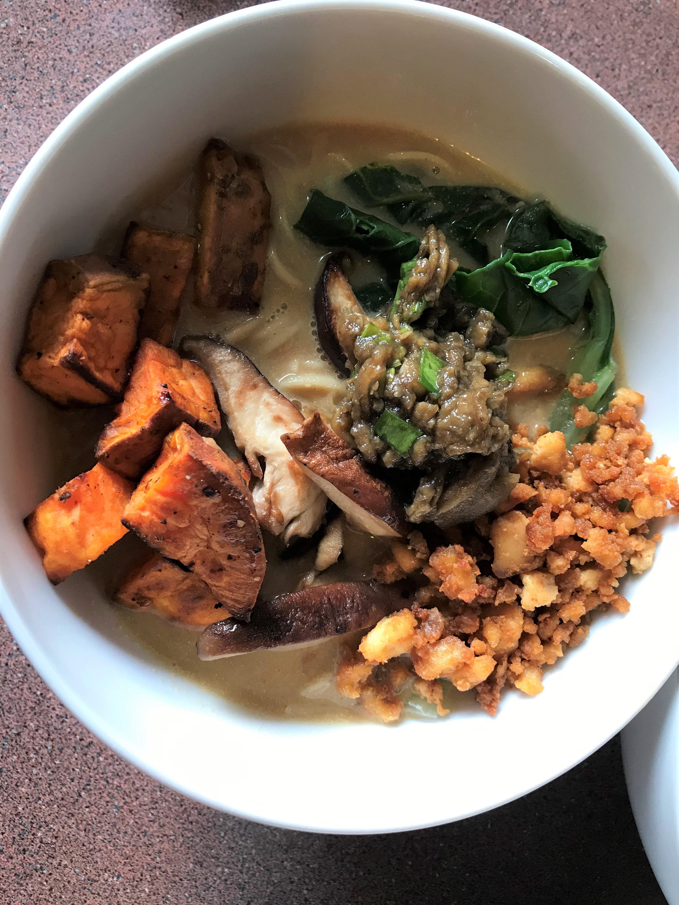
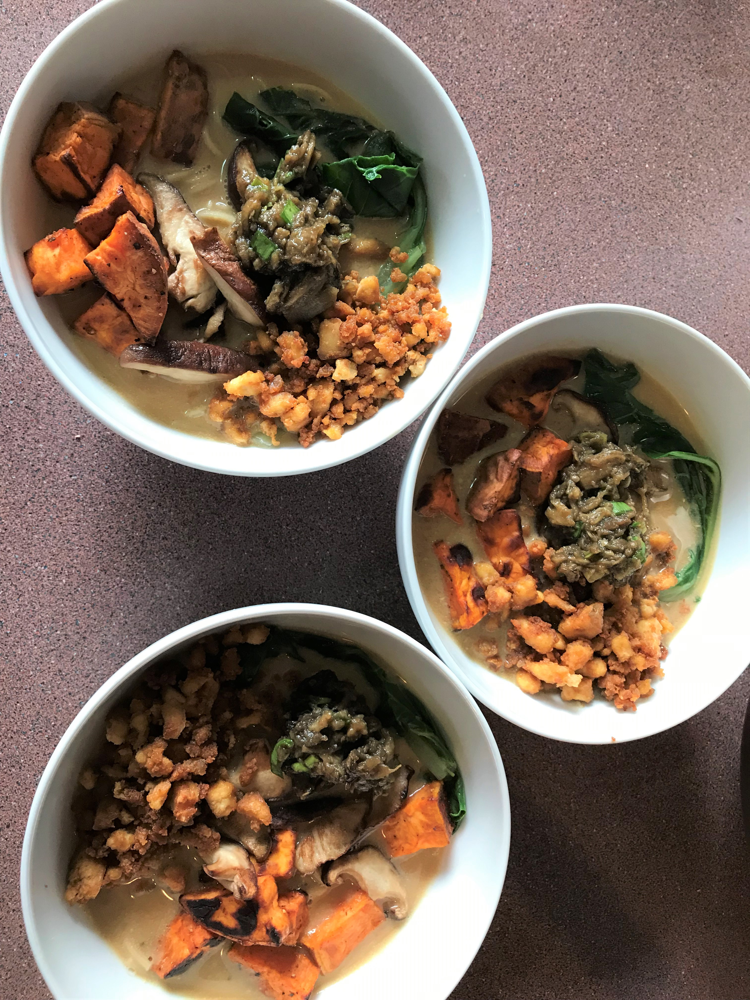
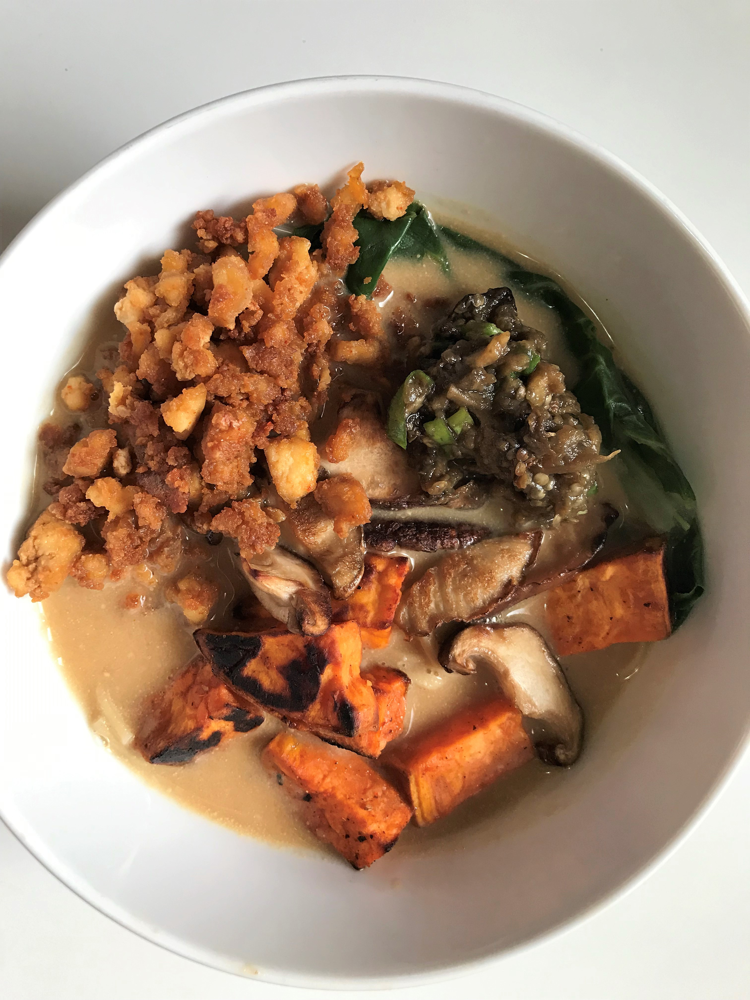

## 

In our house, we LOVE ramen. Before we became vegan, there was a time when Max and I used to go and have ramens for lunch at least once every week. There was a little restaurant run by Japanese guys down the road from my office and they had a lunch special where you could get a huge bowl of ramen with gyozas and rice for something like $15 NZD. It was epic. And epic-ally delicious.

But not so healthy :( Max gained some fair amount of weight those days haha.

Anyway, I digress.

It has been really hard finding a good vegan ramen. We went to a few places but none really hit the spot. Then I came across a recipe from Serious Eats that just sounded too good not to try. I tried it but with some modifications to save time. The first time I made it, Max's verdict was that I shouldn't make it again because it took a lot of time and for that amount of time the taste was not matching up to it.

But I didn't give up.

Since then, I've been trying different variations and trying to perfect it and make it better each time. The last time I made it was about a month ago and it was DELICIOUS. We all loved it and had seconds. And, it took less time.

Max especially requested that I made ramen today and I was more than happy to oblige :) And this time, I recorded it all down on paper (or well, actually, on this blog) so next time we can repeat it exactly as it was this time around. Perfection. Max said he wanted to eat my ramen because he had ramen a few days ago for his work dinner, only it was not vegan (vegan fail!) and he did not like it. Can you believe it, after dinner today he told me that this vegan ramen tastes much, MUCH, nicer than the one he had a few days ago. WIN!! YUS. DELICIOUS, PERFECTION, VEGAN RAMEN: ACHIEVED!

## Ingredients

### For the sweet potatoes

- 1 large sweet potato
- 1 Tbsp olive oil
- 1/4 tsp cayenne pepper (or other chilli powder)
- pepper to taste

### For the eggplant and stock

- 1 medium sized eggplant
- 1 medium onion
- 1 bulb of garlic
- Some slices of ginger
- 6 spring onions
- a small piece of dried kelp
- 6 dried shiitake mushrooms
- 1 Tbsp soy sauce
- 1/2 tsp mirin

### For the crumbled tofu

- 1 Tbsp olive oil
- 1 Tbsp soy sauce
- 2 Tbsp nutritional yeast flakes
- 1 tsp cayenne pepper or chilli
- 1/2 tsp garlic powder
- 1/4 tsp smoked paprika powder.
- 1 pack (approx 380g) extra firm tofu

### For the tahini-miso paste

- 2 cloves finely diced garlic
- 3 Tbsp white miso paste
- 2 Tbsp tahini
- 2 Tbsp soy sauce

### Other toppings

- fried shiitake mushrooms (I used approximately 400g)
- blanched bok-choy

### Noodles

- desired amount of ramen noodles

## Method

### Step 1 - Roast the sweet potatoes

- Cut 1 large sweet potato into cubes. Place in a large bowl.
- Season with 1 Tbsp oil, 1/4 tsp cayenne pepper (or any other chilli powder you have/prefer) and some pepper.
- Mix the sweet potatoes so that it is coated well with oil and the seasoning.
- Put into an oven tray lined with baking paper.
- Roast in the oven  at 200 degrees Celsius for 25 minutes.
- Flip and roast for another 5 minutes

### Step 2 - Roast the veggies

- Pierce 1 medium sized eggplant all around with a knife.
- Cut 1 medium onion into half.
- Separate one head of garlic into cloves and put it on a sheet of aluminium foil. Drizzle with a little bit of olive oil and wrap the foil up.
- Put the eggplant, onion and garlic into the oven and bake for approximately 50 minutes at 200 degrees Celsius or until the onion is charred and the eggplant is cooked through and soft so that it has no resistance towards the stem or the base.
- Remove the eggplant and wrap it foil. Set aside.
- Set aside the onion and garlic too.

### Step 3 - Make the stock

- In a large pot (I used a Dutch Oven) add: the roasted onions, garlic, 6 sprigs of roughly chopped spring onions, a small piece of dried kelp, 6 dried shiitake mushrooms and a few slices of ginger.
- Add in 4 cups of stock and 4 cups of hot water.
- Bring it to a boil. Once boiling, cover the pot and let it simmer for about 1 hour.
- After the 1 hour, strain the stock. Save the garlic cloves and discard the rest of the veggies. Set aside the garlic cloves for use later.
- Add any juice from the roasted eggplant to the stock and then set the stock aside.

### Step 4 - Make the crumbled tofu

- In a large bowl, mix together 1 Tbsp of olive oil, 1 Tbsp of soy sauce, 2 Tbsp of nutritional yeast flakes, 1 tsp of cayenne pepper or chilli, 1/2 tsp of garlic powder and 1/4 tsp of smoked paprika powder.
- Crumble in 1 pack of (approx 380g) extra firm tofu. Mix well.
- Lay the tofu on a baking tray lined with baking paper.
- Bake in oven at 180 degrees Celsius for 45 minutes, checking and turning the tofu every 15 minutes.

### Step 5 - Make the eggplant topping

- Take the roasted eggplant and scoop out the flesh into a bowl (you can also keep some of the skin if you like).
- Add 1 Tbsp of soy sauce and 1/2 tsp of mirin.
- Mix well and set aside.

### Step 6 - Make the sweet potato mixture to add to stock

- Take the garlic gloves that you had set aside earlier, peel it, and put it into a blender.
- Add 1/2 cup of the roasted sweet potatoes and 1 cup of stock to the blender.
- Blend until smooth.

### Step 7 - Fry the mushrooms

- Slice the mushrooms and fry with a little bit of oil in a frying pan. Set aside.

### Step 8 - Prepare the tahini-miso paste to add to stock

- While the mushrooms are frying, begin to prepare the tahini-miso paste. Take a small bowl and add: 2 cloves of finely diced garlic, 3 Tbsp of white miso paste, 2 Tbsp of tahini and 2 Tbsp of soy sauce. Mix well to combine.

### Step 9 - Heat the stock and add in the sweet potato mixture and tahini-miso paste

- Start to heat the stock over low heat. Add in the sweet potato mixture and the tahini-miso paste. PS make sure the stock is not boiling (some bubbles are okay, but not a steady/rapid boil) otherwise the tahini will start to separate and get clumpy!
- Stir to combine.

### Step 10 - Blanch the bok choy and cook the ramen noodles

- Wash and cut the bok choy vertically in half.
- In a large pot over high heat, add in boiling water and then the bok choy.
- Blanch the bok choy in the boiling water for approximately 1 minute then remove from the water.
- Add the ramen noodles into the boiling water and cook according to the time on the packet. Drain.

### Step 11: Putting it all together

- In a bowl, first put the desired amount of noodles, then the bok choy, then laddle with the soup.
- Add in the toppings: the sweet potatoes, fried mushrooms, crumbled tofu that we made and eggplant.
- Enjoy!

