I read this article from Dr Michael Greger about the significantly lower rates of cancer in India as compared to the USA and was absolutely blown away.  
I mean, US men get 23 times more prostate cancer than men in India?! Whaaaat?

>   
> Americans get between 8 and 14 times the rate of melanoma, 10 to 11 times more colorectal cancer, 9 times more endometrial cancer, 7 to 17 times more lung cancer, 7 to 8 times more bladder cancer, 5 times more breast cancer, and 9 to12 times more kidney cancer. And this is not like 5, 10, or 20_%_ more, but _times_ more. So hundreds of percent more breast cancer, thousands of percent more prostate cancer—differences even greater than some of those found in the China Study.
> 
>   
> [https://nutritionfacts.org/video/back-to-our-roots-curry-and-cancer/](https://nutritionfacts.org/video/back-to-our-roots-curry-and-cancer/)

That is crazy!  
  
What causes such a crazy difference? Well, the main thing seems to be turmeric - you see, Indian's use a lot of turmeric in their cooking. But, it's not just the turmeric, it's a combination of things such as the fact that 40% of Indians are vegetarian and the population overall does not eat much meat. It may also be the fact that they eat not only turmeric but many different spices, and lots of it.  
  
So, after reading this, I thought I would share my favourite lentil/dal recipe with you. This version does not use any stock and is, in my view, more authentic and more delicious than my [Simple Dahl](https://shalveena.com/2018/08/26/dahl-indian-lentil-soup/) recipe.

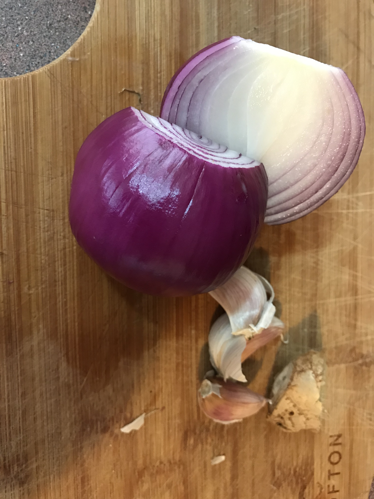

Lots of onion, garlic and ginger

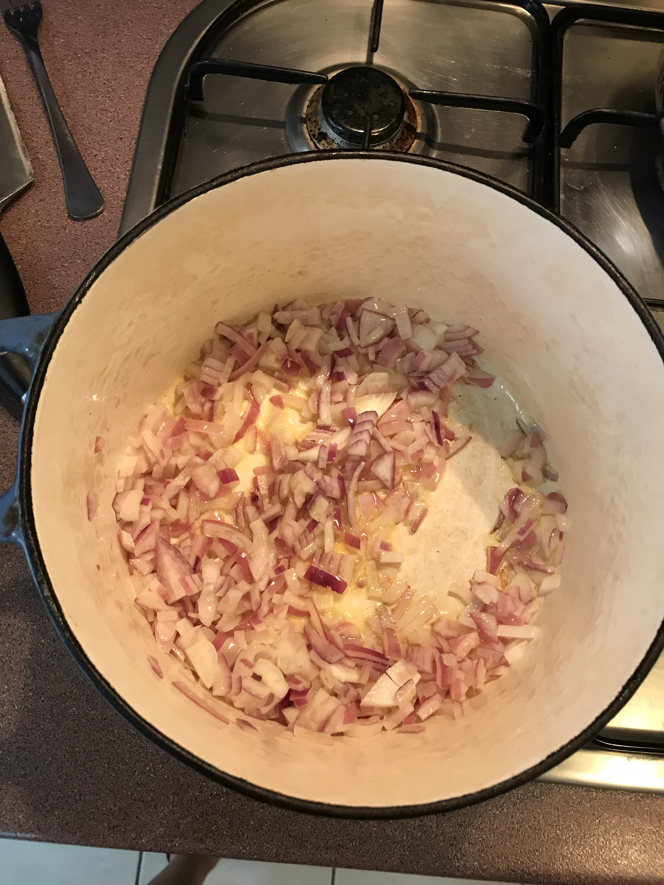

Did you know, most Indian recipes (at least the ones from Fiji) start with onion (and then garlic and other spices)?

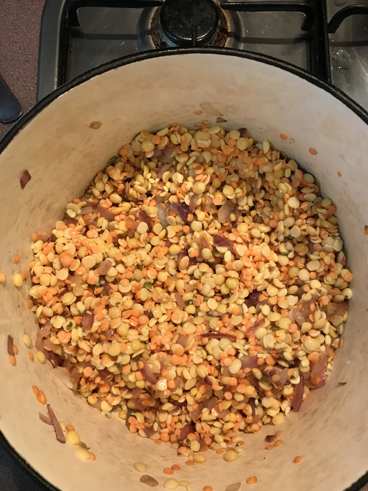

Then in go the lentils

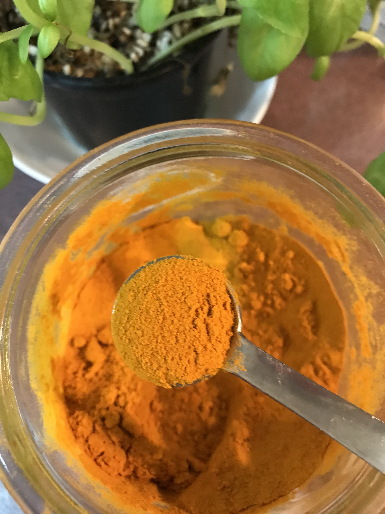

The magic, healing ingredient: turmeric :)

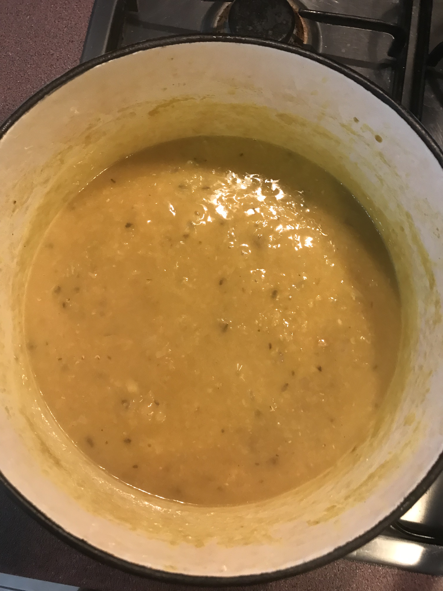

The lentils should be fully broken down. You can add as much (or as little) water as you like - if you like your dal thicker, add less water; if you like thin dal, add more water.

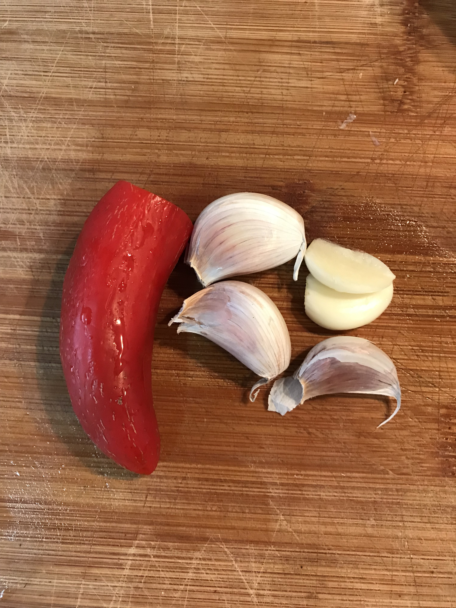

The garlic and chilli for later

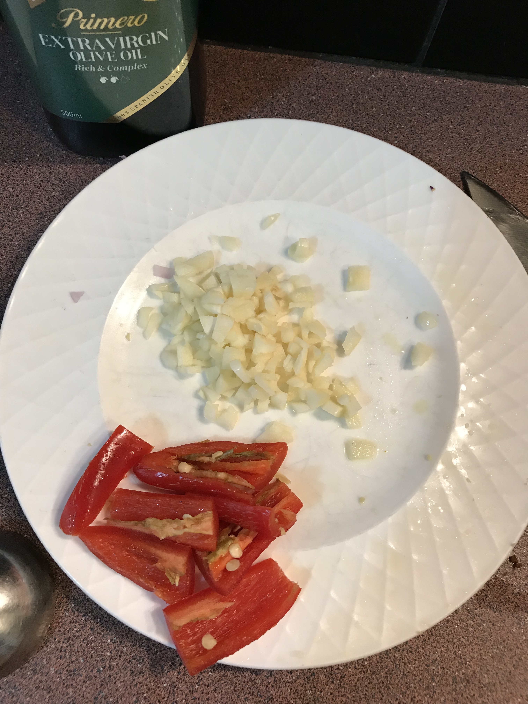

Garlic is now all chopped and the chilli is cut roughly

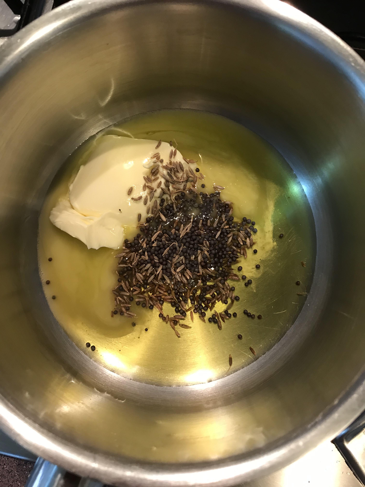

Time to put together the additional spices and fry it in oil and butter

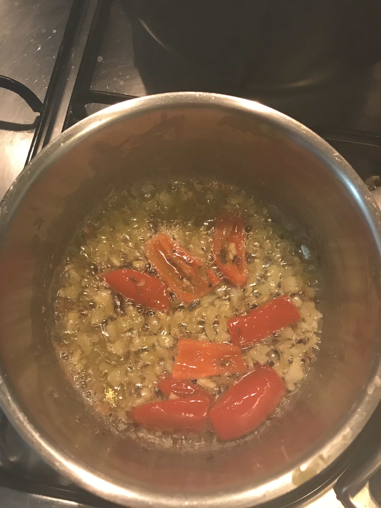

Then adding the garlic and chilli

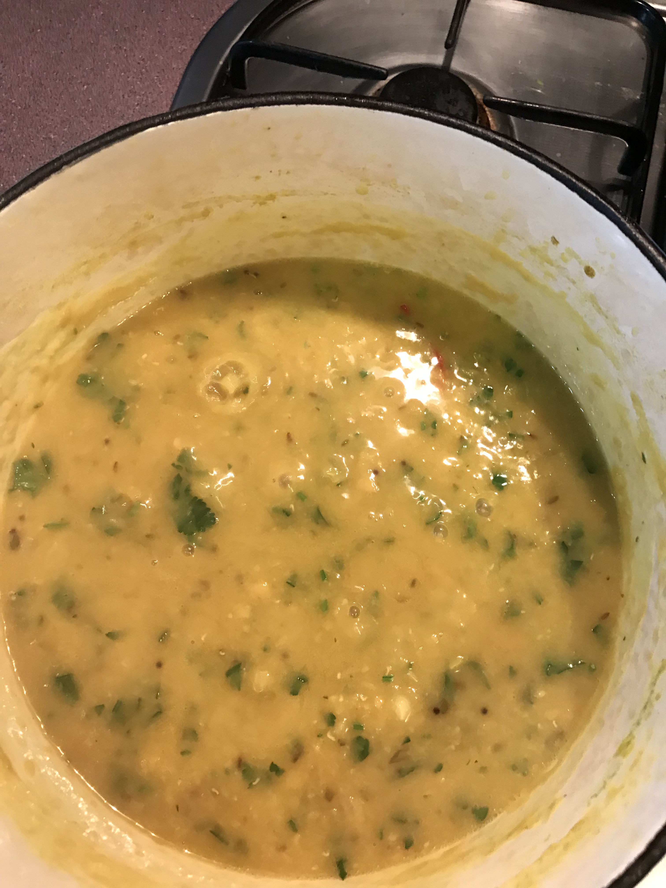

Lastly, some chopped coriander, and you're done. Yummy!

## Ingredients

- 1 tablespoon of olive oil
- 1 onion, chopped
- 2 cloves of garlic, crushed or finely chopped
- A small piece of fresh ginger, crushed, or some ginger powder (about 1/4 tsp)
- 1 cup of lentils, soaked in water over-night or for a few hours (I usually mix 3 different types of lentils, 1/3 cup each. I use any of the following, depending on what I have at home: red lentils (masoor dal), yellow split peas, toor dal, moong dal, channa dal)
- 4 cups of hot water
- 1/2 teaspoon turmeric (heaped)
- Chopped coriander
- Optional: tomatoes, carrots, other veggies

For the tempering:

- 3 -4 cloves of garlic, chopped
- 2 chilli roughly chopped
- 1 teaspoon cumin (whole, not the powder)
- Just over 1/4 teaspoon mustard seeds
- 1 tablespoon butter/vegan butter
- 1 tablespoon oil

## Method

1. Heat 1 Tablespoon of oil in a large pot over medium heat. When it is hot, add the onions. Cook until the onions are soft.
2. Add the garlic and cook for a few more seconds until the garlic is fragrant.
3. If you like, you can add some fresh chopped tomatoes at this point and cook until the tomatoes are soft.
4. Wash and drain the lentils. Add it to the pot. Stir to mix and let it fry for a few minutes.
5. Add 3 - 4 cups of hot water and the turmeric and ginger. If you are using additional vegetables like carrots or potatoes, you can add it at this stage. Bring it to a boil then lower the heat a little bit, cover it partially (if you cover it fully, it will boil over!) and let it simmer away until the lentils are breaking apart and mixed into the soup. I did not time this part but I estimate it takes about 45 minutes.
6. After about 20 minutes you can add some salt to taste. I usually add about 1 teaspoon or a slightly more.
7. If the dal is looking too thick, feel free to add some more hot water until it reaches your desired consistency.
8. When the dal is almost done, heat a small pot/saucepan over medium high heat and add the butter and olive oil for tempering. When the butter starts to melt, add the cumin and mustard seeds. Let it sputter then add the garlic and chilli. Let the garlic fry until it starts to turn golden brown, but be careful not to let it burn!
9. When the garlic starts to get golden brown, take the small pot of the stove top and add the oil and spices to the pot with the dal in it. Mix well. Taste to check the salt and add more if needed.
10. Add chopped coriander to the dal, stir to mix and turn off the heat.
11. Enjoy with rice, roti or by itself :)

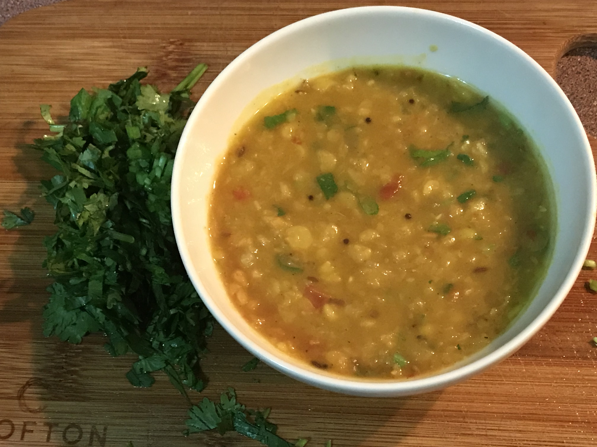