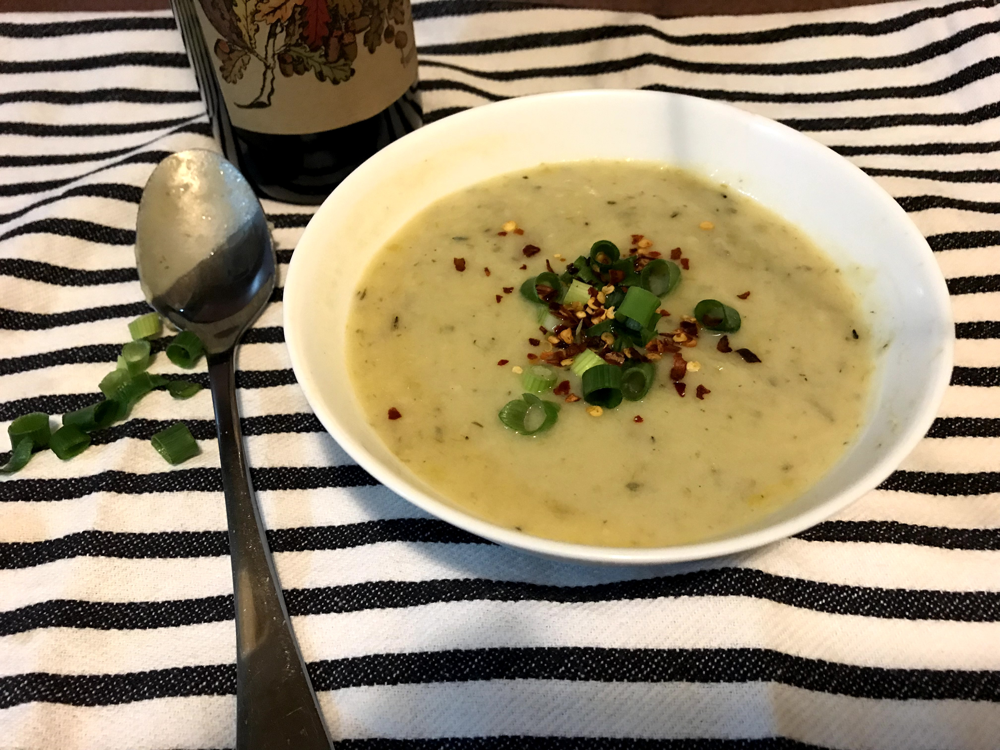

I love potatoes - in all shapes and forms (except for plain boiled potatoes)! This soup is perfect for my fellow potato lovers (and even if you don't like potatoes, I urge you to give this a try). It is easy, fast, and yummy!

I have searched for potato and leek soup for a long time and didn't find one that was vegan and easy, and also yummy. Then, I found [this creamy vegan potato leek soup from Vegan Huggs](https://veganhuggs.com/creamy-vegan-potato-leek-soup/) and it was perfect. I have adapted the original recipe a little bit here. I hope you enjoy it as much as I did.

This recipe will make a big pot of soup, which will easily serve at least 4 people I would say (if not more) as a side dish. You can freeze the rest if it is not eaten up in a few days' time.

## Ingredients

- 1 and 1/2 Tbsp olive oil
- 1 Tbsp vegan butter
- 1 small onion, diced
- 3 large leeks, cleaned, and thinly sliced (while and light green parts only)
- 5 medium potatoes
- 6-7 cloves of garlic, finely chopped
- 1 tsp or more of salt (to taste)
- pepper to taste
- 1 and 1/2 tsp dried thyme
- 1/2 tsp rosemary
- 1/2 tsp ground coriander
- 5 cups vegetable broth/stock
- 2 bay leaves
- 1 cup soy milk

## Method

1. Heat 1 and 1/2 Tbsp of olive oil in a large pot over medium heat.
2. Add the leeks and onion and saute until soft - about 6 minutes. The leeks look like a really large amount when they are sliced and raw, but they will shrink as they cook so don't worry!
3. Add the potatoes, the garlic, 1 and 1/2 tsp thyme, 1/2 tsp rosemary, 1/2 tsp coriander and saute it all for 3 minutes.
4. Add the vegetable broth/stock, 2 bay leaves, salt and pepper. Raise the heat to bring it to a simmer (uncovered), then reduce it to low and let it simmer (covered) for about 20 minutes, until the potatoes are breaking apart and tender.
5. Remove it from heat and remove the bay leaves. Stir in the soy milk.
6. Blend with an immersion blender until smooth. Taste and adjust seasoning as needed.
7. Serve in bowls and top with slices of spring onion and chilli flakes as garnish.

The original recipe asked for coconut milk but I swapped it for soy milk because (in my opinion) coconut milk is very high in saturated fat and therefore not very good for us. It tasted amazing with the soy milk. The original recipe also called for optional lemon juice (1 - 2 Tbsp); I made this soup the first time without the lemon juice and a second time with the lemon juice. Max didn't like it with the lemon juice so I've left it out in this recipe.

I've also added significantly more garlic than the original recipe because, well, I simply LOVE garlic and it is also good for health (bonus!).

