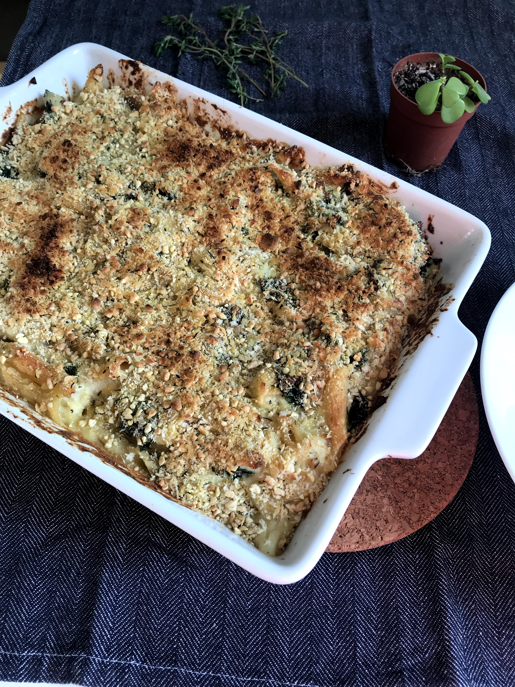

I love pasta bakes - but it has proven difficult to make vegan versions with the same satisfying taste of comfort food. That is, until I found [this pasta bake recipe from Izy Hossack](https://topwithcinnamon.com/creamy-cauliflower-mushroom-kale-pasta-bake-vegan-option/). It tastes delicious and has all the warmth and satisfaction of comfort food without being unhealthy! The secret? Cauliflower! Yes, there is a whole head of cauliflower hidden in this recipe! My version below is slightly changed from the original recipe from Izy.

It is a bit of an involved recipe and requires some time but is oh so worth it.

I hope you try it and I hope you love it :)

Difficulty level: Confident Cook

Time: 1 hour and 40 minutes (I had the cauliflower pre-cut and washed and also had the kale pre-washed)

Serves: 3 - 4 people

## Ingredients

- 1 small head cauliflower, cut into medium florets
- 1 small potato, sliced into about 1 cm slices
- 250g penne pasta
- olive oil
- 2 Tbsp plain flour
- 200ml unsweetened soy milk
- 200ml vegetable stock
- 1 Tbsp Dijon mustard
- salt and black pepper to taste
- 200g button mushrooms, sliced (not super thinly sliced)
- 6 -7 cloves garlic, finely chopped
- 1 tsp dried thyme
- 3 cups tightly packed chopped kale

Topping:

- 4 Tbsp breadcrumbs
- [4 Tbsp vegan parmesan cheese](https://minimalistbaker.com/how-to-make-vegan-parmesan-cheese/)
- 1/2 tsp dried thyme
- a drizzle of olive oil

## Method

1. Bring a large pot of salted water to the boil over high heat.
2. Add the cauliflower and potato to the pot of boiling water and bring back to a boil. Once it is boiling again, lower the heat to simmer and let it simmer for 8 minutes. After 8 minutes, remove the cauliflower and potatoes to a large bowl.
3. In the same water (add more water as necessary), add the pasta and let it come to a boil over high heat. Boil for 5 minutes. Drain pasta, mix with some olive oil to prevent it from sticking and set aside.
4. Mix together 200 ml of stock and 200 ml of soy milk in a bowl or jug.
5. In a medium pot, add 2 tablespoons of flour and 2 tablespoons of olive oil. Stir over low/medium heat and let it cook for 1 minute, stirring constantly. Then, add the stock and milk mixture gradually, mixing it constantly.
6. Once all the liquid is added to the pot, let it come to a simmer and continue to simmer for 2 minutes - stirring frequently to avoid clumps forming.
7. Pour the liquid over the bowl of cauliflower and potato, add a tablespoon of dijon mustard and blend it all together using a hand blender until smooth. Season with salt and pepper to taste. I used 1 teaspoon of salt.  Set aside.
8. Preheat oven to 180 C.
9. In a medium fying pan, heat 1 tablespoon of olive oil over medium heat. Add the mushrooms, garlic and 1 teaspoon of thyme and cook for 6 minutes, uncovered.
10. Add the kale to the frying pan, turn heat down to low, cover with a lid and cook for 7 minutes. Remove the lid and set take the frying pan off the heat.
11. Now, make the topping: in a small bowl, mix together 4 tablespoons of breadcrumbs, 1/2 teaspoon of dried thyme, and 4 tablespoons of vegan parmesan.
12. In a medium casserole dish, mix the pasta, mushrooms & kale, and the cauliflower sauce. Mix it well to combine. Sprinkle the topping on top and drizzle with some olive oil.
13. Bake in the oven for 20 - 30 minutes until the top is golden brown (darker in some places is absolutely okay).

