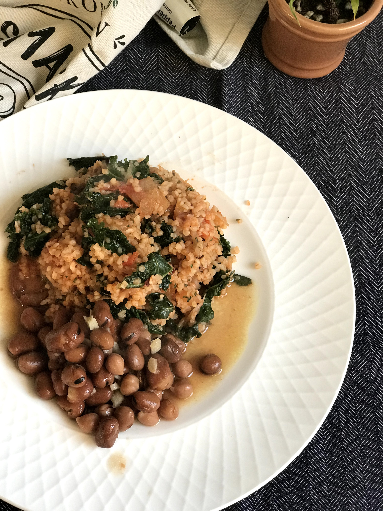

I'm always looking for more ways to incorporate greens and beans into our food. This tomato bulgur recipe with kale and fava beans is a great way to do just that. It's also very YUMMY. Max absolutely loves it (so do I!). And the great thing is that it uses ingredients that I usually have in my pantry/fridge. To top it all of, it is also super easy and fast to put together.

I hope you will too :)

Difficulty level: Absolute beginner

Time: 45 minutes, including preparation time

Serves: 2 - 3

## Ingredients

- 3/4 cups of bulgur (I used the quick cook type that only needs soaking)
- 1 medium onion, sliced
- 5 to 6 cloves of garlic, minced
- 3 tightly packed cups of chopped kale
- 1 large, or 2 small tomatoes, chopped
- 6 Tbsp Passata
- 3 Tbsp dried parsley
- 1/2 tsp salt
- pepper and chilli to taste

For the beans:

- 400g can fava beans (I used a mix of fava beans and chickpeas), slightly drained (I got rid of some of the liquid but kept around half or more)
- 1 Tbsp olive oil
- 3 cloves of garlic, sliced
- 1/4 tsp cumin powder
- 1/4 tsp salt
- 1/2 Tbsp lemon juice

## Method

1. Soak the bulgur in hot water for 10 - 15 minutes (if you have a different type of bulgur, cook it according to package instructions).
2. In a small pot over low heat, heat the 1 Tbsp olive oil. Once the oil is warm, add the garlic slices and fry for a few seconds (until the garlic starts to change colour near the edges).
3. Add the beans with their liquid.
4. Add the 1/4 tsp cumin and 1/2 tsp salt.
5. Cook over low heat, uncovered for a couple of minutes.
6. Then, add the lemon juice, cover, and let it simmer slowly while you cook the rest of the things. Stir it from time to time.
7. Heat a frying pan over medium heat. Add some oil (about 1 Tbsp) and the onion. Cook until onions get soft and start to change colour.
8. Add garlic and cook for a few more seconds, until garlic is fragrant.
9. Add the kale and tomatoes and continue cooking until the kale is wilted and tomatoes are soft to your liking.
10. Drain and add the bulgur, and continue cooking for a minute or so.
11. Add the 6 Tbsp of passata, 3 Tbsp dried parsley, 1/2 tsp salt, and pepper & chilli to your taste. Mix well and let it cook for a couple of minutes so the passata is not raw anymore and is combined well with the bulgur.
12. Take both the frying pan and the small pot of beans off heat and serve with optional avocado on the side.
13. Enjoy!

