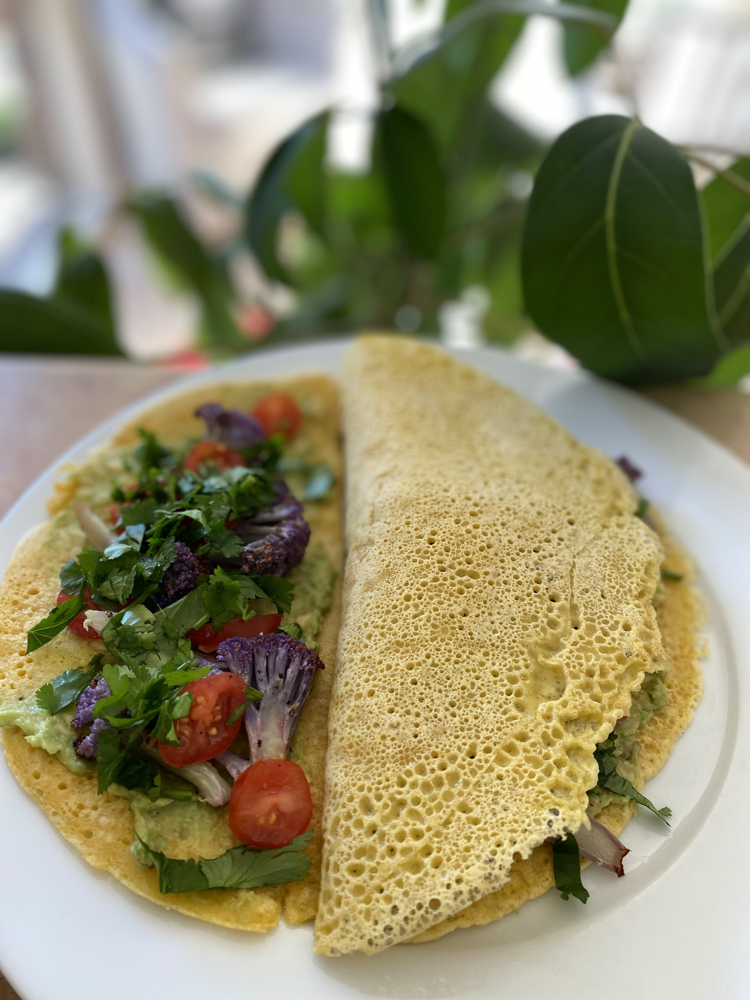

This wrap is magical! It's made with only chickpea flour, salt and water but tastes phenomenal. It's super healthy, fluffy, light and delicious.

## Ingredients

- 1/3 cup chickpea flour
- 1/4 tsp salt
- 1/3 cup water
- oil to cook (I used 1/2 tsp for each wrap)

## Method

1. Heat a non-stick frypan over medium heat.
2. Mix the chickpea flour, salt and water in a bowl using a whisk.
3. When the pan is hot, add 1/2 tsp oil to coat the pan, then add the chickpea mixture. Tilt the pan around a bit to make sure the pancake is nice and round.
4. Cook for a few minutes until the mixture has set. You'll know it is ready to flip when it starts to get bubbles and looks like it's firming up.
5. Flip and cook for a few minutes on the other side.
6. Enjoy with toppings of your choice. I topped it with roasted cauliflower, smashed avocado, sweet tomatoes and fresh coriander.

