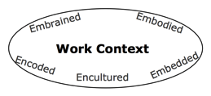
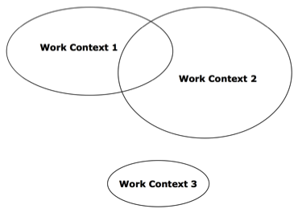

---
authors:
- max
blog: maxrohde.com
categories:
- contemplations
date: "2010-03-29"
title: Work Contexts
---

Sometimes the most difficult thing is to get started. Many writers have described the experience of sitting in front a blank sheet of paper and just not knowing what would be the first line to put. In this article, I want to provide a brief exploration what makes up a work context; or the prerequisites, which enable us to start working on a task effectively.

I have been reading a number of books on PhD research in general and writing in particular ([Rugg and Petre, 2004](http://www.citeulike.org/user/mxro/article/201585); [Mauch and Park, 2003](http://www.citeulike.org/user/mxro/article/6920658); [Single, 2010](http://www.citeulike.org/user/mxro/article/6919285); [King, 2000](http://www.citeulike.org/user/mxro/article/6921099); [Strunk and White, 1999](http://www.citeulike.org/user/mxro/article/231011)). One common theme in King's book and Singles's book was that of creating the right environment before you can start writing. King emphasizes that he needs to keep working on a book, every day, without interruption for not to lose the focus on his work. Furthermore, he describes a mental “basement room”, in which he must go in order to be able to work. Single provides a long description of how she organizes the way she works on her writing (pp. 138 ff.):

“I use my long outline with references—not a blank screen—as the starting point for writing a first draft. I type my first draft into a saved version of my long outline, which I had previously typed into my computer \[..\]. I also place a copy of the original outline on a stand that sits to the right of my computer monitor. At the end of each writing session, I check off the chapters and sections that I have completed so that the outline on my desk is up-to-date and so that I can identify the next sections I will work on. \[...\] After opening today’s version of my writing document and reviewing my long outline, I conduct a search on ‘‘\*\*\*.’’ At the end of yesterday’s writing session, I typed in the three asterisks at the end of what I had written.”

Both authors emphasize that there are certain prerequisites before they can start writing. For King, it is the continuous work and the right environment, for Single it is her organized document. There are, of course, differences between the writing of fiction and academic writing. King emphasizes the importance of the stream of the story, that the story must develop a dynamic, which carries itself forward. He, for instance, opposes the idea of a plot, which is used to structure the story before the writing begins. Academic writing, on the other hand, requires a higher degree of structure, which explains Single’s emphasis on using outlines.

However, despite these differences, both emphasize that writing must happen under the right circumstances with the right prerequisites provided. From a knowledge perspective, I understand this environment and these prerequisites as context. For any work with knowledge, many scholars agree that it cannot be seen apart from the context of its application ([Thompson and Walsham, 2004](http://www.citeulike.org/user/mxro/article/4116); [Kwan and Balasubramanian, 2003](http://www.citeulike.org/user/mxro/article/973799)).

In order to begin with work, which relies on complex knowledge, a right context has to be created. Furthermore, the productivity of knowledge work decreases if this work is interrupted ([Davis, 2002](http://www.citeulike.org/user/mxro/article/531007)). Thereby, the right context must not only be created but also maintained. This is, for instance, why King works with his “door closed”, listening to loud hard rock music, enabling him to indulge in his work and the context, or his “basement room” completely.

But what exactly is this context composed of? Both Thompson and Walsham (2004) and Kwan and Balasubramanian (2003) focus on context in an organizational setting. Single and King describe their work from an individual’s perspective. Though the importance of certain elements of context might vary between knowledge workers, which are embedded in an organizational context, and those working as freelancers, the elements themselves must not be significantly different. Thompson and Walsham describe five different components of context, for each of them, I will illustrate how they are reflected in the work of independent knowledge workers.

**Embrained and Embodied Components**. These components describe what an individual knows. Either explicitly in terms of being cognitively aware of your knowledge, or implicitly, as knowledge, which can be accessed only by intuition, without being explicitly aware of what it is. Self evidently, knowledge workers possess this knowledge independent of whether they work an an organizational context or not. Single describes that a writer must be “ready”, by appropriate engagement with the literature, before being able to write. King’s reference to the story writing itself, characters becoming independent from the control of the author, can be seen as related tot he notion of embodied components - knowledge, which apparently is there, but which we are not able to comprehend completely.

**Encoded Components**. These components represent information, which is explicitly encoded in any media. This can include, among other forms. databases, documents, or tape records. Although encoded information in organizations can be expected to be of far greater quantity and complexity than information of individuals, doubtlessly, both with or without an explicit organizational context, knowledge workers will require encoded information. This, for instance, can be Single’s outline, which supports her writing.

**Encultured Components.** Encultured components are the tacit shared beliefs, which implicitly guide understanding and decisions. This can, for instance, be a a certain corporate language, or an environment of general trust or distrust. Independent freelancers, though they might not be explicitly embedded in a corporate culture, are nonetheless embedded in other cultural contexts. Such as those of society in general, or groups they belong to.

**Embedded Components**. These components refer to implicit knowledge, which is existent in organizational structures and processes. Although freelancers might not be surrounded by organizational structures and processes, they still conduct their work in certain patters: Single has proposed a step by step system, which can be followed to write a dissertation; King describes the process, in which he usually writes his books (first draft, second draft, third draft, ...). These processes are similar to those governing organizations, though they are, of course, less collaborative in nature.

As has been argued above, all contextual components described by Thompson and Walsham (which stem from a literature review by Blackler ([1995](http://www.citeulike.org/user/mxro/article/4234698))) are also relevant for knowledge workers, who are not explicitly embedded in an organizational context. But none withstanding, there are certain differences. One very importance difference is in the length and number of tasks. While authors of an dissertation or a novel usually have only one primary task at hand (King says he writes one novel at a time, though sometimes interrupted by writing a short story between first and second draft), knowledge workers in a organizational context, usually have to deal with a great diversity of tasks, many requiring immediate attention. However, Single stresses the point that writers of dissertations must learn to work on their writing in very short intervals. The mechanism she describes in above given excerpt aim at accomplishing this.

Both in organizational embedded or independent knowledge work, the worker can be interrupted by other task at hand. From anther perspective, each worker has more than one context, which is of importance for the whole of his or her work. Basically, switching between tasks can also be understood as switching between contexts; contexts, which are composed of the components discussed above. Switching task thereby requires to switch the context, or work context, in which on operates.

Work contexts can thereby be of different nature. A very complex task (like writing a novel or dissertation), might require a very rich work context; for instance, one that is build up over weeks and sustained through constant work, as in King’s case. Other work contexts might be smaller; for instance writing an email to property services that a light bulb must be replaced. Moreover, work contexts can be more or less related. The contexts for planning two different projects might still intersect in the area of knowledge, which is required of general project management principles. The following figure illustrates different work contexts in a form of a Venn-digram: bigger circles indicate more complex work contexts; intersecting circles indicate that the work contexts are related to each other. 

Effective transition between work contexts can reduce the effects of interruption. McFarlane ([2002](http://www.citeulike.org/user/mxro/article/6868198)) has shown that it is easier for users to reengage with a tasks, if they can focus on less complex aspects of the tasks first. This indicates that there are different ways to switch between work contexts, where some are better or worse than others.

An interesting question here, is whether the work contexts could effectively be expressed in knowledge networks or if knowledge networks are a more efficient way of expressing work contexts and to support the transition between work contexts. Issues in these context can be the scalability to work contexts of different complexity, the effectiveness in which a work context is presented (Intelligence density ([Dhar and Stein, 1996](http://www.citeulike.org/user/mxro/article/4509095))), and the ability to support related as well as unrelated work contexts.

Some important parameters in this context are:

(1) How much time does it take to create and maintain an encoded work context? (2) How much time does it take to re-indulge in a work context? E.g. how quickly does the productivity rise? (3) Are the results any better when working with explicitly encoded rather than only implicit work contexts? (4) Is it possible to share some parts of a work context with others? Can these work context be created, maintained and used collaboratively? (also considered other modes of CSCW)