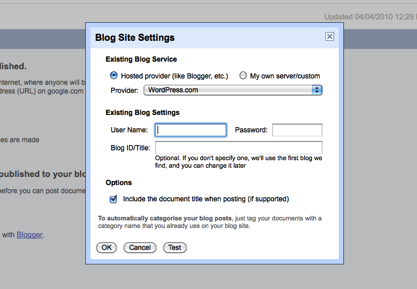

---
authors:
- max
blog: maxrohde.com
categories:
- contemplations
date: "2010-04-03"
title: 'Google Docs: Ubiquitous Information Authoring and Publishing'
---

Google Docs is a cloud computing service, which allows to store and edit formatted text, presentations, and spreadsheets using an online interface. Google Docs can thereby be access from most devices, which support access to the web and JavaScript. This makes Google Docs a great tool to author information of different kind in ubiquitous situations.

Following a few key features, which can enable Google Docs to be a platform for ubiquitous information authoring:

**Desktop Integration**

Desktop integration is supported by a number of tools. Most of them support the upload of files to Google Docs. However, there are more sophisticated solutions, allowing the integration with Microsoft Office or OpenOffice ([OpenOffice.org2GoogleDocs](http://extensions.services.openoffice.org/project/ooo2gd)). However, the OpenOffice extension does not seem to work at the moment. [Memeo Connect](http://www.memeoconnect.com/) does not only directly integrate with Microsoft Office but also has its own editor for Google Docs documents. Furthermore, this software keeps local copies of Google Docs documents synchronized with the documents on the server. New files can be added by drag and drop. However, it seems that this software requires a Google Apps Premier Edition registration (Google applications for for business users, priced at $50 a year per user).

**iPhone Integration**

A number of clients and plugins are available, which integrate with Google Docs with the iPhone.

Doc2, an iPhone work processor allows to download, edit, and upload documents to Google Docs ([Tuaw - Doc² 3.0: iPhone word processing with Google Docs, iDisk goodness, 2010](http://www.tuaw.com/2010/01/05/doc-3-0-iphone-word-processing-with-google-docs-idisk-goodnes/)). Doc2 seems to work without many problems, Google Docs documents can be viewed and edited. In case there is no Internet connection available, local documents can be created and later uploaded to Google Docs. However, the interface for writing text only shows a two lines of text due to the large on-screen keyboard and the formatting buttons in landscape mode. This can make it difficult to edit text. Picture upload does not always seem to work (you supposedly can add pictures from your iPhone camera roll).

Another software is Quickoffice [(geek.com - Quickoffice for iPhone updated with Google Docs, Dropbox, Box.net, 2010](http://geek.com)). However, the latest version of Quickoffice received some bad reviews on Apple’s app store.

Further, there are the free applications Documents Free and Documents 2 Free from Savy Soda. However, they do not seem to support formatted documents, which makes a download from Google Docs difficult. Also, the upload and download of Google Docs documents seems rather clumsy. There is no automatic synchronization.

**File Storage and Synchronization**

Google Docs further provides facilities to store files in any formats, not just the documents created by the service. Many tools have been developed, which allow to upload content to Google Docs ([Life Rocks 2.0 - 4 Simple Ways to Upload Files to Google Docs, 2009](http://www.nirmaltv.com/2009/03/24/upload-files-to-google-docs/)).

**Social Media Integration**

Google Doc integrates with popular blogging engines such as Wordpress or [Blogger.com](http://Blogger.com). Every Google Docs document has an option “Publish as Web page”. Here the “Post to Blog” option can be chosen to publish to the various blogging engines.  Using this facility, the published documents can also be disseminated to various social media platforms ([hobo - Publish Google Docs To Wordpress To Twitter & Facebook ETC, 2010](http://www.hobo-web.co.uk/seo-blog/index.php/google-docs-to-wordpress-to-twitter-social-sites/)).