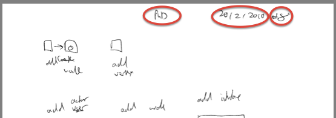
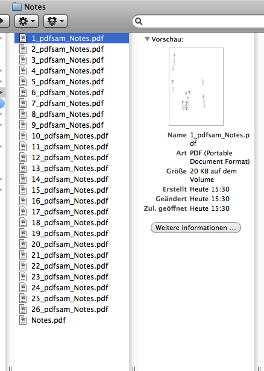
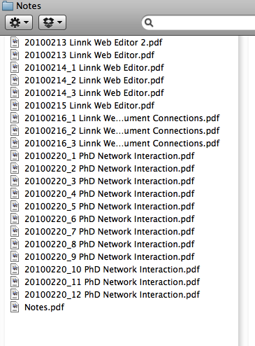

Despite omnipresent digital devices such as laptop, smartphones and tablet computers, it is sometimes inevitable to record a note, thought or concept on a profane piece of undigital paper. For me personally, I sometimes have my best thoughts when working with pen and paper, so, producing a few dozen pages a month, I am struggling to find a process to digitize the pages, which can be helpful for later work. I have been trying this for years and, still, I find the process too time consuming, and too often pages get lost. This is my current process:

**Proposed Process:**

- Record the category and the date on each page. If there is more than one page on a category on a specific day, number the documents #1 ... #n.

- Scan the documents, preferably using a scanner, which can process multiple pages at a time and converts them into PDF.
- Split PDF document with multiple pages into individual pages (for instance using [Split and Merge PDF](http://nexnet.wordpress.com/2010/04/10/software-pdf-split-and-merge/))

- Rename the split pages according to the following schema YYYYMMDD\_{document number for the day} {category}.pdf; delete pages, which do not contain any useful information.

- Add the individual pages to your knowledge network, if they contain useful information.

One problem with this is that when you have scanned a bunch of notes, it is a rather painful process to split one pdf document into separate files with Adobe Acrobat (8.0.0 on Mac OS X), as the individual pages most likely will need to be filed in different locations. [Split and Merge PDF is a useful tool to split a PDF into individual files for each page](http://nexnet.wordpress.com/2010/04/10/software-pdf-split-and-merge/).

Update (11/2/2012): [Shot Note](http://www.wired.com/gadgetlab/2011/02/shot-note-paper-pads-designed-to-be-scanned-by-iphone/) ([more screenshots](http://kenjiair.blogspot.co.nz/2012/01/iphoneandroidshot-noteevernote.html)) seems to be an interesting tool to capture handwritten notes using iPhone/iPad/Android camera. This might be more convenient than manual scanning.
