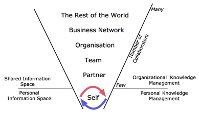

Personal knowledge management or personal information management is a distinct cross-disciplinary stream of literature. Personal information management in an organizational setting is a special case, as the management of personal information should be aligned with organizational knowledge management efforts. In this article, we provide a framework, which can help understanding the context of personal knowledge management in an organizational setting, by illustrating the different levels of “reach” (for a discussion for reach and range see [Weill and Broadbent, 1998](http://www.citeulike.org/user/mxro/article/4834591), p. 91) for personal knowledge management.

 _Framework: Reach of Personal Knowledge Management_

This framework is informed by the notion of knowledge on different units of aggregation. Tiwana ([2002](http://www.citeulike.org/user/mxro/article/281379), p. 42) describes how knowledge is aggregated on different levels. Individuals accumulate knowledge but if they collaborate in a team context or in their department, knowledge on a team level is created. Teams can collaborate with other teams, which leads to knowledge being created on the organizational level. The organization itself can be part of a business network that exchanges and creates knowledge.

Similar levels can be found in multilevel research. Multilevel research tries to provide robust frameworks to guide studies in choosing a unit of analysis. Multilevel research proposes that “organizational entities reside in nested arrangements” ([Hitt et al., 2007](http://www.citeulike.org/user/mxro/article/6999279)). Hitt et al. ([2007](http://www.citeulike.org/user/mxro/article/6999279)), for instance, describe individuals as nested within groups, which themselves are nested in subunits, organizations, interorganizational networks and environments.

Each of the levels or units of aggregation are of importance for knowledge management: knowledge is managed by individuals ([Lansdale, 1988](http://www.citeulike.org/user/mxro/article/4491396); [Kim, 1993](http://www.citeulike.org/user/mxro/article/4575311)), between individuals in direct interaction ([Thompson and Walsham, 2004](http://www.citeulike.org/user/mxro/article/4116); [Orlikowski, 2002](http://www.citeulike.org/user/mxro/article/3739501) among others), between individuals in teams ([Walz et al., 1993](http://www.citeulike.org/user/mxro/article/3754395); [Eppler and Sukowski, 200](http://www.citeulike.org/user/mxro/article/4079526)0), between groups/teams in an organization ([Carlile, 2002](http://www.citeulike.org/user/mxro/article/4079519); [Tanriverdi, 2005](http://www.citeulike.org/user/mxro/article/4226695)) and between organizations ([Dyer and Nobeoka, 2000](http://www.citeulike.org/user/mxro/article/3754397)). The following table summarizes different scopes of researchers in investigating knowledge and knowledge management that correspond to the different units of aggregation.

<table style="empty-cells:show;border-collapse:collapse;"><tbody><tr><td style="border-top:0 solid #000000;border-bottom:0 solid #000000;border-right:0 solid #000000;margin:0;padding:0;"><strong>Scope</strong></td><td style="border:0 solid #000000;margin:0;padding:0;"><strong>Literature</strong></td></tr><tr><td style="border-top:0 solid #000000;border-bottom:1px solid #bfbfbf;border-right:0 solid #000000;margin:0;padding:0;">Individual/Self</td><td style="border-top:0 solid #000000;border-bottom:1px solid #bfbfbf;border-right:0 solid #000000;margin:0;padding:0;">Analysis of how individuals use emails to organize their knowledge (<a href="http://www.citeulike.org/user/mxro/article/483049">Whittaker and Sidner, 1996</a>)Analysis of how individuals organize their knowledge using hierarchical file structures (<a href="http://www.citeulike.org/user/mxro/article/2209218">Barreau and Nardi, 1995</a>)

How individuals can store and retrieve knowledge using information technology (<a href="http://www.citeulike.org/user/mxro/article/4491396">Lansdale, 1988</a>)</td></tr><tr><td style="border-top:0 solid #000000;border-bottom:1px solid #bfbfbf;border-right:0 solid #000000;margin:0;padding:0;">Partner</td><td style="border-top:0 solid #000000;border-bottom:1px solid #bfbfbf;border-right:0 solid #000000;margin:0;padding:0;">Knowledge transformation in an organization (<a href="http://www.citeulike.org/user/mxro/article/4233564">Carlile and Rebentisch, 2003</a>)Knowledge shared in face-to-face meetings (<a href="http://www.citeulike.org/user/mxro/article/3739501">Orlikowski, 2002</a>)</td></tr><tr><td style="border-top:0 solid #000000;border-bottom:1px solid #bfbfbf;border-right:0 solid #000000;margin:0;padding:0;">Team</td><td style="border-top:0 solid #000000;border-bottom:1px solid #bfbfbf;border-right:0 solid #000000;margin:0;padding:0;">Processes in team knowledge management (<a href="http://www.citeulike.org/user/mxro/article/4079526">Eppler and Sukowski, 2000</a>)Knowledge management of a software development team (<a href="http://www.citeulike.org/user/mxro/article/3754395">Walz et al., 1993</a>)</td></tr><tr><td style="border-top:0 solid #000000;border-bottom:1px solid #bfbfbf;border-right:0 solid #000000;margin:0;padding:0;">Organization/ Business units</td><td style="border-top:0 solid #000000;border-bottom:1px solid #bfbfbf;border-right:0 solid #000000;margin:0;padding:0;">Knowledge of the organization emerges from knowing individuals (<a href="http://www.citeulike.org/user/mxro/article/4116">Thompson and Walsham, 2004</a>)New product development project across multiple departments (<a href="http://www.citeulike.org/user/mxro/article/4079519">Carlile, 2002</a>)

Measure of knowledge management capability across business units in large firms (<a href="http://www.citeulike.org/user/mxro/article/4226695">Tanriverdi, 2005</a>)

Knowledge-intensive projects in an multinational organization (<a href="http://www.citeulike.org/user/mxro/article/3739501">Orlikowski, 2002</a>)</td></tr><tr><td style="border-top:0 solid #000000;border-bottom:1px solid #bfbfbf;border-right:0 solid #000000;margin:0;padding:0;">Business Network</td><td style="border-top:0 solid #000000;border-bottom:1px solid #bfbfbf;border-right:0 solid #000000;margin:0;padding:0;">Knowledge Sharing Network of Toyota and its suppliers (<a href="http://www.citeulike.org/user/mxro/article/3754397">Dyer and Nobeoka, 2000</a>)Knowledge sharing in small alliances of limited number of firms and of multiple businesses and institutional entities such as universities (<a href="http://www.citeulike.org/user/mxro/article/4233558">Ciborra and Andreu, 2001</a>)

Multiple organizations integrate their decision support and enterprise resources planning systems (<a href="http://www.citeulike.org/user/mxro/article/4509040">Shafiei and Sundaram, 2004</a>)

Organizations increase their knowledge in a collaborative effort (<a href="http://www.citeulike.org/user/mxro/article/4080469">Levinson and Asahi, 1996</a>)</td></tr></tbody></table>

An organizational knowledge network must consider and be able to represent all of these levels. As posed by multilevel research, all of these levels interact with each other. It is thereby a futile approach to build an exclusive ‘personal knowledge network’ or exclusively looking at an optimal structure for business networks. An effective organizational knowledge networks must be composed of elements from all these different levels. Any solution for personal knowledge management should not only consider the personal information, but must also consider the further reaching levels to be of use for the individual.

**Related Literature**

[Literature with tag Personal Information Management](http://www.citeulike.org/user/mxro/tag/0_pim) [Literature with tag Personal Knowledge Management](http://www.citeulike.org/user/mxro/tag/0_personal_knowledge_management) [Blog post on PIM articles in the Communications of the ACM](http://blog.jackvinson.com/archives/2006/01/07/pim_articles_from_the_acm.html)
