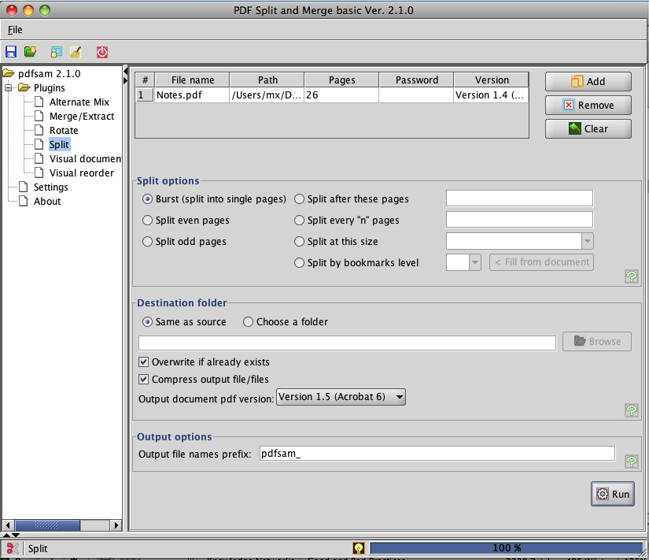

---
categories:
- contemplations
date: "2010-04-10"
blog: maxrohde.com
title: 'Software: PDF Split and Merge'
---

PDF Split and Merge is an utility for OS X, which allows to split and merge pdf files. The interface is not overly pretty but functional.

**Screenshots:**

**Application Overview:**

<table style="empty-cells:show;border-collapse:collapse;"><tbody><tr><td style="vertical-align:top;width:112px;border:0 solid rgb(191,191,191);margin:0;padding:0;"><strong>Application</strong></td><td style="vertical-align:top;width:269px;border:0 solid rgb(191,191,191);margin:0;padding:0;"><strong>PDF Split and Merge</strong></td></tr><tr><td style="vertical-align:top;width:112px;border:0 solid rgb(191,191,191);margin:0;padding:0;">Category</td><td style="vertical-align:top;width:269px;border:0 solid rgb(191,191,191);margin:0;padding:0;">Utilities</td></tr><tr><td style="vertical-align:top;width:112px;border:0 solid rgb(191,191,191);margin:0;padding:0;">Version</td><td style="vertical-align:top;width:269px;border:0 solid rgb(191,191,191);margin:0;padding:0;">2.1.0</td></tr><tr><td style="vertical-align:top;width:112px;border:0 solid rgb(191,191,191);margin:0;padding:0;">Website:</td><td style="vertical-align:top;width:269px;border:0 solid rgb(191,191,191);margin:0;padding:0;"><a href="http://www.pdfsam.org/">http://www.pdfsam.org/</a></td></tr><tr><td style="vertical-align:top;width:112px;border:0 solid rgb(191,191,191);margin:0;padding:0;">Tested on:</td><td style="vertical-align:top;width:269px;border:0 solid rgb(191,191,191);margin:0;padding:0;">10/4/2010, Mac OS X 10.6.3</td></tr><tr><td style="width:112px;border:1px solid rgb(191,191,191);margin:0;padding:0;">Technical Details:</td><td style="width:269px;border:1px solid rgb(191,191,191);margin:0;padding:0;">Open Source, For Mac OS X, Universal Binary</td></tr></tbody></table>