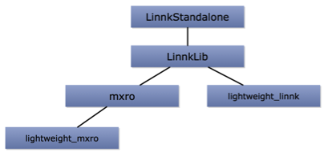
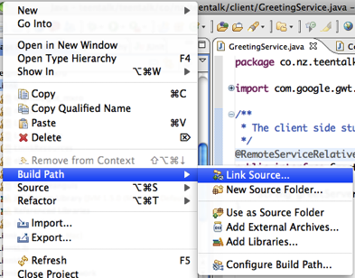
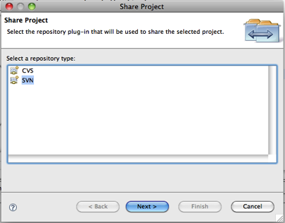

Subversion or SVN is a widely used technology to support collaborative software development. It is best described by the two most important commands. The user can _commit_ changes a svn repository. This leads to the changed files being uploaded to the server. The second command is _update_, which downloads all changes from the server made by other users. Manually triggering these two commands is an essential part of work with Subversion. It is therewith no real-time synchronization solution such as Dropbox ([getdropbox.com](http://getdropbox.com)). However, this might also not be desirable because a software developer might prefer to work with his or her local copy of the software, until it is mature enough to be committed to the repository.

A very strong feature in Subversion is versioning. For every file, changes for all committed versions can be tracked back. These version can be accessed using http or https and some servers provide HTML versions, which can be browsed using a normal web browsers.

Many open source platforms, such as [soureforge.net](http://soureforge.net) support to manage code repositories using Subversion.

Alternative technologies, who provide similar functionality to subversion are, for instance, CVS or git.

**Java Project Structure**

The development of [Linnk](http://www.linnk.de/) takes place on Windows and Mac OS X. Eclipse is used as primary development platform on both operating systems. The code bases on these two platforms must be synchronized and traceability of the development process requires a robust versioning system. This lead us to explore Subversion as possible technology to synchronize the development.

The code base of Linnk is divided into a number of Java projects. The following figure gives a brief impression of the different projects and their dependencies.

The different projects are integrated by linking their sources. In eclipse, this can be accomplished using the “Link Source” function (available in the right click context menu of a Java project).

This means, for instance, that the project LinnkStandalone is linked to a the source folders of LinnkLib, lightweight\_linnk, mxro and lightweight\_mxro (The “lightweight” projects consists of classes, which do not have any dependencies to 3rd party Java libraries).

**Setting up SVN**

There are many different SVN servers available. As a first test, we used the free server VisualSVN for windows ([http://www.visualsvn.com/](http://www.visualsvn.com/)). Using the GUI, a user needs to be set up and at least one “repository”.

For eclipse on Windows and Mac are plugins for Subversion available (Subclipse for Mac OS X and Subversive on Windows). Projects in eclipse can be shared using the option “share projects” (also available on the right click context menu). After the plugins are installed, the wizard for sharing a project offers the option “SVN”.

In the following dialog steps, the repository URL must be chosen (this can be obtained from VisualSVN) and a project name. After a project is set up, the options for updating and committing the project are available.

**Problems**

In synchronizing the two projects between the Mac OS X and Windows machines, a number of problems aroused:

- When the whole project is committed, Eclipse wants to synchronize the project meta-data (e.g. “.project”). This is not desirable as this meta-data contains, for instance, local paths, which are not transferrable between different computers.
- The SVN synchronization seemed to be problematic for projects using Google’s GWT technology. The google plugin constantly complies new versions of the JavaScript files, which pose difficulties in synchronizing between the projects on different computers.

**Solution**

After initially uploading the projects to the SVN server (or downloading them on the other computer respectively), we disconnected the projects from SVN in eclipse. Rather than using the build in features in Eclipse to commit and update projects, we wrote simple scripts to do the committing and uploading.

Mac OS X: Parameterized for update and commit: ./svnmanager.sh update or ./svnmanager.sh commit

\[sourcecode language="bash"\] # svn script for eclipse projects on MacBook

command=$1

\# these folders are to be commited/updated with svn folders=(/Volumes/local/online/Programmierung/eclipseMacBook/Default/Linnk \\ /Volumes/local/online/Programmierung/eclipseMacBook/Default/LinnkLib/Linnk \\ /Volumes/local/online/Programmierung/eclipseMacBook/Default/LinnkLib/LinnkResources \\ /Volumes/local/online/Programmierung/eclipseMacBook/Default/LinnkLib/LinnkArchive \\ /Volumes/local/online/Programmierung/eclipseMacBook/Default/LinnkNetBeanGUIs/linnknetbeanguis \\ /Volumes/local/online/Programmierung/eclipseMacBook/Default/LinnkWebEditorFramework/linnkwef \\ /Volumes/local/online/Programmierung/eclipseMacBook/Default/LinnkWebEditorFramework/lib \\ /Volumes/local/online/Programmierung/eclipseMacBook/Default/leightweight\_linnk/leightweight\_linnk \\ /Volumes/local/online/Programmierung/eclipseMacBook/Default/leightweight\_mxro/leightweight\_mxro \\ /Volumes/local/online/Programmierung/eclipseMacBook/Default/teentalk/teentalk )

for folder in ${folders\[@\]} do if \[ "$command" = "commit" \] then svn $command -m "macbook commit" --username "mroh004" --password "XXXX" $folder fi

if \[ "$command" = "update" \] then svn $command --username "mroh004" --password "XXXX" $folder fi done\[/sourcecode\]

Windows:

Windows does not have a built in SVN client. A client, which supports the command line functions of SVN, is the SilkSVN client ([www.sliksvn.com/en/download](http://www.sliksvn.com/en/download))

For committing:

\[sourcecode language="text"\]@ECHO OFF</pre> rem Commits

"c:\\Program Files\\SlikSvn\\bin\\svn" commit "C:\\eclipseWorkspace\\leightweight\_mxro\\leightweight\_mxro" -m "Commit from STF-428-DSK06" --username "mroh004"

"c:\\Program Files\\SlikSvn\\bin\\svn" commit "C:\\eclipseWorkspace\\leightweight\_linnk\\leightweight\_linnk" -m "Commit from STF-428-DSK06" --username "mroh004"

"c:\\Program Files\\SlikSvn\\bin\\svn" commit "C:\\eclipseWorkspace\\LinnkLib\\Linnk" -m "Commit from STF-428-DSK06" --username "mroh004" "c:\\Program Files\\SlikSvn\\bin\\svn" commit "C:\\eclipseWorkspace\\LinnkLib\\LinnkArchive" -m "Commit from STF-428-DSK06" --username "mroh004" "c:\\Program Files\\SlikSvn\\bin\\svn" commit "C:\\eclipseWorkspace\\LinnkLib\\LinnkResources" -m "Commit from STF-428-DSK06" --username "mroh004"

"c:\\Program Files\\SlikSvn\\bin\\svn" commit "C:\\eclipseWorkspace\\LinnkNetBeanGUIs\\linnknetbeanguis" -m "Commit from STF-428-DSK06" --username "mroh004"

"c:\\Program Files\\SlikSvn\\bin\\svn" commit "C:\\eclipseWorkspace\\LinnkWebEditorFramework\\linnkwef" -m "Commit from STF-428-DSK06" --username "mroh004" "c:\\Program Files\\SlikSvn\\bin\\svn" commit "C:\\eclipseWorkspace\\LinnkWebEditorFramework\\lib" -m "Commit from STF-428-DSK06" --username "mroh004"

"c:\\Program Files\\SlikSvn\\bin\\svn" commit "C:\\eclipseWorkspace\\teentalk\\teentalk" -m "Commit from STF-428-DSK06" --username "mroh004"\[/sourcecode\]

The script for updating is similar, just “commit” is changed to “update” and the “-m ...” parameter is removed.
