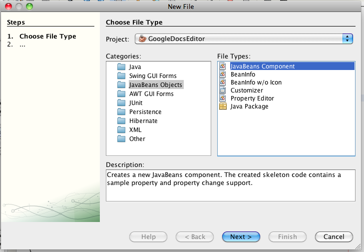
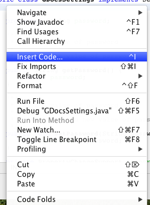
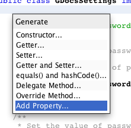
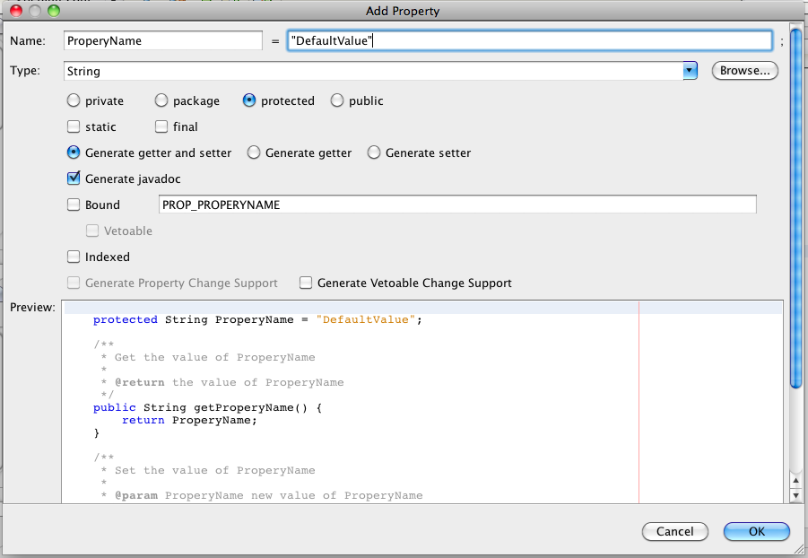

The following is a brief description how a java bean can be linked with the UI using NetBeans:

Java Beans are Java objects (see [Sun Website](http://java.sun.com/javase/technologies/desktop/javabeans/index.jsp)), which have a few unique characteristics:

- have a default constructor without any arguments
- have a number of properties, which are a set of variables and getter and setter methods (see [NetBeans Tutorial](http://wiki.netbeans.org/NetBeansJavaBeansTutorial#What_is_a_JavaBean.2C_and_who_drank_my_coffee.3F)).
- implement property change listeners

The following is a simple example of a JavaBean:

```java

/*
 * A simple JavaBean based on NetBeans tutorial.
 */

package de.mxro.textedit.gdocseditor.gui;

import java.beans.*;
import java.io.Serializable;

/**
 *
 * @author mx
 */
public class GDocsSettings implements Serializable {


    protected String password;

    /**
     * Get the value of password
     *
     * @return the value of password
     */
    public String getPassword() {
        return password;
    }

    /**
     * Set the value of password
     *
     * @param password new value of password
     */
    public void setPassword(String password) {
        this.password = password;
    }

    private PropertyChangeSupport propertySupport;

    public GDocsSettings() {
        propertySupport = new PropertyChangeSupport(this);
    }

    protected String username;

    /**
     * Get the value of username
     *
     * @return the value of username
     */
    public String getUsername() {
        return username;
    }

    /**
     * Set the value of username
     *
     * @param username new value of username
     */
    public void setUsername(String username) {
        this.username = username;
    }


    public void addPropertyChangeListener(PropertyChangeListener listener) {
        propertySupport.addPropertyChangeListener(listener);
    }

    public void removePropertyChangeListener(PropertyChangeListener listener) {
        propertySupport.removePropertyChangeListener(listener);
    }

}
```

A key disadvantage of JavaBeans is that it is quite time intensive to write their code; involving many repetitive tasks like writing getter and setter methods.

Luckily, NetBeans provides generators for generating JavaBeans code. Going through File/ New a new empty bean can be created. ​ In the source code of the bean, using right-click and „insert code“ ...

​

... a new property can be added. ​

​

NetBeans further provides mechanisms to easily link these beans with user interfaces ([Giudici java.net weblog, 2008](http://weblogs.java.net/blog/fabriziogiudici/archive/2008/01/beansbinding_no.html)). Furthermore, through these beans, the UI can be directly linked with databases ([NetBeans Wiki](http://wiki.netbeans.org/BestPracticesWithJPAAndBeansBinding)).

**Further Resources:**

[NetBeans Tutorial on GUI/Beans Binding](http://netbeans.org/kb/docs/java/gui-binding.html) [Java Tutorial on GUI/Beans Binding using NetBeans](http://java.sun.com/docs/books/tutorial/javabeans/nb/index.html)
