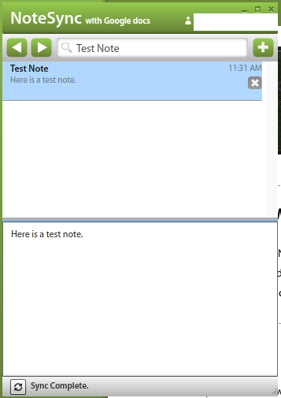

---
authors:
- max
blog: maxrohde.com
categories:
- contemplations
date: "2010-04-26"
title: Software: NoteSync
---

NoteSync has a similar interface to [Notational Velocity](http://maxrohde.com/2010/04/09/software-notational-velocity-note-taking/). In addition, the software synchronizes with Google Docs. Every note is automatically uploaded to Google Docs. If the Google Document is changed, the note in NoteSync will be updated. The pre-order license costs US$4.99.

**Screenshots:**

**Application Overview:**

<table style="empty-cells:show;border-collapse:collapse;"><tbody><tr><td style="vertical-align:top;width:112px;border:0 solid rgb(191,191,191);margin:0;padding:0;"><strong>Application</strong></td><td style="vertical-align:top;width:269px;border:0 solid rgb(191,191,191);margin:0;padding:0;"><strong>NoteSync</strong></td></tr><tr><td style="vertical-align:top;width:112px;border:0 solid rgb(191,191,191);margin:0;padding:0;">Category</td><td style="vertical-align:top;width:269px;border:0 solid rgb(191,191,191);margin:0;padding:0;">Note taking</td></tr><tr><td style="vertical-align:top;width:112px;border:0 solid rgb(191,191,191);margin:0;padding:0;">Version</td><td style="vertical-align:top;width:269px;border:0 solid rgb(191,191,191);margin:0;padding:0;">Beta 1.0.1</td></tr><tr><td style="vertical-align:top;width:112px;border:0 solid rgb(191,191,191);margin:0;padding:0;">Website:</td><td style="vertical-align:top;width:269px;border:0 solid rgb(191,191,191);margin:0;padding:0;"><a href="http://www.notesync.com/">http://www.notesync.com/</a></td></tr><tr><td style="vertical-align:top;width:112px;border:0 solid rgb(191,191,191);margin:0;padding:0;">Tested on:</td><td style="vertical-align:top;width:269px;border:0 solid rgb(191,191,191);margin:0;padding:0;">27/4/2010, Mac OS X 10.6.3</td></tr><tr><td style="width:112px;border:1px solid rgb(191,191,191);margin:0;padding:0;">Technical Details:</td><td style="width:269px;border:1px solid rgb(191,191,191);margin:0;padding:0;">Built on Adobe AIR, runs on Windows and Mac OS X

</td></tr></tbody></table>
