---
authors:
- max
blog: maxrohde.com
categories:
- java
tags:
- osgi
date: "2010-05-22"
title: OSGi + Maven + Declarative Services + eclipse
---

This post is part of a series of post on java modularity.

**Summary:** In this tutorial, I show how declarative service can be implemented with eclipse. I will created each module as plugin project in eclipse to make use of the powerful Plugin Development Environment (PDE), which eclipse offers. But further, I will link each module with a Maven project and implement the dependencies between the modules using Maven.

1. **Download eclipse plugin „Eclipse IAM“**

You first need to download a plugin to work with Maven in eclipse. I found Eclipse IAM the best solution ([Eclipse IAM homepage](http://wiki.eclipse.org/IAM)).

It can be obtained from the following update site:

Update site is: [http://q4e.googlecode.com/svn/trunk/updatesite-iam/](http://q4e.googlecode.com/svn/trunk/updatesite-iam/) (can be found on [Google Code Page](http://code.google.com/p/q4e/))

I tried m2maven ([m2eclipse update site](http://m2eclipse.sonatype.org/installing-m2eclipse.html)) as well but it seemed to slow down eclipse IDE significantly on Mac OS X.

1. **Create a new Plug-In Project in eclipse**

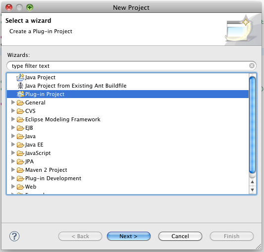​\\

Project name: Service Definition Use maven standard source and output folders: Source folder: „src/main/java“ Output folder: „target/classes“ Select target platform: „standard“ (not equinox) (Later the project will start in equniox anyway if you haven‘t installed another environment in eclipse).

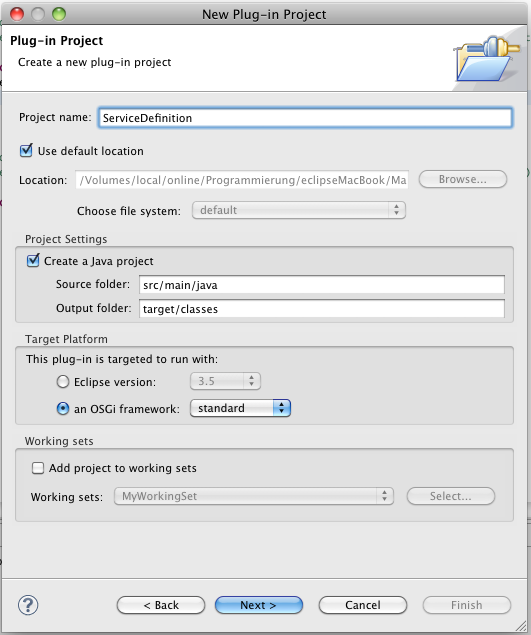

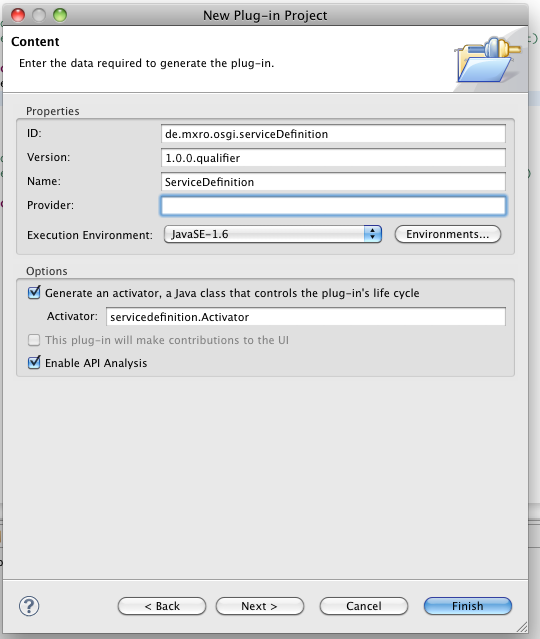

Deselect option creating from template.

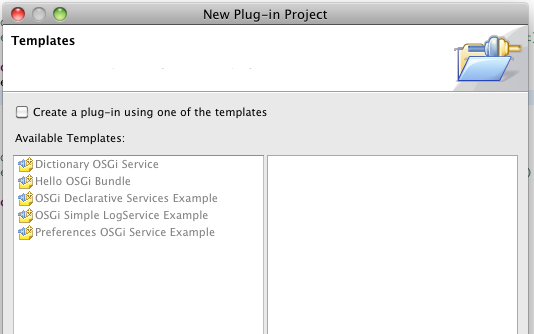​

**Convert eclipse Plugin Project to Maven Project**

Right click the newly create project and select Maven 2 / Convert to Maven Project

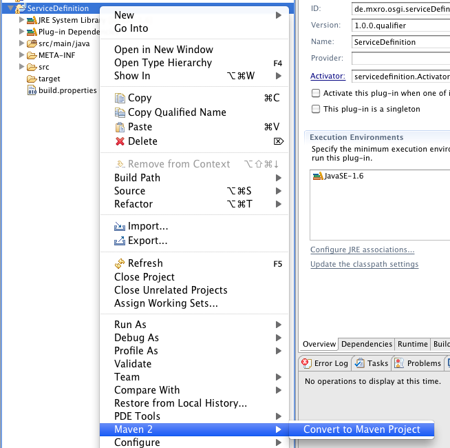

Provide the maven identifiers - use the same version as for the OSGi bundle

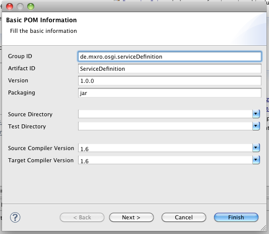

Select Add classpath libraries to dependencies ​​​​​​​​​​​​​​​​​​​​​​​​​​​​​​​​​​​​​​​​​​​​​​​​​​​​​​​​​​​​​​​​​​​​​​​​​​​​​​​​​​​​​​​​​​​​​​​​​​​​​​​​​​​​​​​​​​​​​​​​​​​​​​​​​​​​​​​​​​​​​​​​​​​​​​​​​​​​​​​​​​​​​​​​​​​​​​​​​​​​​​​​​​​​​​​​​​​​​​​​​​​​​​​​​​​​​​​​​​​​​​​​​​​​​​​​​​​​​​​​​​​​​​​​​​​​​​​​​​​​​​​​​​​​​​​​​​​​​​​​​​​​​​​​​​​​​​​​​​​​​​​​​​​​​​​​​​​​​​​​​​​​​​​​​​​​​​​​​​​​​​​​​​​​​​​​​​​​​​​​​​​​​​​​​​​​​​​​​​​​​​​​​​​​​​​​​​​​​​​​​​​​​​​​​​​​​​​​​​​​​​​​​​​​​​​​​​​​​​​​​​​​​​​​​​​​​​​​​​​​​​​​​​​​​​​​​​​​​​​​​​​​​​​​​​​​​​​​​​​​​​​​​​​​​​​​​​​​​​​​​​​​​​​​​​​​​​​​​​​​​​​​​​​​​​​​​​​​​​​​​​​​​​​​​​​​​​​​​​​​​​​​​​​​​​​​​​​​​​​​​​​​​​​​​​​​​​​​​​​​​​​​​​​​​​​​​​​​​​​​​​​​​​​​​​​​​​​​​​​​​​​​​​​​​​​​​​​​​​​​​​​​​​​​​​​​​​​​​​​​​​​​​​​​​​​​​​​​​​​​​​​​​​​​​​​​​​​​​​​​​​​​​​​​​​​​​​​​​​​​​​​​​​​​​​​​​​​​​​​​​​​​​​​​​​​​​​​​​​​​​​​​​​​​​​​​​​​​​​​​​​​​​​​​​​​​​​​​​​​​​​​​​​​​​​​​​​​​​​​​​​​​​​​​​​​​​​​​​​​​​​​​​​​​​​​​​​​​​​​​​​​​​​​​​​​​​​​​​​​​​​​​​​​​​​​​​​​​​​​​​​​​​​​​​​​​​​​​​​​​​​​​​​​​​​​​​​​​​​​​​​​​​​​​​​​​​​​​​​​​​​​​​​​​​​​​​​​​​​​​​​​​​​​​​​​​​​​​​​​​​​​​​​​​​​​​​​​​​​​​​​​​​​​​​​​​​​​​​​​​​​​​​​​​​​​​​​​​​​​​​​​​​​​​​​​​​​​​​​​​​​​​​​​​​​​​​​​​​​​​​​​​​​​​​​​​​​​​​​​​​​​​​​​​​​​​​​​​​​​​​​​​​​​​​​​​​​​​​​​​​​​​​​​​​​​​​​​​​​​​​​​​​​​​​​​​​​​​​​​​​​​​​​​​​​​​​​​​​​​​​​​​​​​​​​​​​​​​​​​​​​​​​​​​​​​​​​​​​​​​​​​​​​​​​​​​​​​​​​​​​​​​​​​​​​​​​​​​​​​​​​​​​​​​​​​​​​​​​​​​​​​​​​​​​​​​​​​​​​​​​​​​​​​​​​​​​​​​​​​​​​​​​​​​​​​​​​​​​​​​​​​​​​​​​​​​​​​​​​​​​​​​​​​​​​​​​​​​​​​​​​​​​​​​​​​​​​​​​​​​​​​​​​​​​​​​​​​​​​​​​​​​​​​​​​​​​​​​​​​​​​​​​​​​​​​​​​​​​​​​​​​​​​​​​​​​​​​​​​​​​​​​​​​​​​​​​​​​​​​​​​​​​​​​​​​​​​​​​​​​​​​​​​​​​​​​​​​​​​​​​​​​​​​​​​​​​​​​​​​​​​​​​​​​​​​​​​​​​​​​​​​​​​​​​​​​​​​​​​​​​​​​​​​​​​​​​​​​​​​​​​​​​​​​​​​​​​​​​​​​​​​​​​​​​​​​​​​​​​​​​​​​​​​​​​​​​​​​​​​​​​​​​​​​​​​​​​​​​​​​​​​​​​​​​​​​​​​​​​​​​​​​​​​​​​​​​​​​​​​​​​​​​​​​​​​​​​​​​​​​​​​​​​​​​​​​​​​​​​​​​​​​​​​​​​​​​​​​​​​​​​​​​​​​​​​​​​​​​​​​​​​​​​​​​​​​​​​​​​​​​​​​​​​​​​​​​​​​​​​​​​​​​​​​​​​​​​​​​​​​​​​​​​​​​​​​​​​​​​​​​​​​​​​​​​​​​​​​​​​​​​​​​​​​​​​​​​​​​​​​​​​​​​​​​​​​​​​​​​​​​​​​​​​​​​​​​​​​​​​​​​​​​​​​​​​​​​​​​​​​​​​​​​​​​​​​​​​​​​​​​​​​​​​​​​​​​​​​​​​​​​​​​​​​​​​​​​​​​​​​​​​​​​​​​​​​​​​​​​​​​​​​​​​​​​​​​​​​​​​​​​​​​​​​​​​​​​​​​​​​​​​​​​​​​​​​​​​​​​​​​​​​​​​​​​​​​​​​​​​​​​​​​​​​​​​​​​​​​​​​​​​​​​​​​​​​​​​​​​​​​​​​​​​​​​​​​​​​​​​​​​​​​​​​​​​​​​​​​​​​​​​​​​​​​​​​​​​​​​​​​​​​​​​​​​​​​​​​​​​​​​​​​​​​​​​​​​​​​​​​​​​​​​​​​​​​​​​​​​​​​​​​​​​​​​​​​​​​​​​​​​​​​​​​​​​​​​​​​​​​​​​​​​​​​​​​​​​​​​​​​​​​​​​​​​​​​​​​​​​​​​​​​​​​​​​​​​​​​​​​​​​​​​​​​​​​​​​​​​​​​​​​​​​​​​​​​​​​​​​​​​​​​​​​​​​​​​​​​​​​​​​​​​​​​​​​​​​​​​​​​​​​​​​​​​​​​​​​​​​​​​​​​​​​​​​​​​​​​​​​​​​​​​​​​​​​​​​​​​​​​​​​​​​​​​​​​​​​​​​​​​​​​​​​​​​​​​​​​​​​​​​​​​​​​​​​​​​​​​​​​​​​​​​​​​​​​​​​​​​​​​​​​​​​​​​​​​​​​​​​​​​​​​​​​​​​​​​​​​​​​​​​​​​​​​​​​​​​​​​​​​​​​​​​​​​​​​​​​​​​​​​​​​​​​​​​​​​​​​​​​​​​​​​​​​​​​​​​​​​​​​​​​​​​​​​​​​​​​​​​​​​​​​​​​​​​​​​​​​​​​​​​​​​​​​​​​​​​​​​​​​​​​​​​​​​​​​​​​​​​​​​​​​​​​​​​​​​​​​​​​​​​​​​​​​​​​​​​​​​​​​​​​​​​​​​​​​​​​​​​​​​​​​​​​​​​​​​​​​​​​​​​​​​​​​​​​​​​​​​​​​​​​​​​​​​​​​​​​​​​​​​​​​​​​​​​​​​​​​​​​​​​​​​​​​​​​​​​​​​​​​​​​​​​​​​​​​​​​​​​​​​​​​​​​​​​​​​​​​​​​​​​​​​​​​​​​​​​​​​​​​​​​​​​​​​​​​​​​​​​​​​​​​​​​​​​​​​​​​​​​​​​​​​​​​​​​​​​​​​​​​​​​​​​​​​​​​​​​​​​​​​​​​​​​​​​​​​​​​​​​​​​​​​​​​​​​​​​​​​​​​​​​​​​​​​​​​​​​​​​​​​​​​​​​​​​​​​​​​​​​​​​​​​​​​​​​​​​​​​​​​​​​​​​​​​​​​​​​​​​​​​​​​​​​​​​​​​​​​​​​​​​​​​​​​​​​​​​​​​​​​​​​​​​​​​​​​​​​​​​​​​​​​​​​​​​​​​​​​​​​​​​​​​​​​​​​​​​​​​​​​​​​​​​​​​​​​​​​​​​​​​​​​​​​​​​​​​​​​​​​​​​​​​​​​​​​​​​​​​​​​​​​​​​​​​​​​​​​​​​​​​​​​​​​​​​​​​​​​​​​​​​​​​​​​​​​​​​​​​​​​​​​​​​​​​​​​​​​​​​​​​​​​​​​​​​​​​​​​​​​​​​​​​​​​​​​​​​​​​​​​​​​​​​​​​​​​​​​​​​​​​​​​​​​​​​​​​​​​​​​​​​​​​​​​​​​​​​​​​​​​​​​​​​​​​​​​​​​​​​​​​​​​​​​​​​​​​​​​​​​​​​​​​​​​​​​​​​​​​​​​​​​​ ​​​​​​​​​​​​​​​​​​​​​​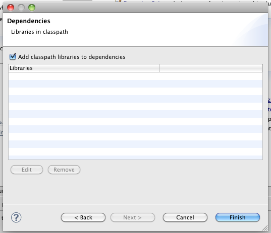​

(for the previous steps also see [Use eclipse plugin project for Maven projects](http://sinnema313.wordpress.com/2009/11/21/osgi-maven-eclipse/))

**Add Maven Dependencies**

Select the generated file „pom.xml“

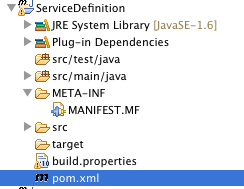​

Go to tab Dependencies and select New

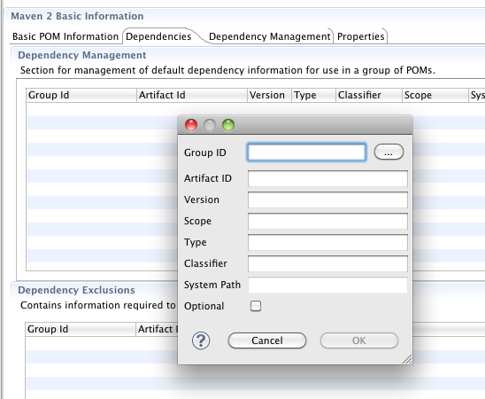​

Add the following two dependencies 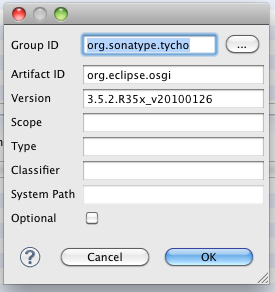​

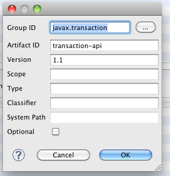​

You can also use the artifact search functionality (click on the button \[...\]). Just type in „transaction-api“ and wait for a while.

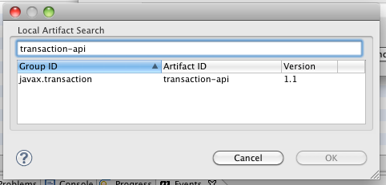

A third dependency, which is on the classpath requires us to connect to an external Maven repository. Go to the tab „Source“ (on the bottom right). In the element „repositoires“ add the following two entries:

<repositories\>         <repository\>                 <id\>com.springsource.repository.bundles.release</id\>                 <name\>SpringSource Enterprise Bundle Repository - SpringSource Bundle Releases</name\>                 <url\>[http://repository.springsource.com/maven/bundles/release](http://repository.springsource.com/maven/bundles/release)</url\>         </repository\>         <repository\>                 <id\>com.springsource.repository.bundles.external</id\>                 <name\>SpringSource Enterprise Bundle Repository - External Bundle Releases</name\>                 <url\>[http://repository.springsource.com/maven/bundles/external](http://repository.springsource.com/maven/bundles/external)</url\>         </repository\>

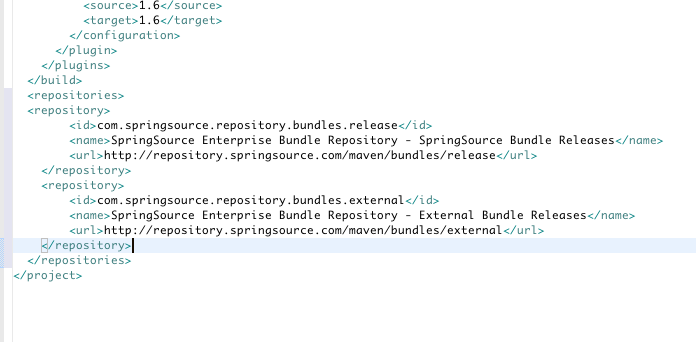

Now a third dependency can be added:

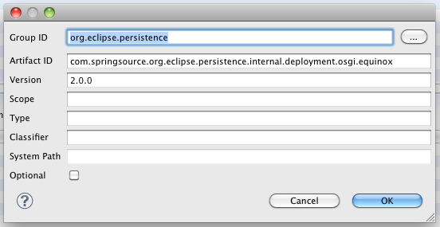​

The repository search is far better in m2eclipse in the current version.

Or you can copy the source of the pom.xml for the elements repositories and dependencies

<repositories\>         <repository\>                 <id\>com.springsource.repository.bundles.release</id\>                 <name\>SpringSource Enterprise Bundle Repository - SpringSource Bundle Releases</name\>                 <url\>[http://repository.springsource.com/maven/bundles/release](http://repository.springsource.com/maven/bundles/release)</url\>         </repository\>         <repository\>                 <id\>com.springsource.repository.bundles.external</id\>                 <name\>SpringSource Enterprise Bundle Repository - External Bundle Releases</name\>                 <url\>[http://repository.springsource.com/maven/bundles/external](http://repository.springsource.com/maven/bundles/external)</url\>         </repository\> </repositories\> <dependencies\> <dependency\>         <groupId\>org.sonatype.tycho</groupId\>         <artifactId\>org.eclipse.osgi</artifactId\>         <version\>3.5.2.R35x_v20100126</version\>         <optional\>false</optional\> </dependency\> <dependency\>         <groupId\>javax.transaction</groupId\>         <artifactId\>transaction-api</artifactId\>         <version\>1.1</version\>         <optional\>false</optional\> </dependency\> <dependency\>         <groupId\>org.eclipse.persistence</groupId\>         <artifactId\>com.springsource.org.eclipse.persistence.internal.deployment.osgi.equinox</artifactId\>         <version\>2.0.0</version\>         <optional\>false</optional\> </dependency\> </dependencies\>

You should have defined the following dependencies:

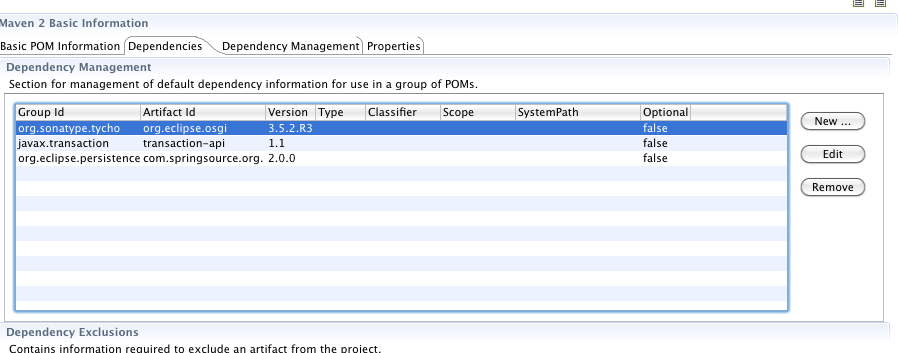

**Create Service Interface**

Create an interface for a service (Wrong source folder in screenshot below: use the src/main/java source folder instead)

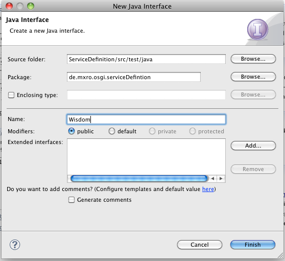​

Add a method to the interface

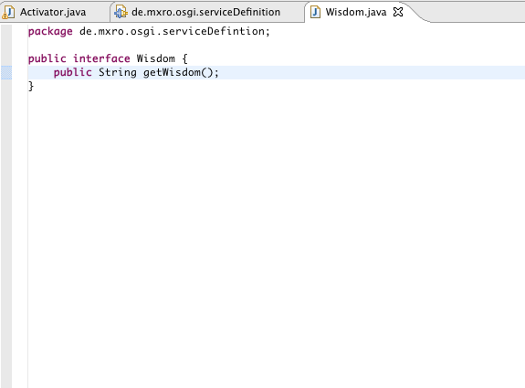​

Open the ServiceDefinition PlugIns MANIFEST.MF file in the directory META-INF. Go to the tab Runtime

Add the package de.mxro.osgi.serviceDefinition to the exported packages.

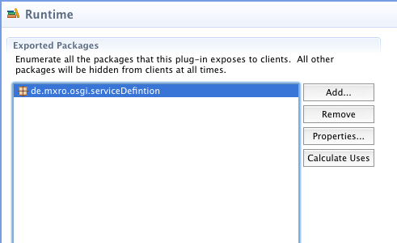

**Deploy Service Definition to Local Maven Repository**

Right click the project and select „Locally Install Artifact“

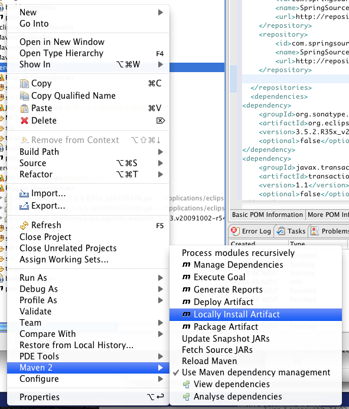​

An output window maven events should appear. One of the messages should have the following format:

Installing /Volumes/local/online/Programmierung/eclipseMacBook/MavenOSGiTest/ServiceDefinition/target/ServiceDefinition-1.0.0.jar to **/Users/mx/.m2/repository/**de/mxro/osgi/serviceDefinition/ServiceDefinition/1.0.0/ServiceDefinition-1.0.0.jar

The highlighted path should be the path to your local Maven repository. In Mac OS X you can easily get there using Terminal and „cd **/Users/mx/.m2/repository/**“. To navigate in this folder with the Finder just type „open .“ after the cd command.

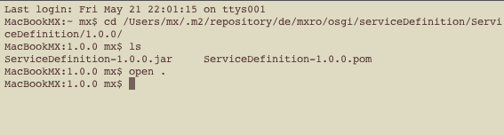

In the finder you can unpack the jar file. Make sure the extracted archive has a folder META-INF.

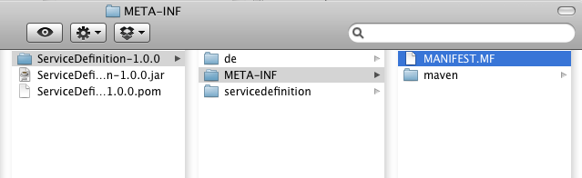

**Create Service Provider Bundle**

Create another eclipse project similar to the one created before.

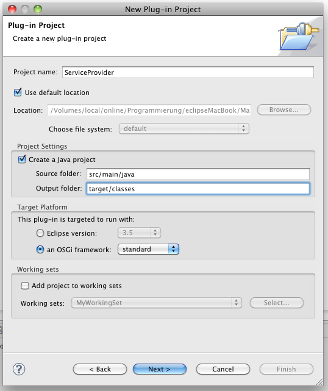

Also convert the project to a maven project by right clicking the project and select Maven 2 / Convert to Maven Project.

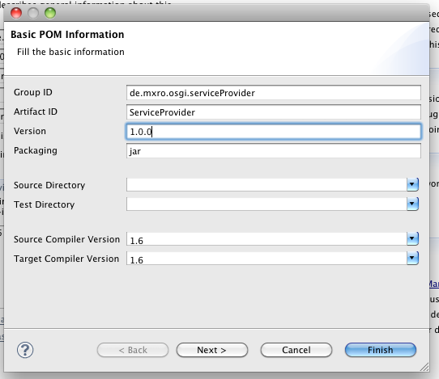​

Add repositories and dependencies as described above.

Add another dependency to the ServiceDefinition bundle. For this, go to the tab „dependencies“ and click \[new ...\]. Click on the button \[...\] next to „Group ID“

Search for ServiceDefinition and add to your dependencies.

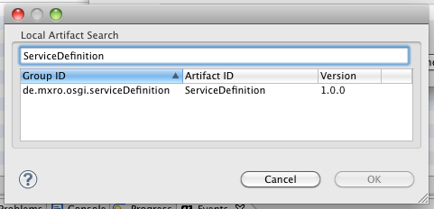

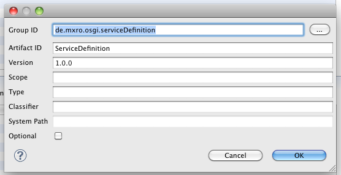

Open the ServiceProvider MANIFEST.MF file

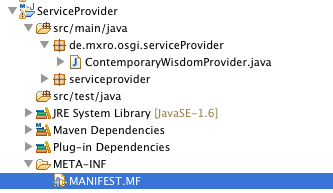

Go to tab Dependencies

Add de.mxro.osgi.serviceDefinition to your the imported packages. If you cannot find de.mxro.osgi.serviceDefinition in your imported packages, there can be a number of reasons. Double check, if your META-INF folder is exported when you deploy your ServiceProvider artifact (extract the JAR file in your local Maven repository). Double check if you have added de.mxro.osgi.serviceDefinition as exported package in your ServiceDefinition project. In doubt, perform the maven action to install in your local repository again and reload the maven dependencies in your ServiceProvider project.

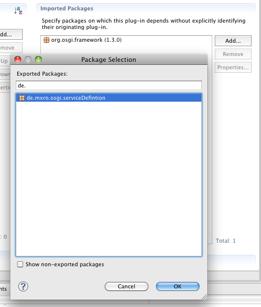

**Implement ServiceProvider**

Create a new java class ContemporaryWisdomProvider. Implement the interface de.mxro.osgi.serviceDefinition.Wisdom

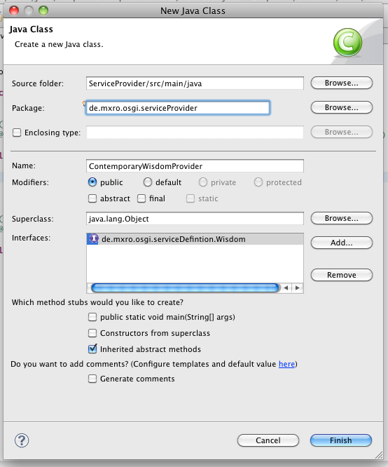

package de.mxro.osgi.serviceProvider;

import de.mxro.osgi.serviceDefintion.Wisdom;

public class ContemporaryWisdomProvider implements Wisdom {        @Override         public String getWisdom() {                         return "A wrong decision is better than indecision."; // The Sopranos (TV Series)         }

}

**Configure the ServiceProvider as Declarative Service**

([also described in article OSGi with Eclipse Equinox](http://www.vogella.de/articles/OSGi/article.html#declarativeservices)) An introduction to declarative services can be found [here](http://www.noway.es/OSGI-Declarative-Services-Components-Tutorial).

Create folder OSGI-INF as child of your main project folder.

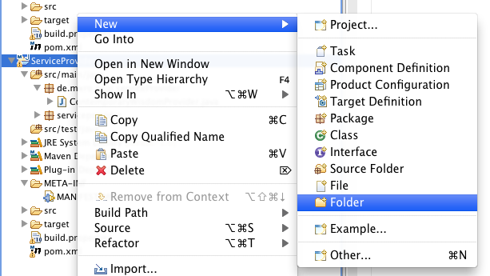

Right Click Folder OSGI-INF and select Add Component Definition.

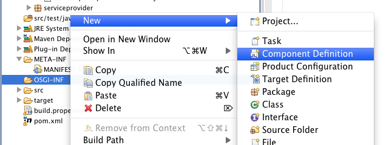

Name the component definition contemporaryWisdomProvider.xml and link to the provider class.

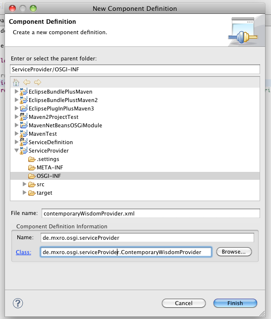

Add the Wisdom Interface to the Provided Services 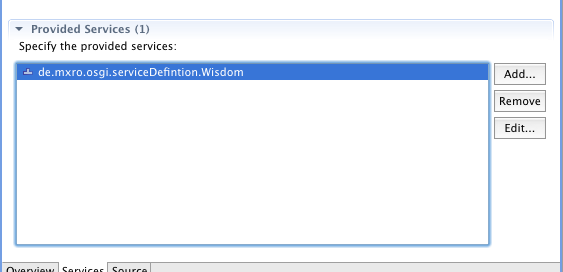

By clicking on the Source tab you can see the source of the service definition. Make sure the schema for scr is http://www.osgi.org/xmlns/scr/v1.0.0 and **NOT** http://www.osgi.org/xmlns/scr/v1.1.0 as the latter does not work on Apache Felix.

<?xml version=“1.0” encoding=“UTF-8”?> <scr:component xmlns:scr=“http://www.osgi.org/xmlns/scr/v1.0.0” name=“de.mxro.osgi.serviceProvider” immideate=“true”\> <implementation enabled=“true” class=“de.mxro.osgi.serviceProvider.ContemporaryWisdomProvider”/> <service servicefactory=“false”\> <provide interface=“de.mxro.osgi.serviceDefintion.Wisdom”/> </service> </scr:component>

**Add OSGI-INF to the Maven Build**

We will need to manually add the new folder OSGI-INF to the Maven Build script. Otherwise, the JAR files created by Maven won‘t contain the service definitions and declarative services won‘t work.

Open the pom.xml using the „Maven 2 POM Editor“. Go to tab „Build Settings“ and there „Resource“ Add the folder „OSGI-INF“

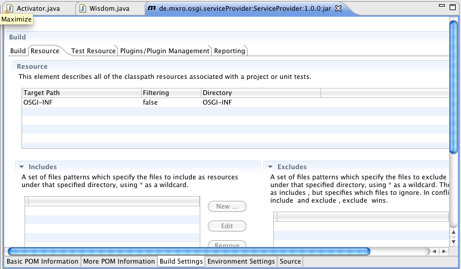

Go to the tab „Source“ (on the bottom right). Make sure the path is not absolute as depicted below.

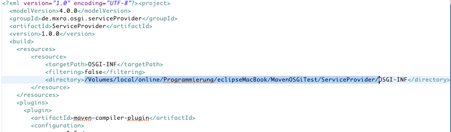

If it is, then change the „directory“ element as shown below.

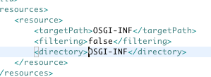
