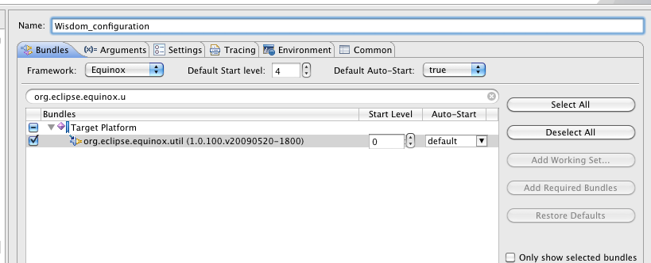
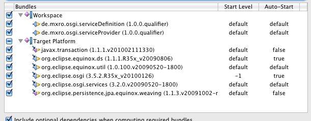
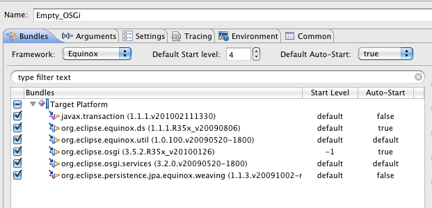
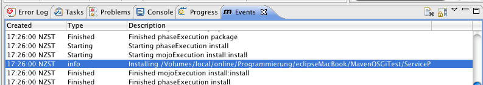

This post is part of a series of posts on java modularity.

This tutorial depends on the part Part 1: [OSGi + Maven + Declarative Services + eclipse](http://maxrohde.com/2010/05/23/osgi-maven-declarative-services-eclipse/)

**Summary:** I show in this tutorial how a convenient launch configuration for the bundles created in the first part can be created using eclipse PDE. Also, I show how the bundles can be manually installed from the local Maven repository. The configurations are specifically aligned to run declarative services.

**Create a Launch Configuration and Test Service Provider**

Right Click your project ServiceProvider and select Run as / Run Configurations

Create a new Run Configuration under OSGi Framework with the name Wisdom_configuration.

Add the bundle org.eclipse.equnix.util to the configuration.

Also add the bundles „org.eclipse.equinox.ds“ and „org.eclipse.osgi.services“ (all these packages have a very small footprint).

Also select the bundles ServiceDefinition and ServiceProvider from your Workspace.

Click on \[Run\]

Type ss to check the status of the bundles

osgi> ss

Framework is launched.

id        State Bundle 0        ACTIVE org.eclipse.osgi_3.5.2.R35x_v20100126          Fragments=2, 3 2        RESOLVED javax.transaction_1.1.1.v201002111330          Master=0 3        RESOLVED org.eclipse.persistence.jpa.equinox.weaving_1.1.3.v20091002-r5404          Master=0 5        ACTIVE org.eclipse.equinox.util_1.0.100.v20090520-1800 6        ACTIVE org.eclipse.equinox.ds_1.1.1.R35x_v20090806 7        ACTIVE de.mxro.osgi.serviceProvider_1.0.0.qualifier 8        ACTIVE de.mxro.osgi.serviceDefinition_1.0.0.qualifier 9        ACTIVE org.eclipse.osgi.services_3.2.0.v20090520-1800 Type „list“ to see all active services.

osgi> list All Components: ID        State                        Component Name                        Located in bundle 1        Satisfied                de.mxro.osgi.serviceProvider                        de.mxro.osgi.serviceProvider(bid=7)

You should see your declared service listed.

**Clear Your Equinox Container**

I do not know exactly why, but sometimes I have to manually reload the bundles in Equinox by using the following commands:

osgi> shutdown osgi> init osgi> close

And then starting the container again using the launch configuration.

**Create an Empty Launch Configuration to Manually Load Bundles**

Often, it can be helpful to have an „empty“ OSGi container, in which one can manually install bundles.

To create a runtime environment for such a case, you can again right click your SerivceProvider project and select Run/ Run Configurations.

Create a new Run Configuration under OSGi Framework with the name Empty_OSGi.

This time only add the Target Platform bundles but not the bundles from your workspace.

You can run this configuration now.

Using the command „ss“ should now only show the following bundles:

osgi> ss

Framework is launched.

id        State Bundle 0        ACTIVE org.eclipse.osgi_3.5.2.R35x_v20100126          Fragments=2, 4 1        ACTIVE org.eclipse.osgi.services_3.2.0.v20090520-1800 2        RESOLVED javax.transaction_1.1.1.v201002111330          Master=0 3        ACTIVE org.eclipse.equinox.util_1.0.100.v20090520-1800 4        RESOLVED org.eclipse.persistence.jpa.equinox.weaving_1.1.3.v20091002-r5404          Master=0 5        ACTIVE org.eclipse.equinox.ds_1.1.1.R35x_v20090806 6        RESOLVED de.mxro.osgi.serviceDefinition_1.0.0.qualifier 8        RESOLVED de.mxro.osgi.serviceProvider_1.0.0.201005231854

**Locate Maven Packages in Local Repository**

In order to manually load our bundles to this container, we will need the path names to where Maven has installed our bundles. These can be found in the Maven events (of Eclipse IAM) after installing the package to the local repository (Right click the bundle project and select Maven 2 / Locally Install Artifact).

The path can be quite long but it can easily be copied by double-clicking on the event, which will open an additional window.

The paths can for example look like:

/Users/mx/.m2/repository/de/mxro/osgi/serviceDefinition/ServiceDefinition/1.0.0/ServiceDefinition-1.0.0.jar /Users/mx/.m2/repository/de/mxro/osgi/serviceProvider/ServiceProvider/1.0.0/ServiceProvider-1.0.0.jar

**Running Bundles Deployed by Maven in Empty OSGi Container**

You can go back to the OSGi container prompt by clicking on the Console output tab.

You can now manually install the Maven deployed bundles:

osgi> install file:///Users/mx/.m2/repository/de/mxro/osgi/serviceDefinition/ServiceDefinition/1.0.0/ServiceDefinition-1.0.0.jar Bundle id is 6

osgi> install file:///Users/mx/.m2/repository/de/mxro/osgi/serviceProvider/ServiceProvider/1.0.0/ServiceProvider-1.0.0.jar Bundle id is 9

You will now need to start the service provider bundle. As seen above, this bundle has the id 9.

osgi> start 9

You can type „ls“ to see the registered services.

osgi> ls All Components: ID        State                        Component Name                        Located in bundle 4        Satisfied                de.mxro.osgi.serviceProvider                        de.mxro.osgi.serviceProvider(bid=10)
